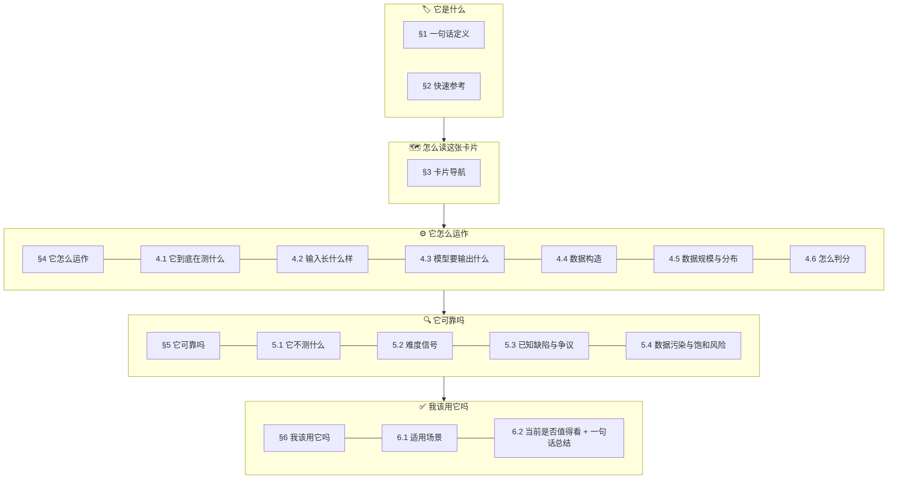

# Benchmark 卡片标准模板 v2

| 字段     | 值                                   |
| -------- | ------------------------------------ |
| 日期     | 2026-04-07                           |
| 版本     | v2                                   |
| 变更记录 | v1 → v2：按 BrowseComp v5 实践，将 18 个扁平章节压缩为 6 个顶级章节；取消独立的推荐标签/参考链接/一句话总结章节，合入 §2 和 §6 |

---

## 一、最终结构总览

所有卡片统一 **6 个顶级章节**，按 4 条读者路径分组：



> [!IMPORTANT]
> **没有独立的推荐标签、参考链接、一句话总结章节。**
> - 分类标签 + 风险标签 + 链接 → 全部收入 §2 快速参考表
> - 一句话总结 → 作为 §6.2 收尾

---

## 二、§1 一句话定义

**格式**：一段话，不超过两句。

**要求**：
- 包含 benchmark 名称、出品方、发布时间
- 说清楚它测什么能力
- 用最通俗的语言

**模板**：

```
`{名称}` 是 {出品方} 在 {时间} 公开的 {类型} benchmark，
测试模型能否 {一句话核心能力描述}。
```

---

## 三、§2 快速参考

**格式**：固定字段的表格。所有卡片使用完全相同的字段集。

| 字段           | 说明                           | 是否必填 |
| -------------- | ------------------------------ | -------- |
| 全称           | benchmark 完整名称             | ✅        |
| 首次公开       | 时间 + 事件（arXiv / 会议等）  | ✅        |
| 出品方         | 组织名 + 核心作者（可选）      | ✅        |
| 数据集规模     | 题目数量，含子集规模           | ✅        |
| 输入形式       | 模型接收什么                   | ✅        |
| 输出形式       | 模型需要产出什么               | ✅        |
| 评分方式       | 一句话概括判分机制             | ✅        |
| 一级类目       | 见能力分类体系                 | ✅        |
| 二级类目       |                                | ✅        |
| 任务形态       | 英文短标签                     | ✅        |
| 风险标签       | 用 `/` 分隔的关键风险          | ✅        |
| 官方页         | URL                            | ✅        |
| 论文           | URL                            | ✅        |
| 代码 / 参考实现 | URL                           | 如有     |
| 数据集         | HuggingFace / 下载链接         | 如有     |
| 官方 Leaderboard | URL                          | 如有     |

**评分方式标签**（选一或多个）：

| 标签             | 含义             | 典型代表     |
| ---------------- | ---------------- | ------------ |
| `exact_match`    | 纯字符串匹配    | MMLU         |
| `fuzzy_match`    | 允许小误差       | 数值运算题   |
| `llm_judge`      | LLM 判断语义等价 | BrowseComp   |
| `test_execution` | 执行测试套件     | SWE-bench    |
| `human_eval`     | 人工评审         | ChatBot Arena |
| `composite`      | 混合多种方式     | HELM         |

---

## 四、§3 卡片导航

每张卡片包含 2-3 张 Mermaid 图：

### 必选 1：阅读路径导航

固定的四路径结构，只替换子节引用：

```
"它是什么"   → §1, §2
"它怎么运作" → §4 (4.1-4.6)
"它可靠吗"   → §5 (5.1-5.4)
"我该用它吗" → §6 (6.1-6.2)
```

### 必选 2：核心逻辑链

按实际 benchmark 定制内容，统一骨架：

```
数据构造(§4.4) → 任务定义(§4.1-§4.3) → 能力信号(§4.1) → 评分(§4.6) → 局限(§5)
```

### 可选 3：特色机制图

每个 benchmark 最多 1 张特色图，如：
- BrowseComp 的"三层过滤门槛"
- SWE-bench 的"家族演化"
- BFCL 的"V1→V4 演进"

---

## 五、§4 它怎么运作

### 4.1 它到底在测什么

**要求**：
- 先说"它**不是**在测什么"（破除误解）
- 再列出它**实际在测的**核心能力（3-5 条）
- 引用论文/官方对能力的定义
- 如果有，放一张能力分解表

### 4.2 输入长什么样

**要求**：
- 输入的数据结构和格式
- 至少 1 个官方/论文示例
- 标注示例来源，如有泄漏顾虑则注明

### 4.3 模型要输出什么

**要求**：
- 输出的数据结构和格式
- 如果有 prompt template / 输出格式要求，引用或概述

### 4.4 数据构造

**要求**：
- 数据来源（人工 / 自动 / 混合）
- 构造逻辑（如反向出题、从真实 issue 收集等）
- 质量控制机制（如多人标注、难度门槛等）
- 关键设计哲学（如 "easy to verify, hard to solve"）

### 4.5 数据规模与分布

**要求**：
- 总规模 + 子集规模（如有）
- 主题/领域/难度分布
- 已知的数据清洗历史

### 4.6 怎么判分

**标准子结构**：

```markdown
#### 流程
{评分的具体步骤}

#### 核心指标
{如 accuracy / % resolved / pass@k}

#### 优点
#### 仍存在的风险
```

---

## 六、§5 它可靠吗

### 5.1 它不测什么

**要求**：
- 明确列出它不覆盖的能力
- 如有常见误读（如"高分 = 全能"），在此指出

### 5.2 难度信号

**标准子结构**：

```markdown
#### 人类基线
{如有}

#### 模型表现（论文原始报告）
{发布时的模型分数}

#### 当前前沿表现
{最新分数，标注数据日期和来源}
```

> [!IMPORTANT]
> 模型分数必须标注：
> - **数据日期**
> - **数据来源**（官方论文 / 第三方排行榜 / 厂商自报）
> - **评测口径**（单次 / 多次采样 / 投票 / best-of-N）
> - **使用的 harness**（如适用）

### 5.3 已知缺陷与争议

**要求**：
- 每个缺陷用独立子标题（`#### 5.3.x`）
- 尽量区分：🏛️ 官方承认 vs 🗣️ 社区揭示
- 附原始来源链接

### 5.4 数据污染与饱和风险

**固定表格**：

| 风险类型       | 评估（高/中/低） | 理由 |
| -------------- | ---------------- | ---- |
| 训练集污染     |                  |      |
| 分数饱和       |                  |      |
| 评测框架差异   |                  |      |
| 数据时效性漂移 |                  |      |

---

## 七、§6 我该用它吗

### 6.1 适用场景

**固定格式**：

```markdown
**适合：**
- {场景}

**不适合单独用来判断：**
- {场景}
```

### 6.2 当前是否值得看

**固定格式**：

```markdown
**{结论}。** 理由：
1. ...

**局限提醒：**
- ...

**一句话总结：**
> {面向"没看全文"的读者的核心记忆点}
```

---

## 八、可选扩展内容

以下内容不是独立顶级章节，而是**嵌入到对应的 §4/§5/§6 子节中**：

| 扩展内容             | 嵌入位置       | 适用场景                                         |
| -------------------- | -------------- | ------------------------------------------------ |
| 与同类 benchmark 对比 | §4.1 正文末尾  | 存在容易混淆的竞品（如 BrowseComp vs WideSearch） |
| 演化脉络             | §4.5 后面       | benchmark 有多版本/子集（如 SWE-bench 家族）     |
| 评测实操指南         | §4.6 后面       | 技术读者想复现评测                                |
| 社区争议深挖         | §5.3 内部展开   | 争议特别多、影响特别大                            |

---

## 九、能力分类体系

所有卡片的 `一级类目` 和 `二级类目` 使用统一词表：

```mermaid
flowchart TD
    ROOT["LLM 能力分类"] --> K["Knowledge"]
    ROOT --> IF["Instruction Following"]
    ROOT --> LC["Long Context"]
    ROOT --> STEM["STEM / Science"]
    ROOT --> R["Reasoning"]
    ROOT --> SA["Search Agent"]
    ROOT --> GA["General Agent"]
    ROOT --> CA["Coding Agent"]
    ROOT --> ML["Multilingualism"]

    K --> K1["General Knowledge QA"]
    K --> K2["Domain Knowledge"]

    IF --> IF1["Format Compliance"]
    IF --> IF2["Constraint Satisfaction"]

    LC --> LC1["Long Document QA"]
    LC --> LC2["Needle Retrieval"]

    STEM --> STEM1["Math Competition"]
    STEM --> STEM2["Science QA"]

    R --> R1["Code Reasoning"]
    R --> R2["Math Reasoning"]
    R --> R3["Logical Reasoning"]

    SA --> SA1["Persistent Browsing"]
    SA --> SA2["Web Fact Finding"]

    GA --> GA1["Tool Use / Function Calling"]
    GA --> GA2["Multi-turn Agent"]
    GA --> GA3["Planning"]

    CA --> CA1["Bug Fix / Patch"]
    CA --> CA2["Terminal Operation"]
    CA --> CA3["Security Coding"]

    ML --> ML1["Translation"]
    ML --> ML2["Multilingual QA"]
```



**Benchmark 映射表**：

| 一级类目             | 二级类目            | 代表 Benchmark                       |
| -------------------- | ------------------- | ------------------------------------ |
| Knowledge            | General Knowledge QA | MMLU-Pro, MMLU-Redux, SuperGPQA      |
| Instruction Following | Format Compliance   | IFEval, IFBench                      |
| Long Context         | Long Document QA    | LongBench v2                         |
| STEM                 | Math Competition    | AIME, HMMT                          |
| STEM                 | Science QA          | GPQA, HLE                           |
| Reasoning            | Code Reasoning      | LiveCodeBench                        |
| Search Agent         | Persistent Browsing | BrowseComp, WideSearch               |
| General Agent        | Tool Use            | BFCL V4, Toolathlon, MCPMark         |
| General Agent        | Planning            | DeepPlanning                         |
| Coding Agent         | Bug Fix / Patch     | SWE-bench Verified                   |
| Coding Agent         | Terminal Operation  | Terminal-Bench 2                     |
| Multilingualism      | Multilingual QA     | MMMLU, INCLUDE                       |

---

## 十、新建卡片 Checklist

- [ ] **§1** 一句话定义包含名称 + 出品方 + 时间 + 核心能力？
- [ ] **§2** 快速参考所有必填字段都填了？风险标签和链接也在里面？
- [ ] **§3** 导航图用了标准四路径？核心逻辑链画了？
- [ ] **§4.1** 先说"不是在测什么"再说"在测什么"？
- [ ] **§4.2** 至少有 1 个完整的输入样例？
- [ ] **§4.3** 输出格式说清楚了？
- [ ] **§4.4** 数据构造逻辑和质量控制都写了？
- [ ] **§4.5** 规模、分布、数据清洗历史都有？
- [ ] **§4.6** 判分流程、指标、优缺点都覆盖了？
- [ ] **§5.1** 列出了不测的能力 + 常见误读？
- [ ] **§5.2** 难度信号标注了数据日期、来源、评测口径？
- [ ] **§5.3** 缺陷附了原始来源链接？
- [ ] **§5.4** 污染风险表的四个维度都评了？
- [ ] **§6.1** 适合/不适合场景都写了？
- [ ] **§6.2** 给了明确结论？以一句话总结收尾？
- [ ] 标签用了统一分类体系？
- [ ] 需要可选扩展吗？（演化史、竞品对比、实操指南、争议深挖）
