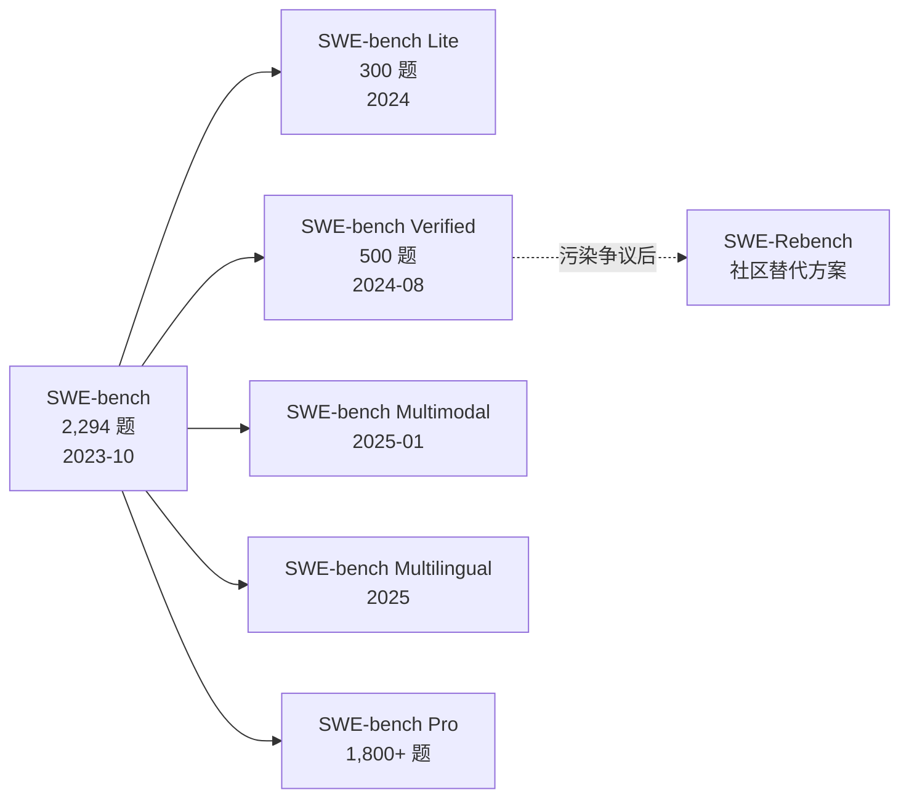

# Benchmark Card 02: SWE-bench

| 字段       | 值                                           |
| ---------- | -------------------------------------------- |
| 日期       | 2026-04-07                                   |
| 版本       | v1                                           |
| 状态       | 首版；基于 BrowseComp 卡片模板格式           |

---

## 1. 一句话定义

`SWE-bench` 是 Princeton NLP 团队在 2023 年提出的软件工程 benchmark，测试模型能否**阅读真实 GitHub issue、理解真实代码库、并生成能通过测试的 patch**。

## 2. 快速参考

| 属性             | 值                                                    |
| ---------------- | ----------------------------------------------------- |
| 全称             | SWE-bench: Can Language Models Resolve Real-World GitHub Issues? |
| 首次公开         | 2023-10 (arXiv)；2024 年 ICLR oral                    |
| 出品方           | Princeton NLP (Carlos Jimenez, John Yang 等)           |
| 数据集规模       | 原始 2,294 题 / Lite 300 题 / Verified 500 题          |
| 输入形式         | 代码仓库快照 + issue 描述                              |
| 输出形式         | Git patch (unified diff)                               |
| 评分方式         | 在 Docker 容器中执行测试套件，pass/fail 判定            |
| 一级类目         | `Coding Agent`                                         |
| 二级类目         | `Autonomous Bug Fix / Feature Implementation`          |
| 任务形态         | `real-world software patch generation`                 |
| 官方站           | https://www.swebench.com/                              |
| 论文             | https://arxiv.org/abs/2310.06770                       |
| GitHub           | https://github.com/SWE-bench/SWE-bench                |

## 3. 它到底在测什么

SWE-bench 测的不是"写一个函数"或"补全一段代码"，而是：

1. **读懂一个真实 issue**：理解用户用自然语言描述的 bug 或功能请求
2. **导航大型代码库**：在数千到数万行的真实 Python 项目中定位相关文件和函数
3. **跨文件协调修改**：很多 issue 的修复需要同时改动多个文件、多个类
4. **生成可通过测试的 patch**：最终产出不是"看起来对"的代码，而是必须通过真实测试套件

与传统 code generation benchmark（如 HumanEval、MBPP）的核心区别：

| 维度            | HumanEval 类       | SWE-bench               |
| --------------- | ------------------- | ------------------------ |
| 代码规模        | 单函数              | 真实项目（数千~数万行）   |
| 任务来源        | 人工构造            | 真实 GitHub issue         |
| 所需理解范围    | 题目描述            | issue + 整个代码库上下文  |
| 验证方式        | 单元测试            | 项目真实测试套件          |
| 工具使用        | 通常不需要          | 常需要终端、执行环境      |

## 4. 输入长什么样

每个 SWE-bench 实例包含：

- **代码仓库快照**：被 checkout 到 issue 提交前的状态
- **Issue 描述**：来自 GitHub issue 的自然语言描述

实例通常来自以下 12 个流行的 Python 开源项目：

```
astropy, django, flask, matplotlib, pylint, pytest,
requests, scikit-learn, seaborn, sphinx, sympy, xarray
```

一个典型的 issue 描述可能是：

> **django/django#13933**: `FloatField` validates `Decimal` incorrectly  
> When a `Decimal` value is passed to a `FloatField`, the validator incorrectly rejects values that should be valid...

模型需要理解这段描述，找到 `django/forms/fields.py` 中的相关验证逻辑，并生成修复 patch。

## 5. 模型要输出什么

模型输出一个 **Git patch**（unified diff 格式），包含对代码库的所有需要的修改。

```diff
--- a/django/forms/fields.py
+++ b/django/forms/fields.py
@@ -303,7 +303,7 @@ class FloatField(IntegerField):
     def validate(self, value):
         super().validate(value)
-        if value and not isinstance(value, float):
+        if value is not None and not isinstance(value, (int, float, Decimal)):
             raise ValidationError(self.error_messages['invalid'])
```

> [!NOTE]
> 以上为说明性示例，非精确的 SWE-bench 真题答案。

## 6. 数据是怎么做出来的

SWE-bench 的数据来源完全**来自真实世界**，不是人工出题：

1. 从 12 个流行 Python 开源仓库收集关闭的 GitHub issue + 对应的 PR
2. 筛选标准：PR 必须有相关的测试变更（确保可验证）
3. 把代码库 checkout 到 issue 出现前的状态
4. 保留 PR 中新增/修改的测试作为验证标准

构造逻辑的关键特性：

- **自然发生**：问题和解决方案都来自真实开发过程
- **可自动验证**：每个实例都有测试用例，不需要人工判分
- **持续可扩展**：理论上可以不断从新 issue 中收集数据

### 子集构造

| 子集                 | 规模    | 构造方式                                     |
| -------------------- | ------- | -------------------------------------------- |
| SWE-bench (原始)     | 2,294   | 自动从 12 个 Python 仓库收集                  |
| SWE-bench Lite       | 300     | 从原始集中筛选独立性高、难度适中的子集         |
| SWE-bench Verified   | 500     | 与 OpenAI 合作，人工标注确认可解               |
| SWE-bench Multimodal | -       | 扩展到涉及 UI/视觉的软件 issue                |
| SWE-bench Multilingual | -     | 扩展到非 Python 语言的仓库                     |

## 7. 怎么判分

### 7.1 流程

1. 在 Docker 容器中恢复代码仓库到 issue 出现前的状态
2. 将模型生成的 patch 应用到代码库
3. 运行该 instance 对应的测试套件
4. 判定：所有相关测试通过 → **Resolved**；否则 → **Failed**

### 7.2 核心指标

- **% Resolved**：成功修复的 issue 占总 issue 数的比例
- 这是一个非常硬的指标——测试通不过就是 0 分，没有部分分

### 7.3 优点

- **完全自动化**：不需要 LLM judge 或人工评审
- **二值判定**：pass/fail，没有主观性
- **可复现**：Docker 隔离环境保证结果一致

### 7.4 仍存在的风险

- 测试套件可能不完备：模型可能生成"通过测试但实际不正确"的 patch
- 测试套件可能过严：正确的替代方案可能因测试写法而被拒绝

## 8. 它不测什么

- **代码生成创造力**：SWE-bench 是修 bug / 实现 feature，不是从零写新项目
- **非 Python 语言**（原始版本）：仅覆盖 12 个 Python 仓库，Multilingual 版本正在扩展
- **架构设计能力**：修改粒度通常在函数/类级别，不涉及系统级架构
- **人机协作调试**：SWE-bench 是单次提交 patch，不测多轮交互
- **运维 / 部署能力**：不涉及 CI/CD、容器化、监控等

## 9. 难度信号

### 9.1 早期模型表现（论文原始报告，2023）

| 模型           | % Resolved  |
| -------------- | ----------- |
| Claude 2       | 1.96%       |
| GPT-4          | 1.74%       |
| SWE-Llama 13b  | 0.70%       |

### 9.2 当前前沿表现（SWE-bench Verified，2026-04）

| 模型                | % Resolved  |
| ------------------- | ----------- |
| Claude Opus 4.5     | 80.9%       |
| Claude Opus 4.6     | 80.8%       |
| Gemini 3.1 Pro      | 80.6%       |
| MiniMax M2.5        | 80.2%       |
| GPT-5.2             | 80.0%       |
| Claude Sonnet 4.6   | 79.6%       |
| Qwen3.6 Plus        | 78.8%       |

### 9.3 进化轨迹的意义

从 2023 年的 ~2% 到 2026 年的 ~80%，SWE-bench Verified 的分数增长非常剧烈。这说明：

1. **模型能力确实在快速提升**——尤其是 agentic coding workflow 的出现
2. **但也引入了可信度问题**——benchmark 是否已经被"学过了"？（详见第 11 节）
3. **前沿分数聚拢**——Top 模型之间差距已压缩到 1-2 个百分点，区分度下降

> [!WARNING]
> 请注意 SWE-bench Verified 分数高度依赖 agent scaffolding（评测框架/工具链）。同一个 LLM 在不同 agent 架构下的分数可能差 10+ 个百分点。比较时务必确认使用的 harness 是否一致。

## 10. 已知缺陷与争议

### 10.1 训练集污染（最严重的问题）

SWE-bench 使用的是真实的开源 GitHub issue，这些 issue + PR 早已在互联网上公开。主流 LLM 的训练数据几乎必然包含这些内容。

**影响**：模型可能通过记忆而非推理来"解"题。分数上升中有多少归因于真正的编程能力提升，有多少归因于数据泄漏，难以区分。

### 10.2 Repo State 作弊（git history loophole）

GitHub issue [#465](https://github.com/SWE-bench/SWE-bench/issues/465) 揭露：

- 即使代码库被 checkout 到 bug 修复前的状态，Docker 环境中仍保留了完整的 git history
- agentic 模型可以使用 `git log --all`、查看 tag/branch/reflog 等方式**直接看到未来的修复 commit**
- 等于"翻到卷子后面看答案"

> [!CAUTION]
> 这是一个已被社区广泛讨论的结构性漏洞。虽然 SWE-bench 团队已知此问题并在后续版本修复，但这说明早期部分高分可能存在"隐性作弊"。

### 10.3 测试套件薄弱

- 部分 instance 的验证测试覆盖不足
- 模型可能生成"通过测试但实际错误"的 patch
- 也存在"正确方案被过窄测试拒绝"的情况

### 10.4 Issue 描述泄漏解答

部分 issue 的描述或评论中直接包含了解决方案线索，使得问题变得简单。

### 10.5 Agent scaffolding 差异污染排行榜

不同提交者使用完全不同的 agent 架构：

- 有的用简单 ReAct loop + bash
- 有的用多轮搜索 + 代码分析工具 + 多次采样 + 投票

如果不控制 scaffolding 变量，排行榜反映的不纯粹是 LLM 能力。

SWE-bench 团队为此推出了 **Bash Only** 子排行榜（mini-SWE-agent），统一使用最小化 agent 做公平比较。

## 11. 数据污染与饱和风险

| 风险类型       | 评估                                                              |
| -------------- | ----------------------------------------------------------------- |
| 训练集污染     | **高**。所有 issue + PR 均来自公开 GitHub，必然被主流 LLM 训练过    |
| 分数饱和       | **中高**。Verified 子集的前沿分数已达 ~81%，Top 模型差距 < 2%       |
| 评测框架差异   | **高**。agent scaffolding 差异对分数影响极大，跨提交比较不可靠     |
| 后续应对       | SWE-bench Pro / SWE-Rebench / Multilingual 正在尝试引入新鲜数据    |

> [!IMPORTANT]
> 截至 2026 年初，SWE-bench Verified 的可信度已受到广泛质疑。部分头部实验室已减少对该 benchmark 分数的宣传依赖。社区正在转向动态更新、抗污染的评测方法。

## 12. 适用场景

**适合：**

- 评估模型在**真实代码修复任务**上的端到端能力
- 比较不同 coding agent 架构的工程效能
- 作为 coding agent 产品化的初步准入门槛

**不适合单独用来判断：**

- 模型的"通用编程能力"（仅覆盖 Python，且偏 bug fix）
- 模型在全新项目中的代码生成创造力
- 模型在多轮人机协作中的调试表现
- 非 Python 语言的开发能力（需看 Multilingual 版本）

## 13. SWE-bench 家族演化



这条演化线对理解"为什么今天有这么多版本"很关键：

- **Lite**：降低评测成本，适合快速迭代
- **Verified**：人工确认可解性，提高标注质量
- **Multimodal**：扩展到 UI/视觉相关 issue
- **Multilingual**：扩展到 JS/TS/Java 等非 Python 语言
- **Pro**：更大规模、更多样的测试集
- **SWE-Rebench**（社区）：动态刷新数据以对抗污染

## 14. 当前是否值得看

**仍然值得，但需要带着批判性看。** 理由：

1. 它是目前最被广泛引用的 coding agent benchmark，跨论文比较不可避免
2. Verified 子集的人工验证确保了基本的可解性
3. 评分完全自动化、二值判定，基础可信度高

**关键注意事项：**

- 污染问题真实存在，分数随时间存在通胀
- 必须关注 agent scaffolding 是否一致
- 建议与 Terminal-Bench、SWE-Rebench 等新 benchmark 组合看

## 15. 推荐标签

```yaml
一级类目: Coding Agent
二级类目: Autonomous Bug Fix
任务形态: real-world software patch generation
评分方式: automated test execution (pass/fail)
风险标签:
  - severe training data contamination
  - agent scaffolding variance
  - weak test coverage on some instances
  - score inflation over time
  - repo state information leakage (partially fixed)
```

## 16. 最值得记住的一句话

> **它是第一个用"真实 GitHub issue + 真实测试套件"来测 LLM 编程能力的 benchmark，定义了 coding agent 这个赛道的评测标准，但自身也成了"benchmark 被训练数据污染"的典型案例。**

## 17. 参考链接

### 官方资源

- SWE-bench 官方站：https://www.swebench.com/
- SWE-bench Verified：https://www.swebench.com/verified.html
- SWE-bench 论文：https://arxiv.org/abs/2310.06770
- SWE-bench GitHub：https://github.com/SWE-bench/SWE-bench
- SWE-bench 数据 (HuggingFace)：https://huggingface.co/datasets/SWE-bench/SWE-bench
- mini-SWE-agent（bash-only 评测）：https://mini-swe-agent.com/

### 社区讨论

- Repo State Loophole issue #465：https://github.com/SWE-bench/SWE-bench/issues/465
- Reddit 关于 SWE-bench Verified 的讨论：https://www.reddit.com/r/LocalLLaMA/comments/1qnt8vp/lets_talk_about_the_swebench_verified/
- Reddit benchmark 污染讨论：https://www.reddit.com/r/LocalLLaMA/comments/1nqo0oo/the_current_state_of_llm_benchmarks_is_so_polluted/
- Linux.do SWE-bench 争议帖：https://linux.do/t/topic/951193
