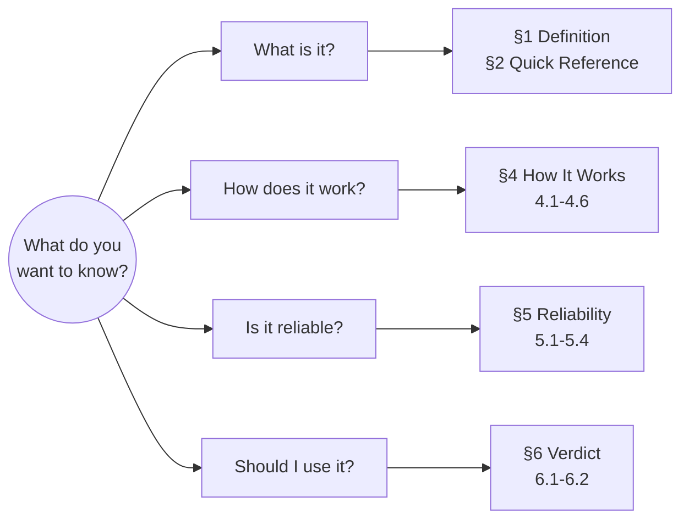
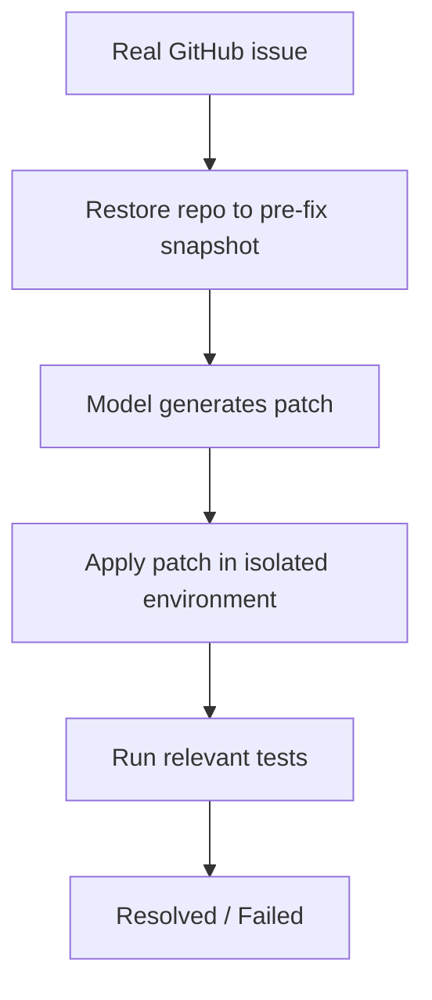

# Benchmark Card: SWE-bench

> Concise English edition. The Chinese version currently contains fuller controversy notes and source grouping.

## 1. One-Line Definition

`SWE-bench` is a software engineering benchmark from Princeton NLP that tests whether a model can read a real GitHub issue, navigate a real repository snapshot, and produce a patch that passes the project’s tests.

## 2. Quick Reference

| Property      | Value |
| ------------- | ----- |
| Full Name     | SWE-bench: Can Language Models Resolve Real-World GitHub Issues? |
| Released      | 2023-10 (arXiv), later presented at ICLR 2024 |
| Creator       | Princeton NLP |
| Dataset Size  | Full 2,294 / Lite 300 / Verified 500 |
| Input Format  | Repository snapshot + issue description |
| Output Format | Git patch (unified diff) |
| Scoring       | Test execution in isolated environment |
| Category      | `Coding Agent` > `Autonomous Bug Fix` |
| Risk Tags     | Training contamination / Scaffold variance / Weak tests / Score saturation |
| Official Site | https://www.swebench.com/ |
| Paper         | https://arxiv.org/abs/2310.06770 |
| GitHub        | https://github.com/SWE-bench/SWE-bench |

## 3. Navigation

### 3.1 Reading Paths

### 3.2 Core Logic

## 4. How It Works

### 4.1 What It Actually Tests

SWE-bench is not a toy code-completion benchmark. It tests whether a system can:

- understand a real issue report
- navigate a real codebase
- modify one or more files coherently
- satisfy the project’s test constraints

### 4.2 What the Input Looks Like

Each instance includes a repository snapshot from before the fix and the corresponding GitHub issue text. The original benchmark mainly covers 12 popular Python repositories such as Django, Flask, matplotlib, pytest, scikit-learn, and SymPy.

### 4.3 What the Model Must Output

The system must output a unified diff patch, not just an explanation or a code snippet.

### 4.4 How the Data Was Built

The benchmark was built from real closed issues and associated pull requests. The repository is rewound to the pre-fix state, and the evaluation keeps the relevant tests so the generated patch can be checked automatically.

### 4.5 Dataset Scale and Distribution

Important subsets and follow-up variants include:

- Full: 2,294 instances
- Lite: 300 instances
- Verified: 500 manually filtered instances
- Multimodal and Multilingual follow-up versions

The original benchmark is heavily Python-centric, which is one reason the family expanded later.

### 4.6 How It Is Scored

#### Process

1. restore the repository snapshot
2. apply the generated patch
3. run the relevant tests
4. count the instance as resolved only if the expected tests pass

#### Core Metrics

- `% Resolved`

#### Strengths

- hard automatic signal
- closer to real engineering work than toy code benchmarks

#### Remaining Risks

- passing tests does not always mean the patch is semantically correct
- different agent scaffolds can change results a lot

## 5. Reliability

### 5.1 What It Does Not Test

- greenfield software design
- long multi-turn human collaboration
- broad multilingual programming ability in the original benchmark
- operations, deployment, and production ownership

### 5.2 Difficulty Signal

Early paper-era large models scored around 1% to 2% resolved, while modern coding-agent systems score much higher on curated subsets such as Verified. The main lesson is that repo navigation, execution loops, and scaffolding matter as much as, or more than, the base model alone.

### 5.3 Known Defects and Disputes

- Public GitHub data makes contamination a structural concern.
- Early evaluation setups exposed git-history loopholes that could leak future fixes.
- Weak or narrow tests can distort the meaning of “resolved.”
- Leaderboards can mix model quality with agent scaffolding quality.

### 5.4 Contamination and Saturation Risk

| Risk Type | Level | Why |
| --------- | ----- | --- |
| Training contamination | High | Issues and fixes come from public GitHub history |
| Score saturation | Medium to high | Top systems on Verified are increasingly clustered |
| Evaluation variance | High | Scaffold and tool budget strongly affect results |
| Data drift | Low | Snapshot-based evaluation is more stable than live-web benchmarks |

## 6. Should I Use It

### 6.1 Good Use Cases

**Good for:**

- measuring real-repo bug-fix ability
- comparing coding-agent scaffolds under controlled conditions
- setting a baseline gate for coding-agent products

**Not enough on its own for:**

- general programming creativity
- full-stack engineering judgment
- deployment, ops, and real team collaboration

### 6.2 Verdict

**Conditionally recommended.** It is still a core reference benchmark for coding agents, but it must be interpreted together with contamination risk and scaffold sensitivity.

> It remains a major coding-agent reference point, but today it is better treated as an important benchmark signal than as the final authority.
