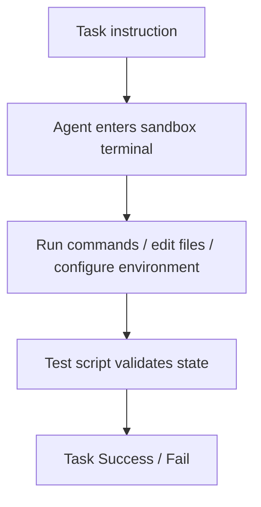

# Benchmark Card: Terminal-Bench 2

> Concise English edition. The Chinese version currently contains fuller Harbor and beta-status notes.

## 1. One-Line Definition

`Terminal-Bench 2` is an end-to-end terminal-agent benchmark that checks whether a model can complete real CLI tasks inside a sandboxed environment rather than merely describe what should be done.

## 2. Quick Reference

| Property | Value |
| -------- | ----- |
| Full Name | Terminal-Bench |
| Current Focused Version | Terminal-Bench 2.0 / Harbor-based runtime |
| Released | 2026-01 beta era |
| Creator | Laude Institute |
| Dataset Size | About 100 tasks in the current beta stage |
| Input Format | Natural-language task instruction plus real terminal sandbox |
| Output Format | Actual terminal actions and final environment state |
| Scoring | Test script success / failure |
| Category | `Coding Agent` > `Terminal Operation` |
| Risk Tags | Beta churn / Adapter dependence / Docker-environment variance / Limited current coverage |
| Repo | https://github.com/harbor-framework/terminal-bench |
| Docs | https://www.tbench.ai/docs |
| Harbor Runtime Docs | https://harborframework.com/docs/running-tbench |
| Leaderboard | https://www.tbench.ai/leaderboard |
| Paper | https://arxiv.org/abs/2601.11868 |

## 3. Navigation

### 3.1 Core Process

### 3.2 If You Only Remember Three Things

- It measures whether an agent can **actually finish the task in a terminal**.
- Each task is built around an instruction, a test script, and an oracle/reference solution.
- The current public benchmark is still beta-era and tightly coupled to the Harbor execution stack.

## 4. How It Works

### 4.1 What It Actually Tests

Terminal-Bench measures:

1. multi-step execution inside a real terminal
2. correct use of shell commands, tools, files, and environment setup
3. whether the final system state satisfies the target, rather than whether the model produced persuasive text

It overlaps with coding-agent evaluation, but it is different from SWE-bench:

- SWE-bench is more about real-repo issue repair
- Terminal-Bench is more about end-to-end CLI execution

### 4.2 What the Input Looks Like

The official task structure is simple:

- an English instruction
- a test script
- a reference/oracle solution

At runtime, the model gets a real terminal sandbox plus the task description and available environment.

### 4.3 What the Model Must Output

Strictly speaking, it does not need to output a textual "answer."

What is evaluated is:

- the terminal action trace
- the produced files and environment state
- whether the task passes the validation script

That makes it much closer to real agent execution than text-only coding benchmarks.

### 4.4 How the Data Was Built

The current official framing has two strongly coupled parts:

1. the task dataset
2. the execution harness

New users are explicitly guided toward the Harbor runtime for Terminal-Bench 2.0, which means numbers depend not just on the base model but also on adapter and harness details.

### 4.5 Dataset Scale and Distribution

| Dimension | Value |
| --------- | ----- |
| Current state | Beta |
| Task count | ~100 |
| Current leaderboard subset | `terminal-bench-core` |
| Current cited leaderboard version | `v0.1.1` |

This is an evolving benchmark family, not a frozen static set.

### 4.6 How It Is Scored

The scoring logic is simple:

1. let the agent execute in the sandbox
2. run the task's test script
3. mark success if the script passes

The strength is clean execution-based evaluation. The cost is that environment, adapter, and dataset-version consistency matter a lot.

## 5. Reliability

### 5.1 What It Does Not Test

- GUI desktop interaction
- long team-based development
- product design and requirement interpretation
- non-terminal real-world workflows

### 5.2 Difficulty Signal

Its difficulty is realistic because:

- tasks are multi-step
- environment handling matters
- many failures come from system state, not just code text
- there is often no easy shortcut to "guess" a passing answer

### 5.3 Known Defects and Disputes

- The benchmark is still explicitly in beta and will change.
- Results depend heavily on Harbor, adapters, and sandbox configuration.
- Around 100 tasks is still an early coverage level for general terminal agents.

### 5.4 Risk Table

| Risk Type | Level | Why |
| --------- | ----- | --- |
| Version churn | High | Beta benchmark and leaderboard are evolving quickly |
| Harness dependence | High | Results are highly sensitive to adapter and sandbox setup |
| Coverage limits | Medium | Current task volume is still modest |
| Reproduction cost | Medium | Docker and execution-stack setup are nontrivial |

## 6. Should I Use It

### 6.1 Good Use Cases

**Good for:**

- terminal-agent evaluation
- checking whether tasks can actually be finished in CLI environments
- complementing SWE-bench with execution-heavy terminal work

**Not enough on its own for:**

- stable long-term leaderboard claims
- full-stack coding-agent evaluation

### 6.2 Verdict

**Conditionally recommended.** It is highly relevant for terminal agents, but right now it is better used as a directionally important frontier benchmark than as a fully settled standard.
