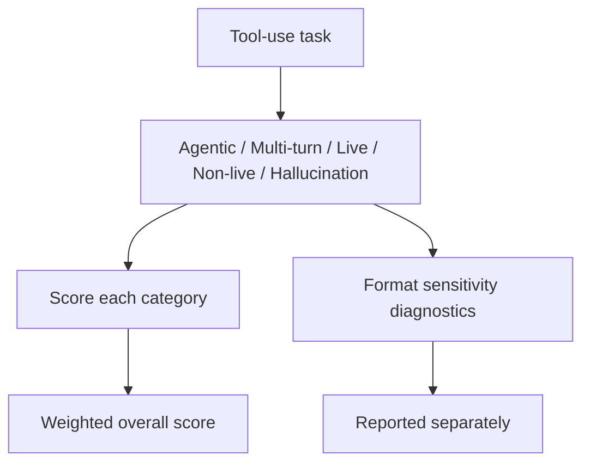

# Benchmark Card: BFCL V4

> Concise English edition. The Chinese version currently contains fuller weighting and diagnostics notes.

## 1. One-Line Definition

`BFCL V4` is the fourth major version of the Berkeley Function Calling Leaderboard, and by V4 it has expanded from single-turn function calling into a broader evaluation of agentic tool use across web search, memory, multi-turn interaction, live endpoints, and hallucination resistance.

## 2. Quick Reference

| Property | Value |
| -------- | ----- |
| Full Name | Berkeley Function Calling Leaderboard V4 |
| Released | 2025-07-17 |
| Creator | Berkeley Sky Computing Lab / Gorilla |
| Dataset Size | 5,088 scoring examples + 5,200 format-sensitivity diagnostic configs |
| Coverage | 18 categories, 34 languages, 171 scenarios |
| Input Format | User request plus tools, live endpoints, memory state, and/or multi-turn history |
| Output Format | Tool call, arguments, tool sequence, and final response |
| Scoring | Deterministic category scoring plus weighted overall score |
| Category | `General Agent` > `Tool Use` |
| Risk Tags | Overall score hides details / Live dependence / Schema drift / Diagnostic protocol complexity |
| Leaderboard | https://gorilla.cs.berkeley.edu/leaderboard |
| Project Page | https://sky.cs.berkeley.edu/project/berkeley-function-calling-leaderboard/ |
| Web Search Note | https://gorilla.cs.berkeley.edu/blogs/15_bfcl_v4_web_search.html |
| Memory Note | https://gorilla.cs.berkeley.edu/blogs/16_bfcl_v4_memory.html |
| Format Sensitivity Note | https://gorilla.cs.berkeley.edu/blogs/17_bfcl_v4_format_sensitivity.html |

## 3. Navigation

### 3.1 Core Process

### 3.2 If You Only Remember Three Things

- By V4, BFCL is no longer just a function-calling leaderboard. It is a more agent-like tool-use benchmark.
- The official overall score is a **weighted average**, so reading only the topline is dangerous.
- Format sensitivity is treated as a separate diagnostic layer, which is highly relevant for real product failures.

## 4. How It Works

### 4.1 What It Actually Tests

BFCL V4 tries to measure:

1. whether the model chooses the right tool
2. whether it fills arguments correctly
3. whether it stays coherent across multi-turn, memory, and live settings
4. whether it avoids hallucinating nonexistent tools or schemas

The biggest conceptual shift is from single-call correctness to broader agentic tool use.

### 4.2 What the Input Looks Like

Inputs now cover far more than a one-shot JSON schema. Official V4 includes:

- single-turn tool use
- multi-turn tool use
- web search
- memory
- live endpoints
- multilingual schemas and requests

So a BFCL V4 example is much closer to a real tool environment than early function-calling benchmarks were.

### 4.3 What the Model Must Output

Typical outputs include:

- the chosen tool
- correct arguments
- multi-step tool sequences when needed
- behavior consistent with memory or live state

Scoring is about action correctness and hallucination avoidance more than polished prose.

### 4.4 How the Data Was Built

The public V4 structure has several layers:

1. a scoring set covering agentic, multi-turn, live, non-live, and hallucination categories
2. a separate format-sensitivity diagnostic set
3. broad language and scenario coverage

This reflects a clear design thesis: real tool use breaks in more places than just "can the model output valid JSON once."

### 4.5 Dataset Scale and Distribution

| Component | Role |
| --------- | ---- |
| Agentic | Web search and memory style workflows |
| Multi-turn | State tracking across turns |
| Live | Dynamic endpoint interaction |
| Non-live | Static tool-use ability |
| Hallucination | Wrong or nonexistent tool use |
| Format Sensitivity | Separate robustness diagnostics |

### 4.6 How It Is Scored

The official overall score is weighted:

- Agentic: 40%
- Multi-turn: 30%
- Live: 10%
- Non-live: 10%
- Hallucination: 10%

Within categories, subcases are averaged. Format sensitivity is reported separately, not folded into the main score.

## 5. Reliability

### 5.1 What It Does Not Test

- GUI automation
- long-horizon project execution
- enterprise permission systems
- repo-scale coding tasks

### 5.2 Difficulty Signal

Its difficulty is operationally realistic:

- schemas may vary across languages
- tasks may span multiple turns
- live endpoints increase environmental fragility
- tiny format changes can still break agents

It is much closer to production tool-use pain than early function-calling evals were.

### 5.3 Known Defects and Disputes

- Weighted overall scores can hide severe weaknesses in a single category.
- Live and agentic settings are harder to reproduce cleanly than non-live ones.
- Because format sensitivity is separate, casual readers of the main leaderboard can underestimate schema fragility.

### 5.4 Risk Table

| Risk Type | Level | Why |
| --------- | ----- | --- |
| Misleading overall score | High | Weighted aggregation can mask category-specific failures |
| Environment dependence | Medium | Live and agentic runs are harder to control |
| Protocol complexity | Medium | Scoring and diagnostics are separated |
| Real-world transfer risk | Medium | It is still a tool-use benchmark, not a total agent benchmark |

## 6. Should I Use It

### 6.1 Good Use Cases

**Good for:**

- function-calling and tool-use products
- checking multi-turn, memory, and web-search tool behavior
- comparing models beyond one-shot JSON calling

**Not enough on its own for:**

- full agent product claims
- coding-agent execution claims

### 6.2 Verdict

**Conditionally recommended.** It is a strong tool-use benchmark, but it should be read category-first, not overall-score-first.
