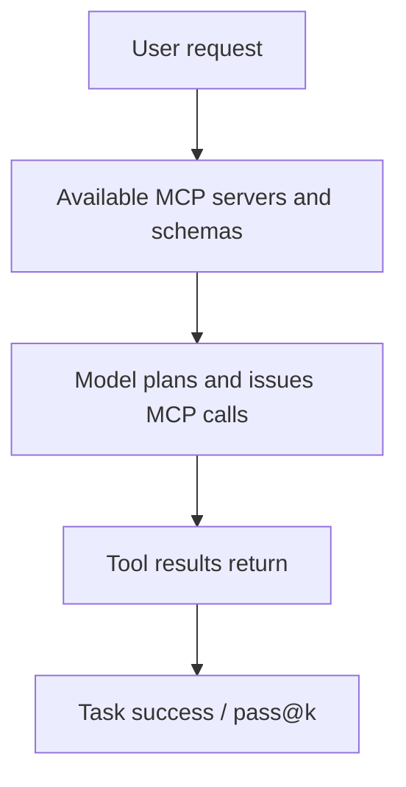

# Benchmark Card: MCPMark

> Concise English edition. The Chinese version currently contains fuller environment and task-boundary notes.

## 1. One-Line Definition

`MCPMark` is a benchmark built specifically for `Model Context Protocol` tool use. It asks whether a model can choose the right MCP server, perform the right sequence of tool calls, and complete real MCP-style tasks successfully.

## 2. Quick Reference

| Property | Value |
| -------- | ----- |
| Full Name | MCPMark |
| Released | 2025-08 |
| Creator | EvalSys |
| Dataset Size | 127 standard tasks across 5 MCP services |
| Covered Services | Notion / GitHub / Filesystem / Postgres / Playwright |
| Input Format | User request plus MCP server capabilities and current state |
| Output Format | Tool-call sequence, arguments, and final task result |
| Scoring | `pass@k` / success rate |
| Category | `General Agent` > `MCP Tool Use` |
| Risk Tags | Server drift / Environment setup dependence / Fast ecosystem change / Early coverage |
| Leaderboard | https://www.mcpmark.ai/leaderboard |
| Repo | https://github.com/eval-sys/mcpmark |
| Paper | https://arxiv.org/abs/2509.24002 |

## 3. Navigation

### 3.1 Core Process

### 3.2 If You Only Remember Three Things

- This is one of the few benchmarks built directly around the **native MCP ecosystem**.
- It is especially useful if your product really depends on MCP instead of generic tool calling.
- Interpretation depends heavily on server versions and environment setup, because the ecosystem is still moving quickly.

## 4. How It Works

### 4.1 What It Actually Tests

MCPMark mainly tests:

1. whether the model understands the capability boundaries exposed by MCP servers
2. whether it can pick the right server and tool in multi-step tasks
3. whether it converts tool results into a correct final task outcome

Its core contribution is to move evaluation from generic function calling into protocol-native MCP usage.

### 4.2 What the Input Looks Like

A typical sample contains:

- a user task
- a set of available MCP servers
- capability definitions for each server
- runtime context and tool results

Compared with older function-calling benchmarks, the tool surface is organized the way real MCP deployments are organized.

### 4.3 What the Model Must Output

The model must produce executable tool behavior:

- choose the correct MCP server
- choose the correct tool
- fill parameters correctly
- chain calls correctly across multiple steps

The benchmark cares about whether the task is actually completed, not whether the reasoning text looks good.

### 4.4 How the Data Was Built

The public repo makes three design choices clear:

1. it uses real MCP-server ecosystems rather than abstract fake schemas
2. it covers multiple servers to avoid becoming a single-tool benchmark
3. it reports `pass@k` because MCP-agent behavior has real variance

That makes its relationship to BFCL V4 easy to understand:

- BFCL V4 is broader across tool-use styles
- MCPMark is narrower but more protocol-native

### 4.5 Dataset Scale and Distribution

| Dimension | Value |
| --------- | ----- |
| Tasks | 127 |
| MCP services | 5 |
| Task style | Native MCP workflows |
| Main outcome signal | `pass@k` / success rate |

It is useful for screening MCP readiness more than for declaring universal agent superiority.

### 4.6 How It Is Scored

The scoring logic is straightforward:

1. give the model an MCP task
2. allow calls to the relevant servers
3. check whether the final task succeeds
4. aggregate success rate or `pass@k`

`pass@k` is valuable because it distinguishes total failure from low single-run stability.

## 5. Reliability

### 5.1 What It Does Not Test

- GUI automation in general
- long project execution
- open-web research
- non-MCP tool ecosystems in full

### 5.2 Difficulty Signal

Its difficulty comes from:

- different capability boundaries across real servers
- multi-step planning and parameter filling
- the fact that a correct tool call sequence is still not enough unless the final state is correct

That makes it more realistic than static schema-only benchmarks for MCP-centric products.

### 5.3 Known Defects and Disputes

- The MCP ecosystem changes quickly, so environment consistency matters a lot.
- Coverage is still early-stage: 127 tasks and 5 services are useful, but not exhaustive.
- Protocol-native tool use is still only one layer of a larger agent stack.

### 5.4 Risk Table

| Risk Type | Level | Why |
| --------- | ----- | --- |
| Ecosystem drift | High | MCP servers and schemas evolve quickly |
| Coverage limits | Medium | Current task and server count is still modest |
| Environment dependence | Medium | Reproduction quality depends on setup fidelity |
| Real-world transfer risk | Medium | It does not cover the full long-chain agent stack |

## 6. Should I Use It

### 6.1 Good Use Cases

**Good for:**

- MCP tool stacks and MCP agents
- comparing protocol-native MCP performance
- turning "supports MCP" from a marketing phrase into a measurable capability

**Not enough on its own for:**

- overall agent rankings
- long-horizon workflow evaluation

### 6.2 Verdict

**Recommended.** It is one of the most useful protocol-specific cards to keep if your product actually runs on MCP. It should not be mistaken for a complete agent benchmark, but it is highly relevant inside its intended scope.
