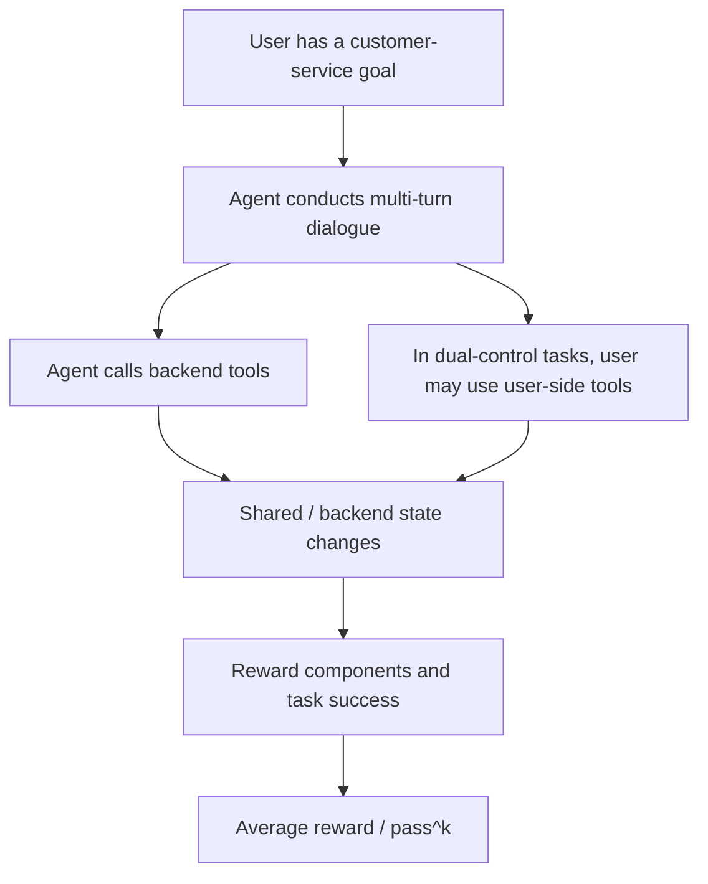

# Benchmark Card: TAU2-Bench

> Current scope note: the original `tau^2` paper is a telecom dual-control benchmark. The current `sierra-research/tau2-bench` repository has evolved into the broader `tau-bench` / `tau^3` framework with text, voice, knowledge-retrieval, and task-quality updates.

## 1. One-Line Definition

`TAU2-Bench` evaluates whether a conversational agent can complete realistic customer-service tasks, not just call tools. Its distinctive `tau^2` contribution is a dual-control telecom environment where both the AI agent and the simulated user can act on shared state.

## 2. Quick Reference

| Property | Value |
| -------- | ----- |
| Full Name | `tau^2-Bench`: Evaluating Conversational Agents in a Dual-Control Environment |
| First Public Paper | arXiv submitted on 2025-06-09 |
| Current Paper Status | ICML 2026 spotlight page on OpenReview |
| Creator | Sierra / University of Toronto researchers |
| Original Core Domain | Telecom technical support with dual-control user tools |
| Current Repo Domains | `mock`, `airline`, `retail`, `telecom`, `banking_knowledge` |
| Current Text Task Counts | `telecom`: 2,285 full / 114 base; `retail`: 114; `airline`: 50; `banking_knowledge`: 97; `mock`: 10 |
| Knowledge Corpus | `banking_knowledge`: 698 policy/procedure documents in the current repo |
| Modalities | Text half-duplex; voice full-duplex via realtime audio providers |
| Input Format | User goal, policy or knowledge context, tools, dialogue state, and backend/user environment state |
| Output Format | Multi-turn dialogue, tool calls, backend state changes, and final task outcome |
| Scoring | Average reward and `pass^k` over task success |
| Category | `General Agent` > `Customer-Service Task Completion` |
| Risk Tags | Version mixing / Simulator dependence / Domain transfer / Retrieval and voice protocol dependence |
| Repo | https://github.com/sierra-research/tau2-bench |
| Paper | https://arxiv.org/abs/2506.07982 |
| OpenReview | https://openreview.net/forum?id=OC2z7iSQKa |
| Leaderboard | https://www.taubench.com/ |

## 3. Navigation

### 3.1 Core Process

### 3.2 If You Only Remember Three Things

- The original `tau^2` contribution is not "more function calls"; it is **dual control**, where the agent must guide a user who can also act in the world.
- The current repo is broader than the original telecom paper: it now includes classic `tau-bench` domains, the `banking_knowledge` retrieval domain, voice full-duplex mode, and task-quality fixes.
- Scores are most useful when the exact domain, split, modality, retrieval config, user simulator, and number of trials are reported.

## 4. How It Works

### 4.1 What It Actually Tests

TAU2-Bench is best read as an end-to-end customer-service agent evaluation. It tests whether a model can:

1. understand the user's goal and constraints
2. maintain state across a dialogue
3. choose and sequence tools correctly
4. communicate enough information for the user to act
5. leave the backend or shared environment in the right final state

The dual-control telecom setting adds a harder coordination problem: the agent cannot simply mutate everything itself. It must sometimes instruct the user to inspect or change the user-side environment.

### 4.2 What the Input Looks Like

A task can include:

- a user scenario and reason for contact
- domain policy, workflow, or knowledge documents
- agent-side business tools
- user-side tools in telecom dual-control tasks
- initial database or device state
- evaluation criteria that define the target outcome

The current repository separates domains and modes. The text setup is turn-based; the voice setup is full-duplex and uses realtime audio APIs.

### 4.3 What the Model Must Output

The model must produce executable customer-service behavior:

- natural-language replies to the user
- clarifying questions when needed
- correct tool calls and arguments
- state-changing backend actions
- final resolution, refusal, or transfer consistent with policy

In the knowledge domain, the agent must also find relevant documents before acting. In voice mode, it must handle a more realistic live-conversation channel.

### 4.4 How the Data Was Built

There are three layers that should not be conflated:

| Layer | What It Means |
| ----- | ------------- |
| Original `tau-bench` | Airline and retail style customer-service tasks with tool use, policy following, simulated users, and `pass^k` evaluation |
| `tau^2-Bench` | Adds a telecom dual-control domain where both agent and user have tools over a shared environment |
| Current `tau^3` repo direction | Adds knowledge retrieval, voice full-duplex evaluation, and broad task-quality fixes |

The local `/mnt/hdd/work/temp/tau2-bench` checkout confirms the current task files contain 2,285 telecom tasks, 114 retail tasks, 50 airline tasks, 97 banking-knowledge tasks, and 10 mock tasks. It also contains 698 `banking_knowledge` document JSON files.

### 4.5 Dataset Scale and Distribution

| Component | Current Repo Count / Scope | Main Use |
| --------- | -------------------------- | -------- |
| `telecom` | 2,285 full tasks; `base` split has 114 | Dual-control technical support |
| `retail` | 114 tasks | Classic customer-service tool use |
| `airline` | 50 tasks | Classic customer-service tool use |
| `banking_knowledge` | 97 tasks + 698 documents | Retrieval plus transactional tool use |
| `mock` | 10 tasks | Lightweight testing |
| Voice mode | Available for supported domains through audio-native providers | Full-duplex voice-agent evaluation |

The public leaderboard and submission docs emphasize using the `base` split for standard evaluation, plus multiple trials when possible.

### 4.6 How It Is Scored

The current code computes:

1. task reward from the task's configured reward components
2. average reward across simulations
3. `pass^k`, computed from repeated trials per task

Important scoring nuance from the local `docs/evaluation.md`: for airline, retail, and telecom, `evaluation_criteria.actions` is a reference trajectory used to derive or diagnose the target state, not necessarily a mandatory script. The reward is gated by the task's `reward_basis`; matching the exact reference action sequence only becomes a hard requirement when `ACTION` appears in `reward_basis`.

## 5. Reliability

### 5.1 What It Does Not Test

- open-web research
- GUI automation
- code repair
- long-running cross-application enterprise workflows
- arbitrary non-customer-service agent behavior

### 5.2 Difficulty Signal

Its signal is valuable because many failures look like real deployment failures:

- the agent solves the wrong customer goal
- the agent knows the right tool but asks the user badly
- the user-side state changes differently from what the agent assumes
- the backend state is almost correct but violates policy
- the model retrieves the right policy document but misapplies it
- a voice interaction fails because turn-taking or interruption handling breaks the task

### 5.3 Known Defects and Disputes

- Version names are easy to mix up: `tau-bench`, `tau^2-Bench`, and current `tau^3` repo features do not describe the same evaluation slice.
- The original `tau^2` dual-control claim is strongest for telecom technical support, not every domain in the repository.
- User simulators are still simulators. They improve repeatability but do not fully capture real customer behavior.
- Knowledge and voice results depend on extra protocol choices such as retrieval configuration, audio provider, speech complexity, and hallucination retry policy.
- Task fixes change the interpretation of old scores. A result from an older checkout may not be comparable to a result from the current repo.

### 5.4 Local Diff Notes

The local `/mnt/hdd/work/temp/tau2-bench` diff includes project notes and HTML reports from a telecom `base`-split run. Treat them as local debugging observations, not official benchmark claims. The useful signals are:

- some runs showed high human-transfer behavior, especially when the agent chose transfer before gathering enough customer or device state
- tool-call argument errors appeared in the analysis, such as confusing location-like strings or unknown values with phone-number fields
- the notes call out user-simulator misclassification risk: a simulated user may believe the task is solved before the environment is actually in the target state

These observations support the risk framing above: TAU2-Bench is useful precisely because it exposes communication, coordination, and environment-state failures, but result interpretation must include scaffold and run configuration.

### 5.5 Risk Table

| Risk Type | Level | Why |
| --------- | ----- | --- |
| Version mixing | High | The repo now covers more than the original `tau^2` paper |
| Domain transfer risk | Medium to High | Customer-service tasks do not imply general open-world agency |
| Simulator dependence | Medium | User behavior is generated and constrained by the harness |
| Environment dependence | Medium | Tool, split, retrieval, voice, and retry configs affect results |
| Old-score comparability | Medium | The current repo includes task fixes and expanded modalities |

## 6. Should I Use It

### 6.1 Good Use Cases

**Good for:**

- customer-service and transaction-completion agents
- testing whether tool use actually closes a task
- studying dual-control coordination between agent and user
- comparing retrieval methods for knowledge-heavy support tasks
- evaluating voice agents under realistic full-duplex constraints

**Not enough on its own for:**

- universal agent rankings
- open-web research claims
- coding-agent capability claims
- GUI or desktop automation claims

### 6.2 Verdict

**Recommended with scope controls.** TAU2-Bench is one of the more realistic customer-service agent evaluations because it checks task closure, backend state, and, in telecom, user-agent coordination. Use it only with explicit domain, split, version, modality, retrieval config, and trial-count reporting.

## 7. Source Audit

| Claim | Status | Source |
| ----- | ------ | ------ |
| `tau^2` paper submitted on 2025-06-09 and titled "Evaluating Conversational Agents in a Dual-Control Environment" | Confirmed | arXiv `2506.07982`; OpenReview ICML 2026 page |
| Core `tau^2` contribution is telecom dual-control with both agent and user tools | Confirmed | arXiv abstract and OpenReview summary |
| Current repo includes `mock`, `airline`, `retail`, `telecom`, and `banking_knowledge` domains | Confirmed | Official GitHub README |
| Current repo adds `banking_knowledge`, voice full-duplex, and task-quality fixes | Confirmed | Official GitHub README and release notes |
| Current local checkout task counts are `telecom=2285`, `retail=114`, `airline=50`, `banking_knowledge=97`, `mock=10` | Confirmed from local files | `/mnt/hdd/work/temp/tau2-bench/data/tau2/domains/*/tasks.json` |
| `banking_knowledge` has 698 policy/procedure documents | Confirmed | Local document count; official GitHub changelog |
| Local telecom analysis notes report high transfer behavior, tool-argument errors, and user-simulator misclassification risk | Partially supported as local run analysis, not official benchmark metadata | `/mnt/hdd/work/temp/tau2-bench/PROJECT_GUIDE.md`; local HTML reports |
