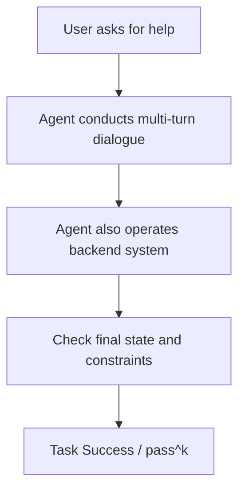

# Benchmark Card: TAU2-Bench

> Concise English edition. The Chinese version currently contains fuller domain notes and public-task context.

## 1. One-Line Definition

`TAU2-Bench` is a business-workflow-style agent benchmark that measures whether a model can handle multi-turn customer-service tasks while correctly operating backend systems at the same time.

## 2. Quick Reference

| Property | Value |
| -------- | ----- |
| Full Name | τ²-Bench |
| Released | 2025-06 |
| Creator | Sierra |
| Core Domain | Telecom customer service |
| Input Format | User request plus tools, dialogue context, and environment state |
| Output Format | Multi-turn dialogue, backend actions, and final task state |
| Scoring | Task success, with support for `pass^k` evaluation |
| Category | `General Agent` > `Real-World Task Completion` |
| Risk Tags | Simulator realism / Narrow domain / Environment dependence / Rapid protocol evolution |
| Repo | https://github.com/sierra-research/tau2-bench |
| Paper | https://arxiv.org/abs/2506.07982 |
| Leaderboard | https://www.taubench.com/ |

## 3. Navigation

### 3.1 Core Process

### 3.2 If You Only Remember Three Things

- It measures **dialogue plus backend action** together, which is broader than plain function calling.
- It is closer to actual business task closure than BFCL-style schema tests.
- It is still a vertical-domain benchmark, so it should not be used as a universal agent score.

## 4. How It Works

### 4.1 What It Actually Tests

TAU2-Bench cares about three linked abilities:

1. understanding the user's real intent
2. clarifying and progressing the task through dialogue
3. making the backend state actually correct

That means many failures are not simple parameter errors. They come from miscommunication, lost state, or incorrect business logic.

### 4.2 What the Input Looks Like

A task typically includes:

- a user request
- multi-turn conversation history
- business tools or APIs
- backend state such as account, order, or plan information

The official term `dual-control` refers to the fact that the agent must manage both the user-facing conversation and the system-facing actions.

### 4.3 What the Model Must Output

The model must produce full task behavior:

- replies to the user
- clarifying questions when needed
- backend operations
- a final result that actually satisfies the task

This makes it much more about end-to-end task closure than about one-shot tool selection.

### 4.4 How the Data Was Built

The benchmark is organized around realistic telecom customer-service tasks and explicitly models the dual control of:

- conversation
- backend operations

The official implementation also supports repeated runs and `pass^k`, acknowledging that agent behavior has meaningful variance.

### 4.5 Dataset Scale and Distribution

| Dimension | Value |
| --------- | ----- |
| Domain | Telecom customer service |
| Interaction style | Multi-turn dialogue plus backend actions |
| Main metrics | Single-run success and `pass^k` |
| Design goal | State tracking, business constraints, task closure |

The benchmark is more about realistic workflow shape than about giant task count.

### 4.6 How It Is Scored

The scoring logic centers on:

1. whether the task is completed
2. whether the backend state is correct
3. whether business constraints were violated

`pass^k` matters because it separates:

- "never succeeds"
- "can succeed, but only inconsistently"

## 5. Reliability

### 5.1 What It Does Not Test

- open-web retrieval
- GUI automation
- code repair
- broad cross-industry agent workflows

### 5.2 Difficulty Signal

Its failures are realistic:

- user phrasing varies
- multi-turn state is easy to lose
- one bad backend action can invalidate the whole task
- many tasks require more than one tool call

That makes it more product-shaped than many general tool-use benchmarks.

### 5.3 Known Defects and Disputes

- The domain is still narrow and centered on telecom customer service.
- Simulated users are not real users and cannot fully reproduce the noise of real service interactions.
- Results depend on sampling budget, tool configuration, and runtime policy.

### 5.4 Risk Table

| Risk Type | Level | Why |
| --------- | ----- | --- |
| Domain transfer risk | High | The benchmark is strongly tied to telecom service workflows |
| Simulator bias | Medium | Synthetic users are not identical to real customer behavior |
| Environment dependence | Medium | Runtime configuration affects results |
| Protocol evolution | Medium | The benchmark family is still young and moving quickly |

## 6. Should I Use It

### 6.1 Good Use Cases

**Good for:**

- customer-service and transaction-completion agents
- measuring whether tasks really close end to end
- complementing function-calling benchmarks with a more workflow-like task shape

**Not enough on its own for:**

- general-agent rankings
- open-world agent claims

### 6.2 Verdict

**Conditionally recommended.** It is valuable because it binds conversation and backend execution together, but it is best treated as a strong vertical benchmark rather than a universal agent exam.
