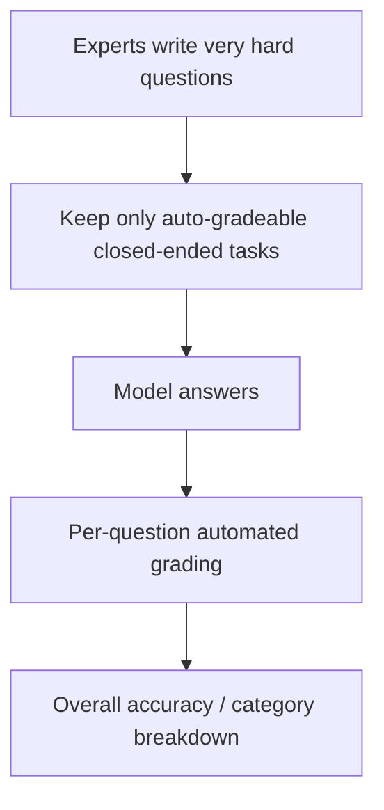

# Benchmark Card: HLE

> Concise English edition. The Chinese version currently contains fuller notes on `HLE-Verified`.

## 1. One-Line Definition

`HLE` (`Humanity's Last Exam`) is an ultra-difficult closed-ended benchmark aimed at frontier models. It uses expert-written questions across many domains, including some multimodal cases, and focuses on whether a model can still reason reliably near expert-level boundaries.

## 2. Quick Reference

| Property | Value |
| -------- | ----- |
| Full Name | Humanity's Last Exam |
| Released | 2025-01 |
| Creator | Center for AI Safety / Scale AI and collaborators |
| Dataset Size | 2,500 questions |
| Source | Expert-written high-difficulty closed-ended problems |
| Input Format | Text questions plus some image-based cases |
| Output Format | Short answer, numeric answer, or option answer |
| Scoring | Automated per-question grading |
| Category | `Hard Reasoning` > `Frontier Closed-Ended Reasoning` |
| Risk Tags | Answer ambiguity / Version evolution / Gradual contamination / Closed-ended bias |
| Official Page | https://www.lastexam.ai/ |
| Dataset | https://huggingface.co/datasets/cais/hle |
| Paper | https://arxiv.org/abs/2501.14249 |
| Follow-up Verified Version | https://futureoflife.org/project/hle-verified/ |

## 3. Navigation

### 3.1 Core Process

### 3.2 If You Only Remember Three Things

- HLE is meant to stress **frontier models**, not average chat systems.
- Its core constraint is that every problem must still be **automatically gradeable**, no matter how hard it is.
- It is best interpreted together with `HLE-Verified`, because very hard problems naturally raise more answer-boundary and data-hygiene questions.

## 4. How It Works

### 4.1 What It Actually Tests

HLE tries to measure:

1. whether a model can parse dense expert-level questions
2. whether it can combine knowledge and reasoning across difficult domains
3. whether it still succeeds when easy benchmark-style shortcuts disappear

It is a pressure test for the remaining headroom above already-strong public knowledge benchmarks.

### 4.2 What the Input Looks Like

Typical HLE questions are:

- short but information-dense
- domain-specific
- sometimes formula- or image-heavy
- designed to end in a short, checkable final answer

That differs from ordinary knowledge benchmarks, where the dominant difficulty is often broader recall rather than very deep reasoning pressure.

### 4.3 What the Model Must Output

The model must return a **gradeable final answer**. Depending on the task, that can be:

- an option
- a number
- a short standardized answer string

So HLE is fundamentally a closed-ended benchmark, not an open-ended essay or research-writing benchmark.

### 4.4 How the Data Was Built

Public materials emphasize:

- problems contributed by experts
- a deliberate goal of very high difficulty
- retention of only questions that can still be graded automatically
- coverage across multiple disciplines, with some multimodal tasks

This is the benchmark's central tradeoff: it wants both extreme difficulty and scalable evaluation.

### 4.5 Dataset Scale and Distribution

| Dimension | Value |
| --------- | ----- |
| Total size | 2,500 |
| Format | Short-answer / option / rule-checkable closed-ended tasks |
| Target difficulty | Frontier-model ceiling test |
| Modalities | Mostly text, with some multimodal items |

It is useful when `MMLU-Pro` and `GPQA` no longer feel hard enough.

### 4.6 How It Is Scored

The key rule is simple: **every question must be auto-gradeable**.

Typical scoring flow:

1. the model outputs a final answer
2. the answer is normalized according to the task type
3. grading uses exact match, numeric comparison, or a task-specific checker
4. results are aggregated into overall accuracy

## 5. Reliability

### 5.1 What It Does Not Test

- long-form argument writing
- tool use or web search
- multi-turn negotiation
- long-horizon real-world task execution

### 5.2 Difficulty Signal

The difficulty signal is direct:

- the benchmark was designed to pressure frontier models
- questions are expert-authored, not just recycled exam items
- many tasks lack obvious template shortcuts

That makes it a natural next layer above already-strong MCQ knowledge benchmarks.

### 5.3 Known Defects and Disputes

- Very hard questions are more likely to create answer-boundary ambiguity.
- The closed-ended design is necessary for automation but compresses the real research process.
- Once a frontier benchmark becomes widely known, contamination and protocol pressure arrive quickly.

### 5.4 Risk Table

| Risk Type | Level | Why |
| --------- | ----- | --- |
| Answer ambiguity | High | Extremely hard questions are harder to normalize cleanly |
| Version evolution | Medium | HLE and HLE-Verified already imply an evolving benchmark family |
| Closed-ended bias | Medium | Auto-grading constrains how open the tasks can be |
| Gradual contamination | Medium | Public frontier benchmarks age quickly once widely cited |

## 6. Should I Use It

### 6.1 Good Use Cases

**Good for:**

- checking frontier-level knowledge and reasoning ceilings
- complementing `MMLU-Pro` and `GPQA`
- comparing hard closed-ended reasoning without an LLM judge

**Not enough on its own for:**

- real-world agent claims
- open-ended research ability claims

### 6.2 Verdict

**Recommended.** It is one of the most useful hard-reasoning cards to keep, but you should read it together with versioning and data-hygiene caveats rather than as a timeless ground-truth score.
