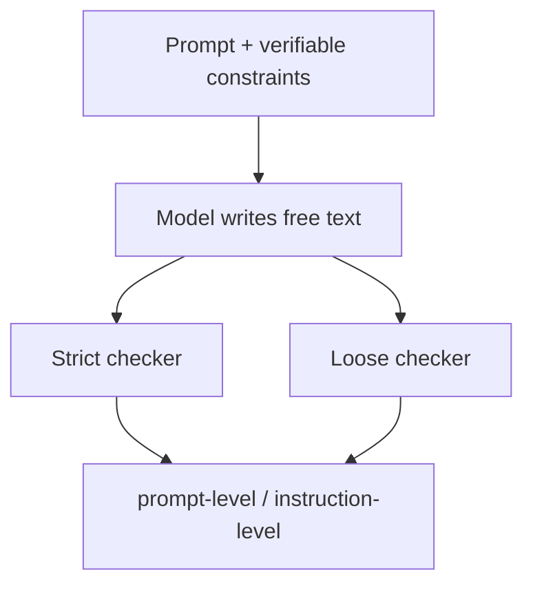

# Benchmark Card: IFEval

> Concise English edition. The Chinese version currently contains fuller implementation notes.

## 1. One-Line Definition

`IFEval` is an instruction-following benchmark from Google Research that checks whether a model actually satisfies explicit, programmatically verifiable constraints such as length, format, keywords, language choice, and forbidden tokens.

## 2. Quick Reference

| Property | Value |
| -------- | ----- |
| Full Name | Instruction-Following Evaluation for Large Language Models |
| Released | 2023-11 |
| Creator | Google Research |
| Dataset Size | 541 prompts |
| Instruction Types | 25 verifiable instruction categories |
| Input Format | Natural-language prompt with one or more explicit constraints |
| Output Format | Free-form text |
| Scoring | Rule-based `strict` and `loose` checking |
| Category | `Instruction Following` > `Verifiable Constraint Satisfaction` |
| Risk Tags | English bias / Surface compliance / Content-quality blind spots / Limited taxonomy |
| Related Extension | MaXIFE for multilingual instruction-following checks |
| Paper | https://huggingface.co/papers/2311.07911 |
| Official Code | https://github.com/google-research/google-research/tree/master/instruction_following_eval |
| Data | https://github.com/google-research/google-research/tree/master/instruction_following_eval/data |

## 3. Navigation

### 3.1 Core Process

### 3.2 If You Only Remember Three Things

- Its biggest strength is that most constraints are **programmatically checkable**, so it does not depend on an LLM judge.
- It measures "did the model do what it was told," not "was the content insightful or true."
- It is extremely good at exposing the common failure mode of sounding compliant while still missing one instruction.

## 4. How It Works

### 4.1 What It Actually Tests

IFEval asks whether a model can:

1. identify explicit constraints inside a prompt
2. satisfy those constraints in the final response
3. satisfy multiple constraints at once instead of dropping one halfway through

Typical failures it catches include:

- writing one paragraph when the prompt asked for three
- producing prose when the prompt asked for JSON
- using banned words anyway
- switching back to English when the response language was specified

### 4.2 What the Input Looks Like

Inputs are normal prompts, but they contain **verifiable constraints**. The official registry includes clusters such as:

- keyword
- language
- length constraints
- detectable content
- detectable format
- start / end
- case
- punctuation

Public-style example:

> Write a 300+ word summary ... Do not use any commas and highlight at least 3 sections in markdown.

That single prompt bundles multiple independently checkable constraints.

### 4.3 What the Model Must Output

The model outputs free text. It can be prose, a list, JSON, or another structured format. What matters is whether the output satisfies every required constraint.

### 4.4 How the Data Was Built

The benchmark includes:

- 541 prompts
- 25 instruction types
- prompt-level and instruction-level reporting

The repo structure is important because it makes the benchmark mechanics very explicit:

- `instructions_registry.py` defines the taxonomy
- `evaluation_lib.py` defines strict and loose checks
- `evaluation_main.py` reports prompt-level and instruction-level results

### 4.5 Dataset Scale and Distribution

| Dimension | Value |
| --------- | ----- |
| Prompts | 541 |
| Instruction types | 25 |
| Report granularity | prompt-level and instruction-level |
| Protocol variants | strict and loose |

Its value comes more from clean constraint design than from raw dataset size.

### 4.6 How It Is Scored

The official implementation has two main protocols:

#### Strict

- check the original response directly
- compute a boolean for each instruction
- count the prompt as passing only if every instruction passes

#### Loose

- apply light normalization first
- retry validation after removing mild formatting noise
- tolerate some presentation artifacts

The two main reported metrics are:

- prompt-level pass rate
- instruction-level pass rate

## 5. Reliability

### 5.1 What It Does Not Test

- factual correctness
- insightfulness
- complex tool use
- multi-turn negotiation
- open-ended content quality

### 5.2 Difficulty Signal

Its difficulty is realistic because the failure mode is realistic: models frequently miss one condition when a prompt bundles several. That makes IFEval operationally important even though the tasks look simple on paper.

### 5.3 Known Defects and Disputes

- It is heavily biased toward surface-verifiable constraints, so bland content can still score well.
- The benchmark is mostly English-centric.
- `strict` and `loose` scores are not interchangeable because loose mode intentionally repairs mild formatting noise before checking.

### 5.4 Risk Table

| Risk Type | Level | Why |
| --------- | ----- | --- |
| Content-quality blind spots | High | Formally correct but weak content can still pass |
| English bias | Medium | The constraint design and checkers are mostly English-oriented |
| Coverage limits | Medium | 25 instruction types are useful but far from exhaustive |
| Protocol mixing | Medium | Strict and loose numbers should not be compared as if identical |

## 6. Should I Use It

### 6.1 Good Use Cases

**Good for:**

- chat assistants and writing tools
- measuring whether a model actually obeys explicit requests
- turning instruction following into a reproducible metric

**Not enough on its own for:**

- overall answer quality
- truthfulness
- multilingual instruction-following claims

### 6.2 Verdict

**Recommended.** It is an unusually practical baseline for "obedience under explicit constraints." It will not tell you whether the answer is smart, but it is very good at telling you whether the model actually did what it was asked to do.
