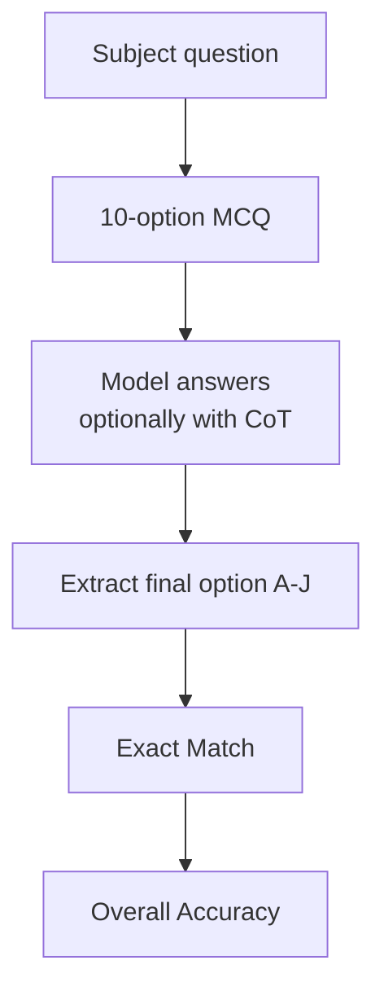

# Benchmark Card: MMLU-Pro

> Concise English edition. The Chinese version currently contains fuller source notes and controversy labels.

## 1. One-Line Definition

`MMLU-Pro` is a strengthened version of the original `MMLU` that keeps the multi-subject knowledge setting but makes the questions harder, especially by expanding many items from 4 choices to 10 and increasing reasoning burden.

## 2. Quick Reference

| Property | Value |
| -------- | ----- |
| Full Name | MMLU-Pro: A More Robust and Challenging Multi-Task Language Understanding Benchmark |
| Released | 2024-06 |
| Creator | TIGER Lab / University of Waterloo team |
| Dataset Size | 12,000+ questions |
| Coverage | 14 subject areas |
| Input Format | Multiple-choice question, typically with 10 options |
| Output Format | Final answer letter or answer-marked text |
| Scoring | Answer extraction followed by exact match / accuracy |
| Category | `Knowledge` > `Robust Multi-Subject QA` |
| Risk Tags | Training contamination / MCQ saturation / Prompt sensitivity / Answer extraction effects |
| Official Repo | https://github.com/TIGER-AI-Lab/MMLU-Pro |
| Paper | https://arxiv.org/abs/2406.01574 |
| Dataset | https://huggingface.co/datasets/TIGER-Lab/MMLU-Pro |
| Leaderboard | https://huggingface.co/spaces/TIGER-Lab/MMLU-Pro |

## 3. Navigation

### 3.1 Core Process

### 3.2 If You Only Remember Three Things

- It is substantially harder than original `MMLU`, mainly because the option count expands and the questions lean more on reasoning.
- It is still a multiple-choice benchmark, so a high score is not the same thing as solving open-ended expert reasoning.
- The official repo makes answer extraction and prompt style part of the story, which means leaderboard numbers need protocol context.

## 4. How It Works

### 4.1 What It Actually Tests

MMLU-Pro mainly tests two things:

1. broad cross-subject knowledge coverage
2. stable multi-step reasoning under lower random-hit probability

Its design is explicitly meant to reduce easy guessing and reduce score fragility under small prompt changes.

### 4.2 What the Input Looks Like

Each sample is a standard multiple-choice question with:

- a question stem
- a set of answer options
- a correct answer label

The important change versus original MMLU is that many questions now use **10 options**, with evaluation scripts extracting answers from `A-J`.

Public-style example:

> Question: In a database system, which of the following is NOT a property of ACID transactions?  
> Options include A through J.  
> Answer: E

### 4.3 What the Model Must Output

At the benchmark-definition level, the model only needs to output the correct option.

In practice, the official implementation also supports responses that include reasoning, as long as the final option can be extracted reliably. That means a small amount of answer-format engineering still matters.

### 4.4 How the Data Was Built

The paper and repo emphasize three design choices:

- 12,000+ questions
- 14 subject areas, including science, law, math, and computer science
- a goal of making the benchmark more reasoning-heavy and less prompt-fragile than original MMLU

The repo also makes local-model and API-model evaluation more explicit than many older MCQ benchmarks.

### 4.5 Dataset Scale and Distribution

| Dimension | Value |
| --------- | ----- |
| Total size | 12,000+ |
| Subjects | 14 |
| Question type | Multiple choice |
| Typical options | 10 |
| Prompt study | 24 prompt styles in the paper |

This makes it useful both as a broad knowledge baseline and as a prompt-robustness check.

### 4.6 How It Is Scored

Typical evaluation flow:

1. generate an answer
2. extract the final answer letter
3. compare it with the reference answer
4. aggregate overall and per-subject accuracy

The official implementation uses multi-step extraction fallback, which makes scoring more robust than raw string matching, but not completely output-format-neutral.

## 5. Reliability

### 5.1 What It Does Not Test

- open-ended long-form writing
- tool use or retrieval
- multi-turn clarification
- real-world execution
- creative problem solving outside MCQ structure

### 5.2 Difficulty Signal

The official paper reports three useful signals:

- many models drop roughly **16% to 33%** relative to original MMLU
- prompt-style variance is around **2%**, lower than the common **4% to 5%** swings seen in older MMLU setups
- chain-of-thought helps more consistently here than in classic MMLU

So the upgrade is not cosmetic. It does make the benchmark meaningfully harder and more reasoning-dependent.

### 5.3 Known Defects and Disputes

- MCQ benchmarks still reward some test-taking tactics more than open-ended reasoning would.
- Answer extraction still introduces small implementation-level variance.
- Different harnesses, especially for thinking models, may not reproduce identical numbers.

### 5.4 Risk Table

| Risk Type | Level | Why |
| --------- | ----- | --- |
| Training contamination | Medium | Academic-style questions can overlap with training data |
| Score saturation | Medium | Top models will eventually bunch up on MCQ tasks |
| Output-format sensitivity | Medium | Answer extraction is robust but not irrelevant |
| Real-world transfer risk | Medium | High MCQ scores do not substitute for agent or open-task ability |

## 6. Should I Use It

### 6.1 Good Use Cases

**Good for:**

- broad knowledge and subject reasoning baselines
- replacing original MMLU with a harder MCQ signal
- prompt and chain-of-thought robustness comparisons

**Not enough on its own for:**

- real-world agent judgment
- open-ended expert reasoning
- product-style capability claims

### 6.2 Verdict

**Recommended.** It is one of the most useful "knowledge base" benchmarks to keep, as long as you interpret it as a stronger multiple-choice benchmark rather than a total measure of intelligence.
