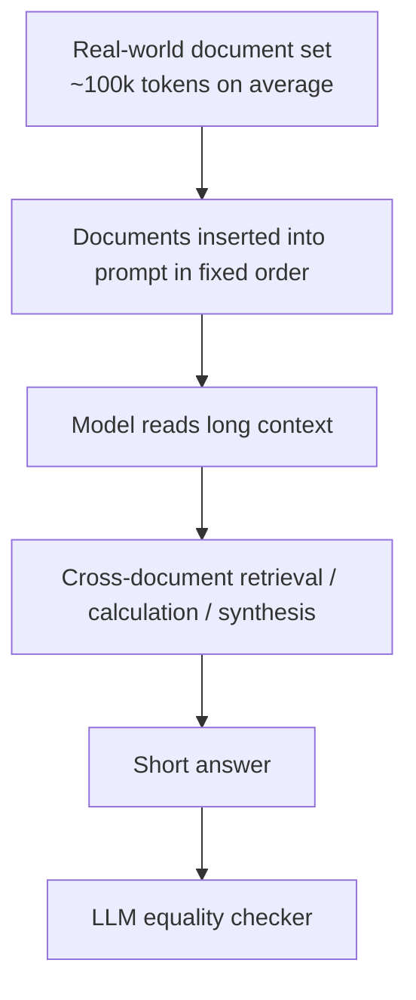

# Benchmark Card: AA-LCR

> Concise English edition. The Chinese version contains fuller protocol notes.

## 1. One-Line Definition

`AA-LCR`, short for `Artificial Analysis Long Context Reasoning`, is a long-context reasoning benchmark built from real-world multi-document sets averaging about 100k input tokens. The questions require extraction, comparison, calculation, and synthesis across documents rather than direct lookup.

## 2. Quick Reference

| Property | Value |
| -------- | ----- |
| Full Name | Artificial Analysis Long Context Reasoning Benchmark |
| Short Name | `AA-LCR` |
| Creator | Artificial Analysis |
| Dataset Size | 100 questions, 30 document sets, 234 documents |
| Context Length | Average document set: about 99,325 tokens; total prompt tokens: about 2,979,757 |
| Document Types | company reports, industry reports, government consultations, academic papers, legal documents, marketing materials, survey reports |
| Input | multiple full-text real-world documents plus one question |
| Output | short answer, number, entity list, or verifiable conclusion |
| Scoring | LLM-based equality checker; the dataset card specifies Qwen3 235B A22B 2507 Non-reasoning |
| Category | `Long Context` > `Multi-Document Long-Context Reasoning` |
| Risk Tags | small sample size / judge dependence / context-reasoning entanglement / document-order sensitivity / public-document contamination |
| Evaluation Page | https://artificialanalysis.ai/evaluations/artificial-analysis-long-context-reasoning |
| Dataset | https://huggingface.co/datasets/ArtificialAnalysis/AA-LCR |

## 3. Navigation

### 3.1 Core Process

### 3.2 If You Only Remember Three Things

- It is harder than needle retrieval because most answers require reasoning across information sources.
- It is closer to knowledge-work document analysis than synthetic long-context stress tests.
- It has only 100 questions, so it is best used as a high-quality stress test, not as a standalone ranking authority.

## 4. How It Works

### 4.1 What It Actually Tests

AA-LCR tests whether a model can:

1. locate evidence across multiple long documents
2. extract tables, definitions, entities, and numeric values
3. compare financial, legal, regulatory, or research facts
4. perform lightweight to moderate calculations
5. synthesize scattered evidence into a concise answer

The main signal is not merely whether the model accepts a long prompt. It is whether the model can reason over realistic long materials.

### 4.2 What the Input Looks Like

For each question, the relevant documents are loaded into one prompt. The dataset card specifies that document order follows `data_source_filenames`, and each document is wrapped between document delimiters.

That means prompt format, extracted text quality, and document order are part of the protocol. A credible result should report whether the official extracted text and prompt template were used.

### 4.3 Task Types

The dataset card describes tasks such as:

- financial analysis and comparative metrics
- legal and regulatory interpretation
- multi-document synthesis
- temporal and conditional logic
- research classification and document identification

These tasks force both retrieval and reasoning. Keyword matching alone is often not enough.

### 4.4 Dataset Distribution

| Category | Questions | Document Sets | Documents | Avg Tokens / Set |
| -------- | --------: | ------------: | --------: | ---------------: |
| Company Documents | 63 | 16 | 92 | 92,265 |
| Industry Reports | 8 | 4 | 18 | 102,675 |
| Government Consultations | 11 | 3 | 60 | 108,418 |
| Academia | 5 | 2 | 14 | 111,888 |
| Legal | 6 | 2 | 23 | 116,525 |
| Marketing | 6 | 2 | 16 | 108,847 |
| Survey Reports | 1 | 1 | 11 | 93,046 |
| **Total** | **100** | **30** | **234** | **99,325** |

Company-document questions dominate, so the benchmark is especially sensitive to report reading and business-document reasoning.

### 4.5 How the Data Was Built

The official dataset card describes a multi-phase process:

1. curate real-world long document sets
2. ask question writers to create practical multi-document reasoning questions
3. validate difficulty with non-frontier models
4. human-test and revise questions
5. keep only questions with clear, defensible answers

### 4.6 How It Is Scored

The official scoring setup uses an LLM equality checker that compares the candidate answer against the official answer and returns a binary correctness label.

Report the equality-checker model, prompt, extracted-text source, and whether the model had enough context window to receive the complete input.

## 5. Reliability

### 5.1 What It Does Not Test

- long-term conversational memory
- user preference updates
- open-web search
- external tool-use agents
- multimodal chart or document-image understanding
- privacy or enterprise data governance

### 5.2 Difficulty Signal

AA-LCR is hard because:

- contexts are near real long-report length
- evidence is spread across multiple files
- numeric and conditional details are easy to miss
- answers are short but the reasoning path is long
- the small question set makes each error visible

### 5.3 Known Defects and Disputes

- 100 questions is too small for a stable global leaderboard by itself.
- Long-context reading failures and reasoning failures are entangled.
- LLM-based equality checking can mis-handle borderline answers.
- Public source documents create contamination risk.
- Company reports are overrepresented relative to some other document types.

### 5.4 Risk Table

| Risk Type | Level | Why |
| --------- | ----- | --- |
| Sample size | High | 100 questions means high per-question variance |
| Judge dependence | High | Binary scoring depends on an equality-checker model |
| Reproducibility | Medium to High | document order, extraction, and prompt format matter |
| Ability attribution | Medium | context use and reasoning are hard to separate |
| Domain skew | Medium | company documents form most of the set |

## 6. Should I Use It

### 6.1 Good Use Cases

**Good for:**

- stress-testing around 100k-token document reasoning
- comparing models on realistic business, policy, legal, and research documents
- supplementing LongBench v2 with more real-world multi-document tasks
- manually inspecting hard long-context failures

**Not enough on its own for:**

- long-term user memory
- personalization
- browsing or research agents
- coding-agent evaluation
- high-confidence leaderboard claims

### 6.2 Verdict

**Recommended.** AA-LCR is valuable because it moves long-context evaluation from "can the model fit the text" toward "can the model reason across real long materials." Use it as a complement to LongBench v2, not as a replacement.
