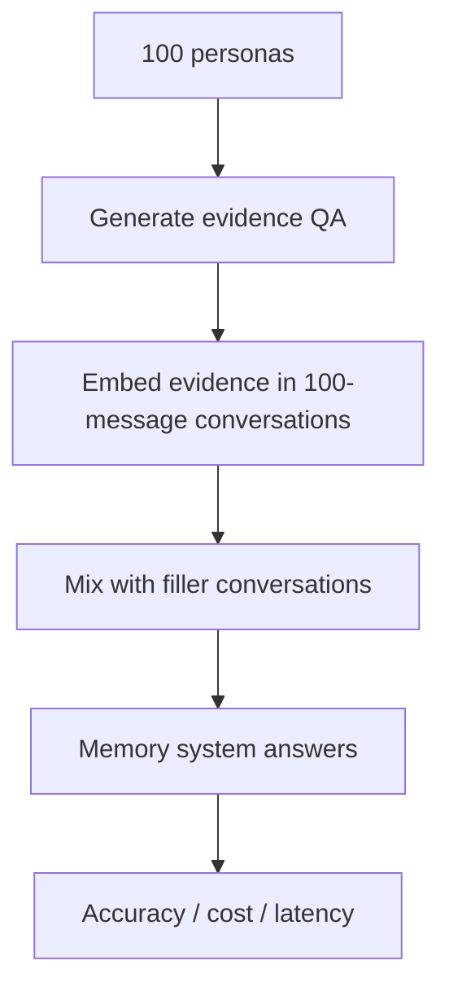

# Benchmark Card: ConvoMem

> Concise English edition. The Chinese version contains fuller protocol notes.

## 1. One-Line Definition

`ConvoMem` is a large-scale conversational-memory benchmark from Salesforce AI Research. It tests whether models can remember user facts, assistant facts, changing information, preferences, implicit connections, and abstain when the answer is absent.

## 2. Quick Reference

| Property | Value |
| -------- | ----- |
| Full Name | ConvoMem Benchmark: Why Your First 150 Conversations Don't Need RAG |
| Released | 2025-11-13 on arXiv |
| Creator | Salesforce AI Research |
| Dataset Size | 75,336 question-answer pairs |
| Personas | 100 professional personas |
| Filler Conversations | 40,000 filler conversations |
| Evidence Categories | user facts / assistant facts / changing facts / abstention / preferences / implicit connections |
| Context Scale | Official materials discuss pre-mixed cases up to 300 conversations / interactions, with key transition points around 30, 150, and 300 |
| Task Format | evidence conversations plus filler conversations plus a question |
| Scoring | category-specific accuracy; preference cases use rubrics; cost and latency can be logged |
| Category | `Long Context` > `Conversational Memory` |
| Risk Tags | synthetic CRM setting / complex harness / terminology mixing / new benchmark |
| Paper | https://arxiv.org/abs/2511.10523 |
| Repo | https://github.com/SalesforceAIResearch/ConvoMem |
| Dataset | https://huggingface.co/datasets/Salesforce/ConvoMem |

## 3. Navigation

### 3.1 Core Process

### 3.2 If You Only Remember Three Things

- It is much larger than LoCoMo or LongMemEval and is built for category-level statistical comparisons.
- It splits conversational memory into six evidence categories, making failures easier to localize.
- Its central claim is not that RAG is useless. It is that full-context methods can be highly competitive for the first tens to roughly 150 conversations, while cost and latency push toward hybrid or RAG systems later.

## 4. How It Works

### 4.1 What It Actually Tests

ConvoMem covers six memory abilities:

| Category | What It Tests |
| -------- | ------------- |
| User Facts | Facts explicitly stated by the user |
| Assistant Facts | Information previously provided by the assistant |
| Changing Facts | Whether the system uses the latest state after updates |
| Abstention | Whether it refuses when the answer is absent |
| Preferences | Whether user preferences guide new recommendations |
| Implicit Connections | Multi-hop relationships across messages |

### 4.2 What the Input Looks Like

The Hugging Face dataset card lists fields such as:

- `question`
- `answer`
- `messages`
- `evidence_type`
- `persona`

Evidence conversations are mixed with unrelated filler conversations at different context sizes.

### 4.3 Dataset Scale

| Dimension | Value |
| --------- | ----- |
| QA pairs | 75,336 |
| Personas | 100 |
| Filler conversations | 40,000 |
| Evidence categories | 6 |
| Multi-message evidence | about 60% |
| Single-message evidence | about 40% |

Category counts:

| Category | Count |
| -------- | ----- |
| User Facts | 16,733 |
| Assistant Facts | 12,745 |
| Changing Facts | 18,323 |
| Abstention | 14,910 |
| Preferences | 5,079 |
| Implicit Connections | 7,546 |

### 4.4 How the Data Was Built

The official README describes a modular generation pipeline:

1. generate 100 personas
2. generate use cases for each persona
3. generate evidence QA pairs
4. validate answerability and necessity
5. embed evidence into natural 100-message conversations
6. mix evidence conversations with filler conversations
7. evaluate memory systems through a common harness

This makes ConvoMem more scalable and category-controlled than LoCoMo, but also more synthetic.

### 4.5 How It Is Scored

The framework:

- loads conversations into a memory system
- asks questions
- records accuracy, cost, latency, and per-question results
- aggregates by evidence type and context size
- uses rubrics for preference-style recommendation answers

The paper reports that simple full-context methods reach roughly 70%-82% accuracy on the hardest multi-message evidence cases, while Mem0-style RAG memory systems are around 30%-45% under 150 interactions in the paper setting. Treat that as a protocol-specific finding, not a universal anti-RAG result.

## 5. Reliability

### 5.1 What It Does Not Test

- real privacy governance for personal memory
- open-web browsing
- external tool-use agents
- multimodal memory
- long-term emotional or behavioral drift in real user relationships

### 5.2 Difficulty Signal

ConvoMem is useful because:

- it has 75k+ QA pairs
- about 60% of evidence is spread across multiple messages
- changing facts test latest-state tracking
- abstention directly tests hallucination control
- implicit connections test cross-message reasoning
- context size can be swept to study the full-context to RAG transition

### 5.3 Known Defects and Disputes

- Official materials use messages, conversations, and interactions somewhat inconsistently around context-size wording, so result reports must define the unit.
- The setting is strongly CRM / professional-persona shaped, not a universal personal-assistant memory distribution.
- The data is programmatically generated, which improves control but can introduce template bias.
- It is a newer 2025 benchmark, so third-party reproduction practices are still maturing.

### 5.4 Risk Table

| Risk Type | Level | Why |
| --------- | ----- | --- |
| Domain bias | Medium | CRM and professional personas are prominent |
| Synthetic-generation bias | Medium | Generated data may contain templates |
| Protocol mixing | Medium | Context-size units must be reported clearly |
| Harness complexity | Medium | Memory-system integration and cost logging matter |
| Benchmark maturity | Medium | Newer benchmark with less community practice |

## 6. Should I Use It

### 6.1 Good Use Cases

**Good for:**

- large-scale conversational-memory evaluation
- category-level comparison of memory failures
- comparing long-context, RAG, Mem0, and hybrid memory systems
- studying when a conversation memory system needs retrieval

**Not enough on its own for:**

- natural personal-memory behavior
- privacy or deletion-policy claims
- multimodal or tool-use agent evaluation

### 6.2 Verdict

**Conditionally recommended.** ConvoMem fills the scale and category-coverage gap in conversational-memory evaluation. It complements LoCoMo and LongMemEval rather than replacing them.
