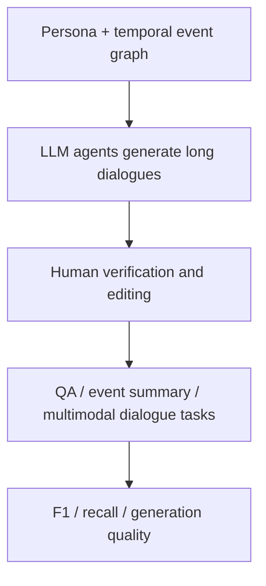

# Benchmark Card: LoCoMo

> Concise English edition. The Chinese version contains fuller protocol notes.

## 1. One-Line Definition

`LoCoMo` is a very long-term conversational-memory benchmark. It uses persona-grounded, temporally structured long dialogues to test question answering, event summarization, and multimodal dialogue generation.

## 2. Quick Reference

| Property | Value |
| -------- | ----- |
| Full Name | LoCoMo / Evaluating Very Long-Term Conversational Memory of LLM Agents |
| Released | 2024-02-27 on arXiv; ACL 2024 paper |
| Creators | Adyasha Maharana et al.; Snap / UNC / Meta and collaborators |
| Current Repo Size | 10 long conversations; about 1,986 QA annotations in `locomo10.json` |
| Paper Scale | Each conversation averages about 300 turns and 9K tokens, across up to 35 sessions |
| Tasks | question answering / event summarization / multimodal dialogue generation |
| QA Types | single-hop / multi-hop / temporal / open-domain / adversarial |
| Scoring | QA F1 / partial F1 / adversarial refusal; optional evidence recall for RAG |
| Category | `Long Context` > `Long-Term Conversational Memory` |
| Risk Tags | small sample / version protocol / synthetic-dialogue bias / incomplete multimodal reproducibility |
| Project Page | https://snap-research.github.io/locomo/ |
| Paper | https://arxiv.org/abs/2402.17753 |
| Repo / Dataset | https://github.com/snap-research/locomo |

> [!NOTE]
> The official README says the current release is a subset of the original 50 conversations, sampled to retain the longest high-quality annotated conversations and reduce closed-model evaluation cost. Report whether a result uses the current `locomo10.json` release.

## 3. Navigation

### 3.1 Core Process

### 3.2 If You Only Remember Three Things

- It targets very long-term open-domain dialogue, not short chat-session QA.
- The current public repo release centers on `data/locomo10.json`, not the initial 50-conversation release.
- It is best used as a small, difficult diagnostic set rather than a standalone large-scale leaderboard.

## 4. How It Works

### 4.1 What It Actually Tests

LoCoMo tests whether models can track:

1. single evidence facts
2. multi-hop evidence across dialogue turns
3. temporal order and event evolution
4. open-domain background plus dialogue facts
5. adversarial questions that should not be answered
6. causal and temporal links in long event histories

Compared with LongMemEval:

| Benchmark | Main Signal |
| --------- | ----------- |
| LoCoMo | Long open-domain dialogue understanding, event summarization, and multimodal generation |
| LongMemEval | Retrieval, reading, update handling, and abstention in assistant memory systems |

### 4.2 What the Input Looks Like

Each current sample contains:

- `sample_id`
- `conversation`
- `observation`
- `session_summary`
- `event_summary`
- `qa`

The `conversation` field is organized into timestamped `session_<num>` blocks. Turns include speaker, dialogue id, and text. If a turn involves an image, the release includes an image URL, BLIP caption, and search query, but not the image file itself.

### 4.3 QA Task

The `qa` annotations include:

- `question`
- `answer`
- `category`
- `evidence`, when evidence dialogue ids are available

The project page describes five QA reasoning types: single-hop, multi-hop, temporal, open-domain, and adversarial.

### 4.4 Data Construction

The pipeline:

1. assigns personas to agents
2. creates temporal event graphs
3. generates multi-session conversations with LLM agents
4. includes image sharing and image reactions
5. uses human annotators to verify long-range consistency and event grounding
6. adds QA and event-summary annotations

### 4.5 Dataset Scale and Versions

| Protocol | Value |
| -------- | ----- |
| Paper abstract | About 300 turns, 9K tokens, and up to 35 sessions per conversation |
| Current repo release | 10 long conversations |
| Current `locomo10.json` | About 1,986 QA annotations and 272 session keys |
| Initial release note | The README says the first arXiv release contained 50 conversations |

The value is therefore depth per sample, not sample count.

### 4.6 How It Is Scored

The QA scripts use category-specific scoring:

- several categories use token-level F1
- multi-hop answers use partial F1 over split sub-answers
- adversarial questions check for refusal-style answers
- RAG runs can report evidence recall

The README still marks event summarization and multimodal dialogue generation evaluation as "Coming soon," so QA is currently the most directly reproducible task.

## 5. Reliability

### 5.1 What It Does Not Test

- large-sample statistical stability
- real production user memory
- privacy deletion or consent workflows
- external tool use
- fully reproducible multimodal image inputs

### 5.2 Difficulty Signal

LoCoMo is hard because:

- conversations span many sessions
- questions include temporal and multi-hop reasoning
- event summaries require causal and temporal understanding
- adversarial questions expose unsupported guessing
- long-context, RAG, observation, and session-summary databases can be compared

### 5.3 Known Defects and Disputes

- The current public release is a 10-conversation subset, while the initial release contained 50 conversations.
- Image files are not released, only URLs, captions, and search queries.
- Some advertised tasks are not fully reproducible from the current README because their evaluation code is still listed as forthcoming.
- The conversations are generated through an LLM-agent pipeline and human edited, so they are controlled but not natural user-history logs.

### 5.4 Risk Table

| Risk Type | Level | Why |
| --------- | ----- | --- |
| Sample size | High | Current release has only 10 long conversations |
| Version protocol | High | Initial 50-conversation release and current `locomo10.json` differ |
| Multimodal reproducibility | Medium | Images are not bundled with the dataset |
| Synthetic-dialogue bias | Medium | Conversations are generated, then verified and edited |
| Task completeness | Medium | QA is more reproducible than the other tasks today |

## 6. Should I Use It

### 6.1 Good Use Cases

**Good for:**

- very long-term dialogue-memory diagnostics
- temporal, causal, and multi-hop conversation understanding
- comparing long-context, RAG, session summaries, and observation databases
- manual error analysis on a small but difficult set

**Not enough on its own for:**

- broad leaderboard ranking
- production privacy or memory-policy claims
- large-scale statistical conclusions

### 6.2 Verdict

**Conditionally recommended.** LoCoMo is worth keeping as a high-quality long-dialogue diagnostic set. The safest use is the QA task on the current `locomo10.json` protocol, with version caveats stated explicitly.
