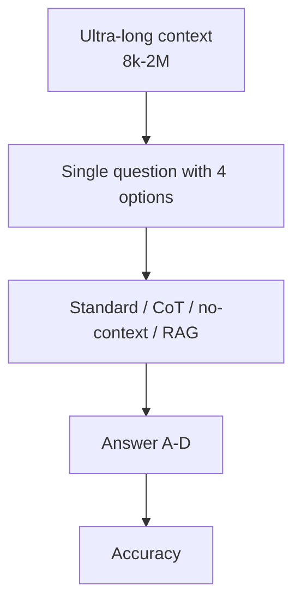

# Benchmark Card: LongBench v2

> Concise English edition. The Chinese version currently contains fuller protocol notes.

## 1. One-Line Definition

`LongBench v2` is a long-context benchmark from THUDM that emphasizes **deep understanding and reasoning over realistic long materials**, not just shallow "needle in a haystack" retrieval.

## 2. Quick Reference

| Property | Value |
| -------- | ----- |
| Full Name | LongBench v2: Towards Deeper Understanding and Reasoning on Realistic Long-context Multitasks |
| Released | 2024-12-20 |
| Creator | THUDM / Tsinghua-affiliated team |
| Dataset Size | 503 challenge questions |
| Context Length | 8k to 2M words |
| Task Format | Unified multiple-choice questions |
| Scoring | Exact match / accuracy |
| Category | `Long Context` > `Deep Long-Context Reasoning` |
| Risk Tags | MCQ constraints / Length-reasoning entanglement / No-context confusion / High reproduction cost |
| Project Page | https://longbench2.github.io |
| Paper | https://arxiv.org/abs/2412.15204 |
| Repo | https://github.com/THUDM/LongBench |
| Dataset | https://huggingface.co/datasets/THUDM/LongBench-v2 |

## 3. Navigation

### 3.1 Core Process

### 3.2 If You Only Remember Three Things

- It covers six realistic long-context task families, not just context lookup.
- It standardizes everything into multiple-choice form mainly to keep scoring reliable.
- The official repo treats `--cot`, `--no_context`, and `--rag` as first-class comparison modes, which makes the benchmark unusually interpretable.

## 4. How It Works

### 4.1 What It Actually Tests

LongBench v2 asks whether a model can:

1. read **very long** context
2. integrate evidence across long materials
3. prove that it is really using the context instead of only prior memory

The six task families are:

- single-document QA
- multi-document QA
- long in-context learning
- long-dialogue history understanding
- code repo understanding
- long structured data understanding

### 4.2 What the Input Looks Like

Each sample includes fields such as:

- `question`
- `choice_A` to `choice_D`
- `answer`
- `context`
- metadata like `domain`, `difficulty`, and `length`

So it is a long-context benchmark with a relatively clean and comparable input structure.

### 4.3 What the Model Must Output

At evaluation time the model only needs to output the correct option.

But the repo supports several modes:

- standard full-context mode
- `--cot`
- `--no_context`
- `--rag N`

This allows you to compare long-context use against explicit reasoning and retrieval-based approximations.

### 4.4 How the Data Was Built

The official materials emphasize:

- 503 challenge questions
- context lengths from 8k to 2M words
- contributions from nearly 100 highly educated annotators
- a unified MCQ format chosen for evaluation reliability

So the benchmark is explicitly balancing realism, difficulty, and automatable scoring.

### 4.5 Dataset Scale and Distribution

| Dimension | Value |
| --------- | ----- |
| Questions | 503 |
| Length range | 8k-2M words |
| Task families | 6 |
| Answer format | 4 options |
| Difficulty labels | easy / hard |

The paper also reports a strong signal: under a 15-minute limit, human experts score around **53.7%**, while strong models cluster around roughly the same order of magnitude depending on setup.

### 4.6 How It Is Scored

The headline metric is **accuracy**.

The more interesting part is the official comparison structure:

- full context
- chain-of-thought
- no-context
- RAG with top-N retrieval

That lets you separate several different failure modes:

- context window weakness
- reasoning weakness
- prior-memory leakage

## 5. Reliability

### 5.1 What It Does Not Test

- long-form writing quality
- real multi-turn agent workflows
- browsing or tool-use interaction
- long-horizon memory management

### 5.2 Difficulty Signal

It is hard in a way that matters:

- the contexts are genuinely long
- the tasks are diverse
- the questions require understanding plus reasoning
- no-context ablations can expose fake long-context ability

### 5.3 Known Defects and Disputes

- The MCQ format is an explicit compromise that reduces task openness.
- Score differences do not cleanly separate "long-context power" from "reasoning power."
- Reproduction is expensive because long-context inference and evaluation require serious resources.

### 5.4 Risk Table

| Risk Type | Level | Why |
| --------- | ----- | --- |
| Reproduction cost | High | Long-context evaluation is expensive in compute and runtime |
| Task-format compromise | Medium | MCQ scoring improves reliability but narrows task realism |
| Memory confusion | Medium | Some no-context accuracy can come from prior knowledge rather than context use |
| Length extrapolation risk | Medium | High aggregate scores do not guarantee equal strength at every length band |

## 6. Should I Use It

### 6.1 Good Use Cases

**Good for:**

- evaluating long-context models
- checking whether bigger context windows produce real understanding gains
- comparing long-document, multi-document, dialogue, and repo-understanding behavior

**Not enough on its own for:**

- open-ended long-form generation claims
- agent workflow evaluation

### 6.2 Verdict

**Recommended.** It is one of the better long-context cards to keep because it does not only test context length. It also exposes deeper reasoning and includes useful official ablations.
