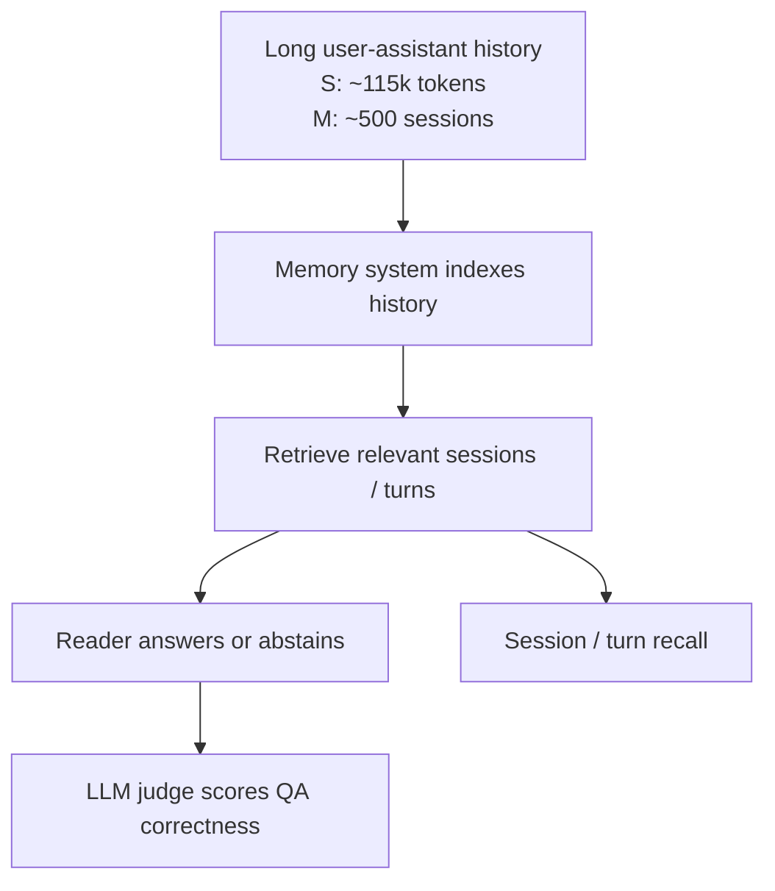

# Benchmark Card: LongMemEval

> Concise English edition. The Chinese version contains fuller protocol notes.

## 1. One-Line Definition

`LongMemEval` is a long-term interactive memory benchmark for chat assistants. It asks whether a system can remember, retrieve, update, temporally reason over, and abstain on information from long user-assistant histories.

## 2. Quick Reference

| Property | Value |
| -------- | ----- |
| Full Name | LongMemEval: Benchmarking Chat Assistants on Long-Term Interactive Memory |
| Released | 2024-10; arXiv submitted 2024-10-14; ICLR 2025 paper |
| Creators | Di Wu et al.; UCLA / Tencent AI Lab Seattle / UC San Diego |
| Dataset Size | 500 questions; the cleaned dataset provides 500 evaluation instances per split |
| Standard Splits | `longmemeval_s_cleaned` / `longmemeval_m_cleaned` / `longmemeval_oracle` |
| History Length | `S`: roughly 115k tokens / around 30-40 sessions; `M`: roughly 500 sessions / about 1.5M tokens |
| Task Format | Timestamped user-assistant chat history plus a question |
| Core Abilities | information extraction / multi-session reasoning / knowledge updates / temporal reasoning / abstention |
| Scoring | LLM-judge QA correctness plus session-level and turn-level memory-retrieval recall |
| Category | `Long Context` > `Long-Term Interactive Memory` |
| Risk Tags | LLM-judge dependence / synthetic-history bias / cleaned-version protocol / memory-system variance |
| Project Page | https://xiaowu0162.github.io/long-mem-eval/ |
| Paper | https://arxiv.org/abs/2410.10813 |
| ICLR 2025 | https://proceedings.iclr.cc/paper_files/paper/2025/hash/d813d324dbf0598bbdc9c8e79740ed01-Abstract-Conference.html |
| Repo | https://github.com/xiaowu0162/LongMemEval |
| Dataset | https://huggingface.co/datasets/xiaowu0162/longmemeval-cleaned |

> [!NOTE]
> As of 2026-05-29, the official repo points to `longmemeval-cleaned`, and the original Hugging Face dataset is deprecated. `LongMemEval-V2` also exists as of 2026-05, but it is a later agentic-context benchmark, not the same protocol as this card.

## 3. Navigation

### 3.1 Core Process

### 3.2 If You Only Remember Three Things

- It is not just a long-document reading benchmark. It is about persistent chat-assistant memory across many interactions.
- Use the cleaned dataset protocol when quoting modern results, and state whether the split is `S`, `M`, or `oracle`.
- It can evaluate both final-answer correctness and memory retrieval, which makes it useful for diagnosing where a memory system failed.

## 4. How It Works

### 4.1 What It Actually Tests

LongMemEval tests whether a chat assistant can:

1. remember facts from prior interactions
2. retrieve the relevant evidence session or turn
3. combine information across sessions
4. handle updated user information
5. reason over timestamps and temporal expressions
6. abstain when the history does not contain the answer

Compared with LongBench v2, the emphasis is different:

| Benchmark | Main Signal |
| --------- | ----------- |
| LongBench v2 | Deep reasoning over a long context provided at once |
| LongMemEval | Long-term memory over accumulated interactive history |

### 4.2 What the Input Looks Like

Each instance contains fields such as:

- `question_id`
- `question_type`
- `question`
- `answer`
- `question_date`
- `haystack_session_ids`
- `haystack_dates`
- `haystack_sessions`
- `answer_session_ids`

Evidence turns may include `has_answer: true`, and `answer_session_ids` identifies the evidence sessions for retrieval evaluation.

### 4.3 Task Types

The official README lists these base `question_type` values:

- `single-session-user`
- `single-session-assistant`
- `single-session-preference`
- `temporal-reasoning`
- `knowledge-update`
- `multi-session`

If `question_id` ends with `_abs`, the instance is an abstention question. The official retrieval evaluation skips 30 abstention instances because they generally do not have a ground-truth answer location.

### 4.4 Standard Splits

| Split | Use Case | Notes |
| ----- | -------- | ----- |
| `longmemeval_s_cleaned` | Standard long-context / memory evaluation | Around 115k tokens, suitable for 128k-context or memory-system comparisons |
| `longmemeval_m_cleaned` | Longer-history stress test | Around 500 history sessions, about 1.5M tokens on the project page |
| `longmemeval_oracle` | Reader / upper-bound control | Contains only the evidence sessions |

Each split has 500 evaluation instances, but they are not interchangeable protocols.

### 4.5 How the Data Was Built

The paper and project page describe an attribute-controlled pipeline:

1. create questions, answers, and evidence
2. compile coherent timestamped chat histories
3. hide the evidence in user-assistant interactions
4. add filler sessions so the system must locate relevant memory

This makes the benchmark closer to a long-running assistant memory setting than to simple document concatenation.

### 4.6 How It Is Scored

There are two main evaluation layers:

| Layer | Signal | Meaning |
| ----- | ------ | ------- |
| End-to-end QA | LLM-judge correctness / accuracy | The official script evaluates model hypotheses and writes `autoeval_label` |
| Memory retrieval | session-level and turn-level recall | Measures whether the memory system retrieved the evidence location |

The official example uses `gpt-4o` as the QA evaluator. Report the evaluator, split, history format, reader model, retrieval method, and top-k when comparing results.

## 5. Reliability

### 5.1 What It Does Not Test

- open-web browsing
- external tool-use agents
- privacy governance, deletion, or consent workflows
- long-form writing quality
- multimodal personal memory

### 5.2 Difficulty Signal

The benchmark is hard because:

- `S` is already near the practical 128k-context regime
- `M` is far beyond direct full-context prompting for most systems
- questions can require cross-session synthesis
- user facts and preferences can be updated over time
- abstention cases punish unsupported guessing
- retrieval and reading can be evaluated separately

The paper reports large performance drops for long-context LLMs on `LongMemEval_S`, and the project page emphasizes that strong commercial assistants still struggle with sustained memory.

### 5.3 Known Defects and Disputes

- The original Hugging Face dataset is deprecated; the official repo now points to `longmemeval-cleaned`.
- End-to-end QA scoring depends on an LLM judge, so evaluator choice matters.
- Synthetic timestamped histories are useful for controlled evaluation but do not fully represent messy real user memory.
- Indexing, retrieval, prompt format, reader model, top-k, and time-aware query expansion can all materially change the score.

### 5.4 Risk Table

| Risk Type | Level | Why |
| --------- | ----- | --- |
| Version protocol | High | The original dataset was replaced by the cleaned dataset |
| Judge dependence | High | QA correctness relies on a model evaluator |
| Implementation variance | High | Retrieval and reading design choices strongly affect results |
| Real-world transfer | Medium | Controlled histories do not fully capture real user behavior and privacy constraints |
| Cost | Medium to High | The `M` split is very long and expensive to run end to end |

## 6. Should I Use It

### 6.1 Good Use Cases

**Good for:**

- evaluating long-term memory in chat assistants
- comparing vector memory, summary memory, retrieval memory, and time-aware memory
- testing whether systems handle updated user information
- separating retrieval failures from reader failures

**Not enough on its own for:**

- broad knowledge evaluation
- browsing or research-agent evaluation
- tool-use agent benchmarks
- privacy and policy compliance claims
- multimodal personal memory

### 6.2 Verdict

**Recommended.** LongMemEval is worth keeping because it moves long-context evaluation toward real assistant memory: indexing, retrieval, reading, updates, and abstention all matter. Use the cleaned dataset protocol and report the evaluator plus memory-system settings.
