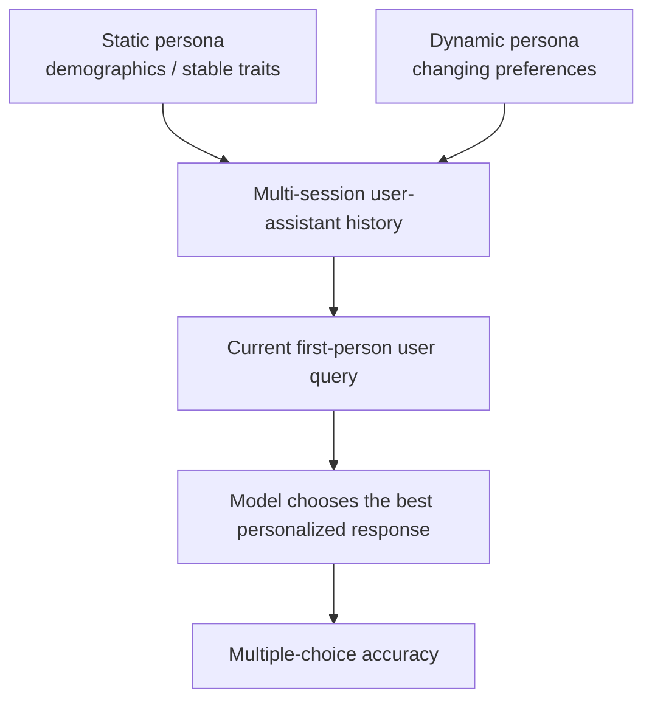

# Benchmark Card: PersonaMem

> Concise English edition. The Chinese version contains fuller protocol notes.

## 1. One-Line Definition

`PersonaMem` is a personalization and long-term conversational-memory benchmark. It tests whether a model can infer a user's profile from multi-session interaction history, track preference changes, and choose the response that best matches the user's current state.

## 2. Quick Reference

| Property | Value |
| -------- | ----- |
| Full Name | Know Me, Respond to Me: Benchmarking LLMs for Dynamic User Profiling and Personalized Responses at Scale |
| Short Name | `PersonaMem` |
| Released | arXiv 2025-04-19; GitHub labels the work as COLM 2025 |
| Creators | Bowen Jiang et al.; University of Pennsylvania and collaborators |
| Dataset Scale | The paper abstract describes 180+ simulated user-LLM histories, each with up to 60 multi-turn sessions |
| Context Splits | `32k` / `128k` / `1M` |
| Data Files | `questions_[SIZE].csv` plus `shared_contexts_[SIZE].jsonl` |
| Task Format | long interaction history plus a first-person user query; choose the most personalized response |
| Task Scope | the paper abstract describes 15 personalization tasks; the current repo generation scripts list 18 topics |
| Core Abilities | user-fact recall / preference updates / preference evolution / personalized recommendation / cross-scenario generalization |
| Scoring | multiple-choice accuracy |
| Category | `Long Context` > `Personalized Conversational Memory` |
| Risk Tags | synthetic users / multiple-choice simplification / privacy overclaiming / v1-v2 mixing / personalization-memory entanglement |
| Paper | https://arxiv.org/abs/2504.14225 |
| Repo | https://github.com/bowen-upenn/PersonaMem |
| Dataset | https://huggingface.co/datasets/bowen-upenn/PersonaMem |
| Project | https://zhuoqunhao.github.io/PersonaMem.github.io/ |

> [!NOTE]
> The official Hugging Face page points readers to PersonaMem-v2 / ImplicitPersona as a later dataset. This card covers the original PersonaMem protocol.

## 3. Navigation

### 3.1 Core Process

### 3.2 If You Only Remember Three Things

- It is not just "what did the user say before"; it asks whether the model can maintain a current user profile.
- Preference evolution is central: the model must know what changed, why, and what applies now.
- It is a multiple-choice benchmark, so it is useful for controlled comparison but does not fully measure free-form personalization quality.

## 4. How It Works

### 4.1 What It Actually Tests

PersonaMem tests whether a model can:

1. internalize long-term user facts and preferences
2. track how those preferences evolve over time
3. respond according to the user's current profile in new scenarios

Compared with LongMemEval:

| Benchmark | Main Signal |
| --------- | ----------- |
| LongMemEval | fact retrieval, updates, temporal reasoning, and abstention over chat history |
| PersonaMem | user profiling, preference evolution, and personalized response selection |

### 4.2 What the Input Looks Like

Each split has:

- `questions_[SIZE].csv`: question metadata, options, correct answer, topic, context length, and distance to the latest preference evidence
- `shared_contexts_[SIZE].jsonl`: user-model interaction histories

Important fields include:

- `persona_id`
- `question_id`
- `question_type`
- `topic`
- `context_length_in_tokens`
- `distance_to_ref_in_tokens`
- `user_question_or_message`
- `correct_answer`
- `all_options`
- `shared_context_id`
- `end_index_in_shared_context`

The model reads the relevant history slice and chooses the option that best reflects the current user profile.

### 4.3 Seven Query Types

The dataset card lists seven in-situ user-query types:

1. recall user-shared facts
2. suggest new ideas
3. acknowledge latest user preferences
4. track full preference evolution
5. revisit reasons behind preference updates
6. provide preference-aligned recommendations
7. generalize to new scenarios

This makes PersonaMem more product-like than simple memory QA.

### 4.4 Context Splits

| Split | Files | Main Use |
| ----- | ----- | -------- |
| `32k` | `questions_32k.csv` / `shared_contexts_32k.jsonl` | medium-long personalization evaluation |
| `128k` | `questions_128k.csv` / `shared_contexts_128k.jsonl` | main long-context personalization setting |
| `1M` | `questions_1M.csv` / `shared_contexts_1M.jsonl` | very long history stress test |

Do not mix split sizes when reporting results.

### 4.5 How the Data Was Built

The official repo describes a synthetic generation pipeline:

1. generate user personas
2. generate multi-session conversations across topics
3. introduce changing user preferences over time
4. generate question-answer pairs and candidate responses
5. concatenate histories into 32k, 128k, and 1M context settings

The design is scalable and controlled, but it is still synthetic.

### 4.6 How It Is Scored

PersonaMem uses multiple-choice accuracy. The model picks the best candidate response for the current user query and interaction history.

The paper and repo emphasize that frontier models still struggle in this setting, with overall performance around the low-50% range in the reported multiple-choice setup.

## 5. Reliability

### 5.1 What It Does Not Test

- real-user data governance
- consent, deletion, and memory-control UX
- free-form response quality
- open-web search
- external tool use
- multimodal personal memory

### 5.2 Difficulty Signal

PersonaMem is hard because:

- user preferences can change
- the latest relevant preference may be far back in context
- user profiles must transfer across scenarios
- irrelevant conversations can distract the model
- answer options often differ in subtle user-specific ways

### 5.3 Known Defects and Disputes

- Synthetic personas do not fully represent real users.
- Multiple-choice scoring simplifies real assistant behavior.
- Memory, preference tracking, and personalization are entangled.
- PersonaMem-v2 / ImplicitPersona is a different later dataset, so version naming matters.

### 5.4 Risk Table

| Risk Type | Level | Why |
| --------- | ----- | --- |
| Version protocol | High | PersonaMem, PersonaMem-v2, and ImplicitPersona are easy to mix |
| Synthetic bias | High | users and interactions are generated |
| Multiple-choice simplification | Medium to High | real assistants generate answers rather than pick options |
| Context protocol | Medium to High | 32k, 128k, and 1M splits differ substantially |
| Privacy overclaiming | Medium | the benchmark does not validate memory governance |

## 6. Should I Use It

### 6.1 Good Use Cases

**Good for:**

- personalized chat assistants
- dynamic user-profile tracking
- comparing direct long-context prompting with profile memory, summary memory, or retrieval memory
- testing whether personalization degrades from 32k to 128k to 1M contexts

**Not enough on its own for:**

- general long-document reasoning
- browsing or research-agent evaluation
- external tool-use benchmarks
- coding-agent evaluation
- privacy and memory-governance claims

### 6.2 Verdict

**Recommended.** PersonaMem adds a useful angle that LongMemEval, LoCoMo, and ConvoMem cover less directly: dynamic user profiles and personalized response selection. Use it with clear split and version reporting.
