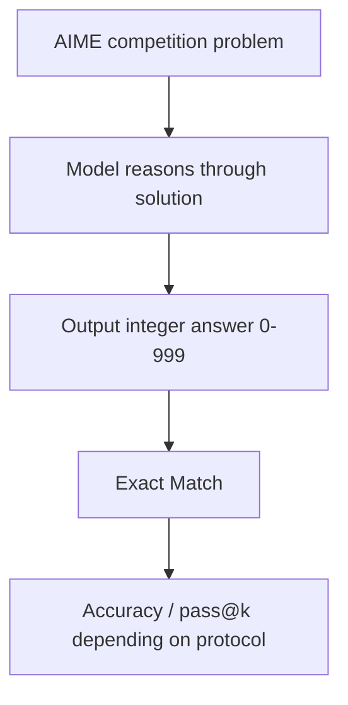

# Benchmark Card: AIME

> Concise English edition. The Chinese version currently contains fuller notes on MathArena usage.

## 1. One-Line Definition

In the LLM-evaluation context, `AIME` usually means a closed-answer competition-math benchmark built from American Invitational Mathematics Examination problems and commonly evaluated through MathArena year-based sets.

## 2. Quick Reference

| Property | Value |
| -------- | ----- |
| Full Name | American Invitational Mathematics Examination |
| Common Current Evaluation Surface | MathArena yearly sets such as `AIME 2025` and `AIME 2026` |
| Original Organizer | MAA |
| Common Current Platform | MathArena |
| Dataset Size | 15 problems per exam, often 30 when AIME I and II are combined |
| Input Format | One competition-math problem |
| Output Format | Final integer answer in `0-999` |
| Scoring | Exact match, sometimes reported with sampling budget or `pass@k` |
| Category | `Math` > `Competition Math` |
| Risk Tags | Tiny sample size / High variance / Final-answer bias / Year and budget mixing |
| MathArena | https://matharena.ai/competitions |
| Repo | https://github.com/eth-sri/matharena |

## 3. Navigation

### 3.1 Core Process

### 3.2 If You Only Remember Three Things

- Its main value is that the answer is unique, the problems are hard, and the sample is tiny.
- It measures "can the model get the final answer," not "can the model write a beautiful proof."
- When you quote an AIME score, you must say the year, the exact exam set, and whether sampling budget or pass@k was involved.

## 4. How It Works

### 4.1 What It Actually Tests

AIME is close to a pure math-reasoning stress test:

1. can the model uncover hidden structure in hard contest problems
2. can it carry out multi-step derivations
3. can it still reason reliably when pattern-matching shortcuts fail

The output is closed-ended, which makes scoring clean but leaves proof quality outside the benchmark.

### 4.2 What the Input Looks Like

The input is usually just a full competition problem:

- no options
- compressed conditions
- often short wording but high reasoning density
- a required final integer answer in `0-999`

This is why AIME often separates models that look fine on broader math benchmarks but are shaky on high-difficulty closed-answer problems.

### 4.3 What the Model Must Output

The model only needs to output the correct integer answer.

That makes the metric clean, but it also means:

- lucky final answers can be rewarded
- correct reasoning with bad extraction can still be marked wrong

### 4.4 How the Data Was Built

AIME itself is a historical human-written competition. In current LLM evaluation practice, people usually:

1. use public AIME problems from recent years
2. package them by year on MathArena or similar evaluation layers
3. compare models under a common answer-extraction and budget protocol

Using newer yearly sets is partly about reducing contamination pressure.

### 4.5 Dataset Scale and Distribution

| Dimension | Value |
| --------- | ----- |
| Problems per exam | 15 |
| Common yearly view | AIME I + II = 30 |
| Format | Open question, closed integer answer |
| Main value | Tiny but extremely sharp math upper-bound signal |

This is better for seeing tier differences than for over-reading one- or two-problem gaps.

### 4.6 How It Is Scored

Basic scoring:

1. the model outputs a final integer
2. exact-match against the gold answer
3. aggregate correct counts or accuracy

In practice, two extra protocol layers matter a lot:

- single-sample accuracy
- `pass@k` or best-of-k style reporting

## 5. Reliability

### 5.1 What It Does Not Test

- proof writing quality
- tool-assisted solving
- exploratory mathematical research
- broad knowledge

### 5.2 Difficulty Signal

The benchmark is hard because:

- the source problems are already elite competition math
- there are no answer options
- the sample is tiny, so consistency matters

That is why many models that do well on easier math benchmarks still separate sharply on AIME.

### 5.3 Known Defects and Disputes

- The sample size is inherently tiny, so variance is large.
- Final-answer scoring compresses many different failure types into one binary outcome.
- Year and sampling-budget protocols are easy to mix up in public reporting.

### 5.4 Risk Table

| Risk Type | Level | Why |
| --------- | ----- | --- |
| Sample variance | High | Each problem carries a lot of weight |
| Protocol mixing | High | Year, budget, and pass@k settings change the meaning of the score |
| Process blind spot | Medium | Proof quality is invisible to the metric |
| Contamination | Medium | Older yearly sets are more likely to have leaked |

## 6. Should I Use It

### 6.1 Good Use Cases

**Good for:**

- checking math-reasoning ceiling
- getting a clean closed-answer high-difficulty math signal
- complementing softer or older math benchmarks

**Not enough on its own for:**

- proof-writing claims
- broad mathematical research claims

### 6.2 Verdict

**Recommended.** It is still one of the clearest high-difficulty math signals, but it is best used as a sharp tiering tool rather than as a place to over-interpret tiny score differences.
