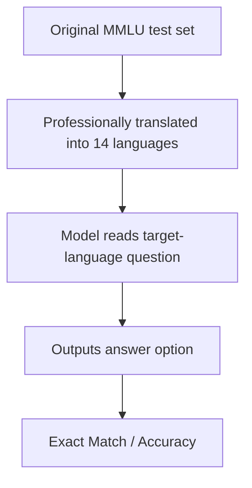

# Benchmark Card: MMMLU

> Concise English edition. The Chinese version currently contains fuller notes on translated-data limitations and `MMLU-ProX`.

## 1. One-Line Definition

`MMMLU` is a multilingual benchmark built by translating the original `MMLU` test set into 14 languages with professional human translation. Its main purpose is to test **knowledge retention across languages**, not stylistic naturalness.

## 2. Quick Reference

| Property | Value |
| -------- | ----- |
| Full Name | Multilingual Massive Multitask Language Understanding |
| Released | 2024 |
| Creator | OpenAI |
| Dataset Size | 57 subjects across 14 languages |
| Input Format | Translated MMLU multiple-choice questions |
| Output Format | Answer option |
| Scoring | Exact match / accuracy |
| Category | `Multilingualism` > `Multilingual QA` |
| Risk Tags | Inherited MMLU defects / Translation artifacts / Non-native question construction / Limited cultural coverage |
| Related Extension | MMLU-ProX expands the harder MMLU-Pro idea to more languages |
| Dataset | https://huggingface.co/datasets/openai/MMMLU |
| Eval Repo | https://github.com/openai/simple-evals |
| Original MMLU Paper | https://arxiv.org/abs/2009.03300 |

## 3. Navigation

### 3.1 Core Process

### 3.2 If You Only Remember Three Things

- It is best for measuring whether the **same knowledge task survives language switching**.
- It is not a native multilingual benchmark, because the questions are translated rather than locally authored.
- It is especially useful for exposing multilingual imbalance in low-resource languages.

## 4. How It Works

### 4.1 What It Actually Tests

MMMLU mainly asks:

1. does knowledge performance remain stable when the language changes?
2. do multiple-choice understanding and answering degrade in non-English settings?
3. how uneven is performance across low-resource and high-resource languages?

It is about multilingual knowledge transfer, not multilingual style or conversation quality.

### 4.2 What the Input Looks Like

The inputs are translated MMLU test questions:

- same question structure
- same MCQ form
- language swapped into the target locale

The dataset card lists 14 locales, including Arabic, Bengali, German, Spanish, French, Hindi, Indonesian, Italian, Japanese, Korean, Portuguese, Swahili, Yoruba, and Simplified Chinese.

### 4.3 What the Model Must Output

The model only needs to output the correct option.

Because MMMLU preserves MMLU's MCQ structure, it is straightforward to compare performance across languages, though that simplicity also inherits MMLU's old limitations.

### 4.4 How the Data Was Built

The official dataset card is very explicit:

1. start from the original MMLU **test set**
2. translate it into 14 languages with professional human translation
3. publish both the translated data and evaluation code

The main advantage is aligned cross-language comparison on essentially the same questions.

### 4.5 Dataset Scale and Distribution

| Dimension | Value |
| --------- | ----- |
| Original source | MMLU test set |
| Subjects | 57 |
| Languages | 14 |
| Format | Multiple choice |
| Main strength | Strong cross-language comparability |

It is especially useful for plotting how much a model drops when moving away from English.

### 4.6 How It Is Scored

The scoring mostly inherits MMLU:

1. read the target-language question
2. output an answer option
3. exact-match against the gold answer
4. aggregate accuracy

The upside is clarity. The downside is that the task remains MCQ knowledge QA.

## 5. Reliability

### 5.1 What It Does Not Test

- native multilingual instruction following
- local cultural knowledge beyond translated question sets
- multilingual writing quality
- cross-language agent workflows

### 5.2 Difficulty Signal

Its value comes less from absolute difficulty and more from exposure of multilingual imbalance, especially in:

- low-resource languages
- non-Latin scripts
- models whose English performance hides weaker multilingual knowledge retention

### 5.3 Known Defects and Disputes

- It inherits many structural issues from original MMLU.
- Professionally translated data is still not the same as natively authored tasks.
- Translation itself can subtly change how natural or awkward a question feels in different languages.

### 5.4 Risk Table

| Risk Type | Level | Why |
| --------- | ----- | --- |
| Inherited MMLU defects | High | It is still fundamentally an MMLU variant |
| Translation artifacts | Medium | Questions are not native to each language |
| Real-world transfer risk | Medium | MCQ QA does not represent the whole multilingual stack |
| Low-resource interpretation ambiguity | Medium | Weak performance can reflect both translation and training-data gaps |

## 6. Should I Use It

### 6.1 Good Use Cases

**Good for:**

- multilingual knowledge-retention checks
- comparing English vs non-English performance drop
- testing whether low-resource language support is real or mostly marketing

**Not enough on its own for:**

- multilingual product-quality claims
- translation-quality claims
- native multilingual capability claims

### 6.2 Verdict

**Conditionally recommended.** It is worth keeping as a multilingual knowledge-transfer baseline, but it should be paired with native multilingual tasks and translation benchmarks before making broad claims.
