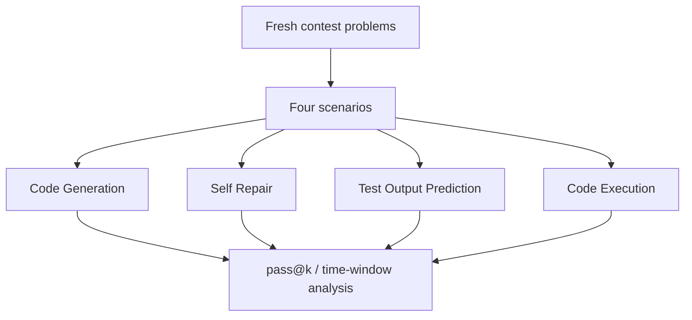

# Benchmark Card: LiveCodeBench

> Concise English edition. The Chinese version currently contains fuller release and errata notes.

## 1. One-Line Definition

`LiveCodeBench` is a continuously updated coding benchmark designed to reduce contamination pressure through time-windowed fresh problems while evaluating more than just code generation.

## 2. Quick Reference

| Property | Value |
| -------- | ----- |
| Full Name | LiveCodeBench: Holistic and Contamination Free Evaluation of Large Language Models for Code |
| Released | 2024 |
| Creator | LiveCodeBench team |
| Dataset Size | From 400 tasks in `release_v1` to 1055 in `release_v6` |
| Data Sources | LeetCode / AtCoder / CodeForces |
| Input Format | Programming problem, tests, and scenario configuration |
| Output Format | Code, repaired code, predicted test output, or execution result |
| Scoring | `pass@1`, `pass@5`, and scenario-specific accuracy |
| Category | `Reasoning` > `Code Reasoning` |
| Risk Tags | Version drift / Contest-task bias / Errata noise / Lite-full protocol differences |
| Site | https://livecodebench.github.io/ |
| Repo | https://github.com/LiveCodeBench/LiveCodeBench |
| Datasets | https://huggingface.co/livecodebench/ |
| Errata | https://github.com/LiveCodeBench/LiveCodeBench/blob/main/ERRATA.md |

## 3. Navigation

### 3.1 Core Process

### 3.2 If You Only Remember Three Things

- Its defining feature is **time-windowed freshness**, which is an explicit anti-contamination design.
- It is closer to a code-capability cluster than a one-mode benchmark like HumanEval.
- The project openly maintains an `ERRATA` file, which is a good sign but also a reminder that automated coding evals still have noise.

## 4. How It Works

### 4.1 What It Actually Tests

LiveCodeBench covers four broad coding scenarios:

1. code generation
2. self repair after failure feedback
3. test output prediction from reading code
4. code execution tracking

So it should be read as a multi-scenario code reasoning benchmark, not just as "another code generation set."

### 4.2 What the Input Looks Like

The exact input varies by scenario, but it usually includes:

- a real programming-problem description
- testing or runtime context
- scenario metadata
- release/version context

Compared with SWE-bench, the tasks are much closer to fresh algorithmic and contest workflows than to repo repair.

### 4.3 What the Model Must Output

Depending on the scenario, the output may be:

- a code solution
- a repaired version of failing code
- the predicted output of a test
- an execution-related answer

For code generation, the official reporting focuses on multi-sample measures such as `pass@1` and `pass@5`.

### 4.4 How the Data Was Built

The repo emphasizes three important mechanisms:

- continuous collection of new problems from major contest platforms
- packaging into `release_v*` versions
- evaluation by explicit `start_date / end_date` windows to study contamination pressure

Each scenario has its own prompts and evaluation logic, so the benchmark is designed to support more than a single global score.

### 4.5 Dataset Scale and Distribution

| Release | Time Window | Task Count |
| ------- | ----------- | ---------- |
| `release_v1` | 2023-05 to 2024-03 | 400 |
| `release_v2` | 2023-05 to 2024-05 | 511 |
| `release_v3` | 2023-05 to 2024-07 | 612 |
| `release_v4` | 2023-05 to 2024-09 | 713 |
| `release_v5` | 2023-05 to 2025-01 | 880 |
| `release_v6` | 2023-05 to 2025-04 | 1055 |

So a LiveCodeBench number is incomplete unless you know the release.

### 4.6 How It Is Scored

In code generation, the core metrics are:

- `pass@1`
- `pass@5`

Two extra protocol details matter a lot:

1. scores can be recomputed over different time windows
2. `code_generation_lite` and full benchmark results are not interchangeable

## 5. Reliability

### 5.1 What It Does Not Test

- real-repo issue fixing
- long multi-turn software collaboration
- product requirements reasoning
- GUI or terminal-agent workflows

### 5.2 Difficulty Signal

Its difficulty comes from:

- freshness of the problems
- multi-scenario evaluation
- weaker benefit from simple memorization than older code benchmarks

This is why strong HumanEval performance does not guarantee equally strong LiveCodeBench performance.

### 5.3 Known Defects and Disputes

- The official errata already lists multiple valid outputs, interactive problems, and erroneous test cases.
- `code_generation_lite` uses test pruning and is not the same protocol as full evaluation.
- Contest-problem distributions are still biased toward algorithmic reasoning rather than full software engineering.

### 5.4 Risk Table

| Risk Type | Level | Why |
| --------- | ----- | --- |
| Version drift | High | v1-v6 differ substantially |
| Protocol mixing | High | release, scenario, lite/full, and time window all matter |
| Evaluation noise | Medium | Errata and runtime issues introduce some noise |
| Contest-task bias | Medium | It is not a full software-engineering benchmark |

## 6. Should I Use It

### 6.1 Good Use Cases

**Good for:**

- checking fresh-code performance
- reducing dependence on stale code benchmarks
- comparing code generation, repair, execution, and output prediction together

**Not enough on its own for:**

- repo-repair claims
- coding-agent product claims

### 6.2 Verdict

**Recommended.** It is one of the most useful fresh-code baselines, but every quoted score should carry its release, scenario, and lite/full context.
