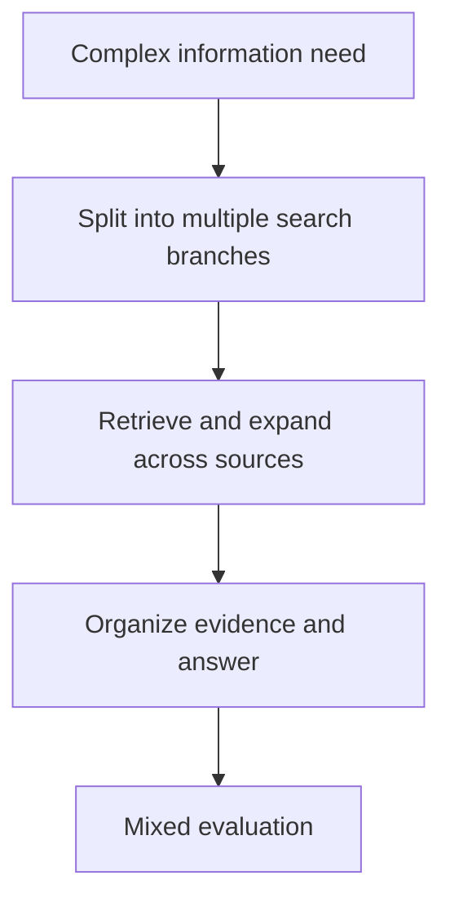

# Benchmark Card: WideSearch

> Concise English edition. The Chinese version currently contains fuller examples and source notes.

## 1. One-Line Definition

`WideSearch` is a search-agent benchmark that emphasizes **breadth-first information seeking**: expanding the search space, collecting evidence from multiple directions, and producing a complete answer to a complex information need.

## 2. Quick Reference

| Property | Value |
| -------- | ----- |
| Full Name | WideSearch |
| Released | 2025-08 |
| Creator | ByteDance Seed |
| Dataset Size | 200 complex information needs |
| Input Format | Research-style information request |
| Output Format | Answer synthesized from multiple sources and evidence |
| Scoring | Mixed evaluation using automatic checks plus judging |
| Category | `Search Agent` > `Broad Information-Seeking` |
| Risk Tags | Judge involvement / Web drift / Small sample size / Research-task bias |
| Official Page | https://widesearch-seed.github.io/ |
| Dataset | https://huggingface.co/datasets/ByteDance-Seed/WideSearch |
| Paper | https://arxiv.org/abs/2508.07999 |

## 3. Navigation

### 3.1 Core Process

### 3.2 If You Only Remember Three Things

- It measures whether an agent searches **widely enough**, not whether it can tunnel down a single path to one short answer.
- It complements `BrowseComp`: one is breadth-first information gathering, the other is hard fact pursuit.
- If your product goal is deep research or research assistance, it is often closer to the target shape than short-answer browsing QA.

## 4. How It Works

### 4.1 What It Actually Tests

WideSearch focuses on:

1. identifying how many directions a complex request should branch into
2. expanding the search space instead of converging too early
3. assembling multi-source evidence into a structured final answer

It is much less about single-hop web QA or one hidden fact.

### 4.2 What the Input Looks Like

Inputs are usually not short factoid questions. They are more like:

- research requests
- broad coverage problems
- multi-source synthesis tasks

The official positioning emphasizes:

- broad information seeking
- search space expansion
- evidence organization

### 4.3 What the Model Must Output

The model must produce a final answer that shows:

- coverage of the relevant aspects of the task
- evidence gathered from multiple sources
- organized presentation rather than isolated facts

This makes it closer to a research-workflow benchmark than to a short-answer browsing benchmark.

### 4.4 How the Data Was Built

The official intent is clear:

1. create 200 complex information needs
2. make the tasks naturally reward breadth-first search
3. score whether the agent really expanded and organized information instead of stopping at partial coverage

That sharply distinguishes it from BrowseComp:

- BrowseComp: hard answer to verify, short output, narrow pursuit
- WideSearch: broader request, harder coverage, harder organization

### 4.5 Dataset Scale and Distribution

| Dimension | Value |
| --------- | ----- |
| Total tasks | 200 |
| Task type | Complex information need |
| Design priority | Breadth, coverage, organization |
| Best fit | Search agents / deep-research agents |

This is a direction-setting benchmark more than a giant industrial-scale leaderboard.

### 4.6 How It Is Scored

The evaluation is mixed rather than purely mechanical:

1. check whether the answer covers the key aspects of the request
2. check search and evidence organization quality
3. use judging for parts that are difficult to reduce to exact automatic checks

The tradeoff is straightforward:

- more realistic for complex research tasks
- less mechanically clean than exact match

## 5. Reliability

### 5.1 What It Does Not Test

- terminal execution
- protocol correctness for tool calling
- code repair
- single-answer extreme fact chasing

### 5.2 Difficulty Signal

Its difficulty comes from:

- needing multiple queries and branches
- needing to avoid partial information capture
- needing to organize results into something useful

That matches real deep-research product needs much better than many short-answer search benchmarks do.

### 5.3 Known Defects and Disputes

- It still inherits web drift because it depends on the open web.
- Some dimensions are hard to score without judges.
- A 200-task benchmark is useful, but still early in scale.

### 5.4 Risk Table

| Risk Type | Level | Why |
| --------- | ----- | --- |
| Judge reliance | Medium | Coverage and organization are not fully mechanical |
| Web drift | Medium | Open-web evidence changes over time |
| Sample size | Medium | 200 tasks are informative but not exhaustive |
| Task bias | Medium | It leans toward research-style search rather than all search behavior |

## 6. Should I Use It

### 6.1 Good Use Cases

**Good for:**

- deep research and search-agent products
- checking whether an agent expands the search space
- evaluating multi-source coverage rather than one-answer retrieval

**Not enough on its own for:**

- exact factual retrieval comparisons
- non-search agent evaluation

### 6.2 Verdict

**Recommended.** It is worth keeping because it pushes search benchmarking toward organized broad information gathering. If your product looks like a research assistant, its value is higher than a narrow browsing-QA leaderboard.
