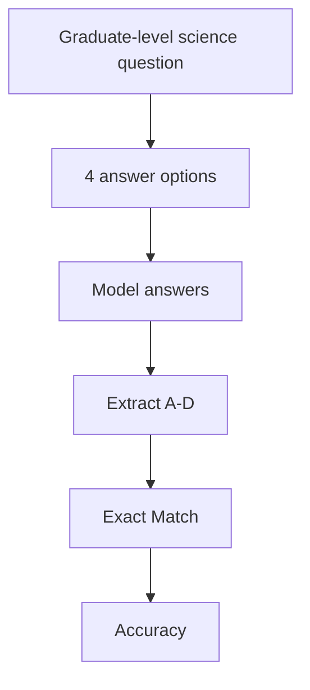

# Benchmark Card: GPQA

> Concise English edition. The Chinese version currently contains fuller subset notes.

## 1. One-Line Definition

`GPQA` is a graduate-level science QA benchmark designed to be hard even for a skilled non-expert using ordinary web search, making it a cleaner signal for high-end STEM reasoning than broad general-knowledge tests.

## 2. Quick Reference

| Property | Value |
| -------- | ----- |
| Full Name | GPQA: A Graduate-Level Google-Proof Q&A Benchmark |
| Released | 2023-11 |
| Creator | David Rein, Samuel R. Bowman, and collaborators |
| Dataset Size | 448 questions, with the Diamond subset cited frequently |
| Main Subjects | Biology / Physics / Chemistry |
| Input Format | 4-option multiple-choice science question |
| Output Format | Final answer letter |
| Scoring | Exact match / accuracy |
| Category | `STEM` > `Graduate Science QA` |
| Risk Tags | Narrow subject coverage / MCQ saturation / Contamination / Subset mixing |
| Paper | https://arxiv.org/abs/2311.12022 |
| OpenReview | https://openreview.net/forum?id=Ti67584b98 |
| Official Repo | https://github.com/idavidrein/gpqa |
| Dataset | https://huggingface.co/datasets/idavidrein/gpqa |
| Reference Eval | https://github.com/openai/simple-evals/blob/main/gpqa_eval.py |

## 3. Navigation

### 3.1 Core Process

### 3.2 If You Only Remember Three Things

- GPQA explicitly tries to be "Google-proof," meaning hard to solve reliably through casual search alone.
- It is much narrower than broad STEM or broad knowledge benchmarks.
- Whenever you cite GPQA, you should specify the subset, prompt style, and whether retrieval was allowed.

## 4. How It Works

### 4.1 What It Actually Tests

GPQA mainly tests:

1. advanced science knowledge
2. serious reasoning under strong distractors
3. the ability to solve questions that resist shallow lookup

Its target is not casual science trivia. It is high-end science multiple-choice reasoning.

### 4.2 What the Input Looks Like

The input format is simple:

- one science question
- four candidate answers

The difficulty comes from the question content, not from an unusual interface. Questions often require real domain reasoning and stronger discrimination among distractors than mainstream science QA sets.

### 4.3 What the Model Must Output

The model outputs a final option letter. Official and reference implementations typically:

- shuffle answer order
- ask for an `A/B/C/D` answer
- score with exact match

This makes the benchmark easy to run but also sensitive to prompt details and answer extraction.

### 4.4 How the Data Was Built

The official benchmark emphasizes:

- expert-written questions
- graduate-level difficulty
- resistance to simple search-based shortcutting

The repo also exposes both closed-book and retrieval-oriented baselines, which is useful because the benchmark sits at the boundary between knowledge recall and real reasoning.

### 4.5 Dataset Scale and Distribution

| Dimension | Value |
| --------- | ----- |
| Questions | 448 |
| Format | 4-option MCQ |
| Main disciplines | Biology / Physics / Chemistry |
| Frequently cited subset | GPQA Diamond |

This means a GPQA score is not self-contained unless you also know which subset and protocol it came from.

### 4.6 How It Is Scored

The core metric is **accuracy**. Typical evaluation flow:

1. randomize answer order
2. collect the model's final choice
3. extract the final letter
4. compare it with the gold label

The upside is clean scoring. The downside is that explanation quality and scientific argument quality are not part of the score.

## 5. Reliability

### 5.1 What It Does Not Test

- open-ended research writing
- literature review and evidence synthesis
- experiment design
- multi-turn scientific collaboration

### 5.2 Difficulty Signal

GPQA is hard because:

- the questions target expert-level science
- the distractors are stronger
- the "just search it" path is intentionally weaker

It is useful for distinguishing models that are merely strong on broad knowledge from models that actually retain serious STEM depth.

### 5.3 Known Defects and Disputes

- Subject coverage is narrow and concentrated in biology, physics, and chemistry.
- Different subsets such as GPQA and GPQA Diamond are often mixed carelessly in vendor claims.
- High scores on closed science MCQs do not mean the model is a real scientific research agent.

### 5.4 Risk Table

| Risk Type | Level | Why |
| --------- | ----- | --- |
| Subset mixing | High | Different leaderboards do not always use the same GPQA split |
| Subject narrowness | Medium | It is a natural-science benchmark, not all of STEM |
| Training contamination | Medium | Public high-quality science questions can leak into training |
| Real-world transfer risk | Medium | MCQ science reasoning is not research workflow performance |

## 6. Should I Use It

### 6.1 Good Use Cases

**Good for:**

- high-end STEM reasoning checks
- going beyond broad general-knowledge benchmarks
- finding a middle layer between "easy search" and "real research agents"

**Not enough on its own for:**

- broad STEM claims
- research-assistant claims

### 6.2 Verdict

**Recommended.** It is worth keeping, but only if you label the exact subset and protocol. Treat it as a hard science-MCQ benchmark, not as a complete proxy for scientific intelligence.
