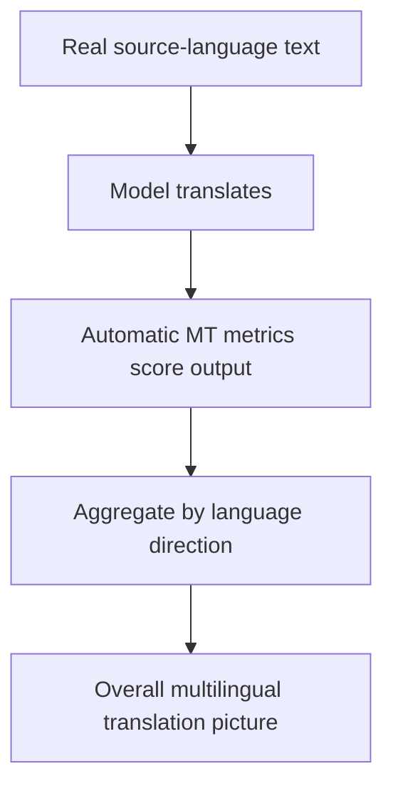

# Benchmark Card: WMT24++

> Concise English edition. The Chinese version currently contains fuller notes on language-pair interpretation.

## 1. One-Line Definition

`WMT24++` is a large-scale multilingual machine-translation benchmark that places real-document translation, broad language coverage, and unified automatic scoring in the same evaluation frame.

## 2. Quick Reference

| Property | Value |
| -------- | ----- |
| Full Name | WMT24++ |
| Released | 2025-02 |
| Creator | WMT / Google Research and collaborators |
| Dataset Size | 55 language directions, about 998 segments per direction |
| Data Source | 171 documents across 5 text domains |
| Input Format | Real source-language text segments |
| Output Format | Target-language translation |
| Scoring | Automatic MT metrics and associated evaluation tooling |
| Category | `Translation` > `Multilingual Machine Translation` |
| Risk Tags | Metric bias / Domain variation / Translation-vs-knowledge confusion / Resource-level heterogeneity |
| Dataset | https://huggingface.co/datasets/synquid/wmt24pp |
| Paper | https://arxiv.org/abs/2502.12404 |
| Metrics Toolkit | https://github.com/google-deepmind/mt-metrics-eval |

## 3. Navigation

### 3.1 Core Process

### 3.2 If You Only Remember Three Things

- It is one of the clearest public benchmarks that covers **55 language directions** under one framework.
- It measures translation quality, not knowledge retention or multilingual instruction following.
- Automatic MT metrics are practical and useful here, but they are not identical to human preference or production readiness.

## 4. How It Works

### 4.1 What It Actually Tests

WMT24++ mainly tests:

1. whether the model can translate source text into the target language
2. whether quality stays stable across many language directions
3. whether high-resource and low-resource directions diverge sharply

Its focus is machine translation itself, not general multilingual intelligence.

### 4.2 What the Input Looks Like

Inputs are real text segments drawn from real documents:

- explicit source and target language direction
- multiple text domains
- more realistic distribution than toy sentence-pair benchmarks

The public data card emphasizes:

- 171 documents
- 5 text domains
- 55 language directions

### 4.3 What the Model Must Output

The model outputs a target-language translation.

The benchmark cares about:

- fidelity
- fluency
- stability across language directions

That is why it should be kept separate from multilingual knowledge or instruction-following evaluations.

### 4.4 How the Data Was Built

Public materials emphasize three things:

1. the data comes from real documents rather than tiny synthetic examples
2. the benchmark covers many language directions
3. unified automatic metrics are used to keep large-scale comparison feasible

This makes it a natural central reference for translation quality, especially when comparing high-resource and low-resource performance patterns.

### 4.5 Dataset Scale and Distribution

| Dimension | Value |
| --------- | ----- |
| Language directions | 55 |
| Segments per direction | ~998 |
| Documents | 171 |
| Domains | 5 |

Its main strength is coverage breadth rather than a single dramatic difficulty story.

### 4.6 How It Is Scored

Typical evaluation flow:

1. the model produces translations
2. outputs are compared with references and metric tooling
3. scores are aggregated across language directions

This is scalable and practical, but automatic metrics still have blind spots, especially for style, nuance, and some low-resource cases.

## 5. Reliability

### 5.1 What It Does Not Test

- multilingual knowledge QA
- multilingual instruction following
- long-form dialogue
- tool use

### 5.2 Difficulty Signal

The benchmark is informative because:

- it spans many language directions
- it covers multiple domains
- it makes high-resource vs low-resource differences visible

That is much more useful than reading only a handful of mainstream language pairs.

### 5.3 Known Defects and Disputes

- Automatic MT metrics still diverge from human preference in important cases.
- Different language directions should not be compared by raw score as if they had identical difficulty.
- Good translation quality does not imply strong multilingual knowledge or local cultural grounding.

### 5.4 Risk Table

| Risk Type | Level | Why |
| --------- | ----- | --- |
| Metric bias | High | Automatic metrics do not cover all aspects of translation quality |
| Language-pair heterogeneity | Medium | Difficulty varies sharply across directions |
| Capability confusion | Medium | Translation is not the same as multilingual knowledge or instruction following |
| Domain effects | Medium | Performance can move meaningfully across text domains |

## 6. Should I Use It

### 6.1 Good Use Cases

**Good for:**

- multilingual translation quality checks
- broad language-direction coverage under one protocol
- identifying weak language-pair regions

**Not enough on its own for:**

- multilingual intelligence claims
- multilingual instruction-following claims

### 6.2 Verdict

**Conditionally recommended.** It is the right card to keep for translation quality, but important language pairs still deserve human spot checks and should not be conflated with other multilingual capabilities.
