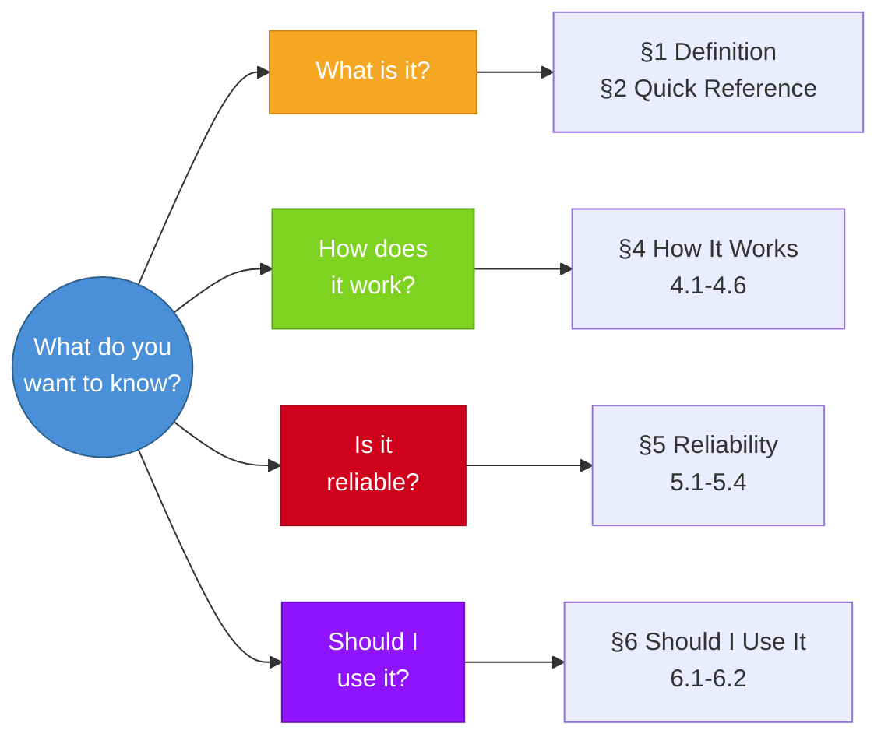

# How to Read a Benchmark Card

Each card has **6 top-level sections**, grouped by 4 reader paths. You don't need to read top to bottom — jump to the section that answers your question.

## Reading Paths

## Section Overview

| Section | Title | Content |
| ------- | ----- | ------- |
| §1 | Definition | Name, creator, release date, what it tests |
| §2 | Quick Reference | Metadata table (size, scoring, links, etc.) |
| §3 | Navigation | Mermaid diagrams for quick orientation |
| §4 | How It Works | What it tests(4.1), Input(4.2), Output(4.3), Data(4.4), Scale(4.5), Scoring(4.6) |
| §5 | Reliability | Limitations(5.1), Difficulty(5.2), Defects(5.3), Contamination(5.4) |
| §6 | Should I Use It | Use cases(6.1), Verdict(6.2) + one-line summary |

## Key Conventions

### Score Source Annotations

Every model score is annotated with:

- **Data date**: When the data was collected
- **Data source**: Official paper / Third-party leaderboard / Vendor self-reported
- **Evaluation protocol**: Single attempt / Multi-sample / Voting

> [!WARNING]
> Scores under different protocols are not directly comparable. Vendor self-reported scores may not be reproducible.

### Defect Source Tags

- 🏛️ = Officially acknowledged issue
- 🗣️ = Discovered by community research/discussion

### Verdict Labels

| Label       | Meaning              |
| ----------- | -------------------- |
| ★ Recommended | Worth referencing    |
| ⚠️ Conditional | Check prerequisites |
| ❌ Not Recommended | Outdated or unreliable |
