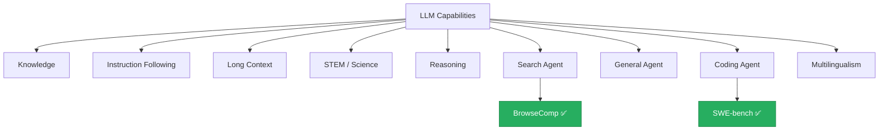

## What Is This

A practical reference site that builds a standardized **explainer card** for each important LLM benchmark.

Every card answers 4 core questions:

| Question              | Section |
| --------------------- | ------- |
| What is it?           | §1-§2   |
| How does it work?     | §4      |
| Is it reliable?       | §5      |
| Should I use it?      | §6      |

> [!TIP]
> Not sure how to read these cards? Start with the [reading guide](/en/guide/how-to-read).

## Capability Taxonomy

✅ = Card available &nbsp;|&nbsp; Other categories coming soon
