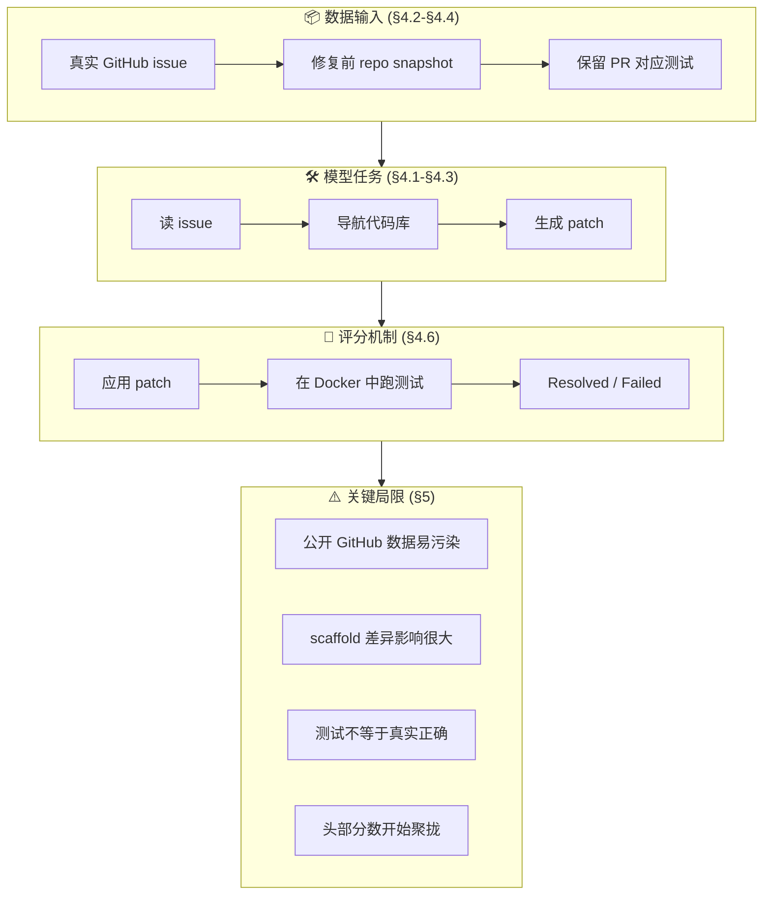
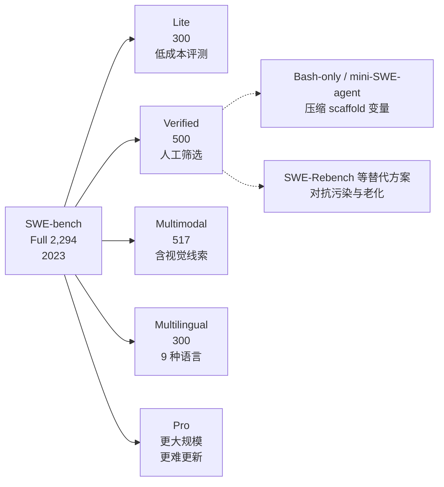

# Benchmark Card: SWE-bench

| 字段       | 值                                  |
| ---------- | ----------------------------------- |
| 日期       | 2026-04-07                          |
| 版本       | v2                                  |
| 状态       | 已重构为 6 章节模板；可横向对比      |
| 变更记录   | v1 → v2：对齐 6 个顶级章节；新增 §3 导航；将旧版 §3-§17 重组进 §4-§6；补齐 §5.4 四维风险表 |

---

## 1. 一句话定义

`SWE-bench` 是 Princeton NLP 团队在 2023 年公开的软件工程 benchmark，测试模型能否读取真实 GitHub issue、在真实代码仓库中定位问题，并生成能通过测试套件的 patch。

## 2. 快速参考

| 属性             | 值                                                           |
| ---------------- | ------------------------------------------------------------ |
| 全称             | SWE-bench: Can Language Models Resolve Real-World GitHub Issues? |
| 首次公开         | 2023-10（arXiv）；2024 ICLR Oral                             |
| 出品方           | Princeton NLP（Carlos Jimenez、John Yang 等）                |
| 数据集规模       | Full 2,294 / Lite 300 / Verified 500                         |
| 输入形式         | 代码仓库快照 + GitHub issue 描述                             |
| 输出形式         | Git patch（unified diff）                                    |
| 评分方式         | 在隔离环境中执行测试套件，以 `% Resolved` 统计通过率         |
| 一级类目         | `Coding Agent`                                               |
| 二级类目         | `Autonomous Bug Fix`                                         |
| 任务形态         | `real-world software patch generation`                       |
| 风险标签         | 训练集污染 / scaffold 差异 / 测试覆盖不足 / 排行榜饱和       |
| 官方站           | https://www.swebench.com/                                    |
| 论文             | https://arxiv.org/abs/2310.06770                             |
| GitHub           | https://github.com/SWE-bench/SWE-bench                       |
| 数据集           | https://huggingface.co/datasets/SWE-bench/SWE-bench          |
| 官方 Leaderboard | https://www.swebench.com/                                    |

## 3. 卡片导航

### 3.1 核心逻辑链：从真实 issue 到 `% Resolved`



### 3.2 家族演化：为什么今天有这么多 SWE-bench 版本



---

## 4. 它怎么运作

### 4.1 它到底在测什么

SWE-bench 主要关注以下能力：

1. 模型能否**读懂真实 issue**，把自然语言问题映射到代码修改任务。
2. 模型能否在**真实代码仓库里导航定位**，找到相关文件、类和测试。
3. 模型能否做出**跨文件、可执行的补丁修改**，并把问题落到实际代码变更上。
4. 模型能否在**受测试约束的工程环境**下完成修复，而非生成“看起来对”的代码。

与 HumanEval/MBPP 这类传统 code generation benchmark 的差异：

| 维度         | HumanEval 类            | SWE-bench                           |
| ------------ | ----------------------- | ----------------------------------- |
| 代码范围     | 单函数                  | 真实项目，常含多文件修改            |
| 任务来源     | 人工构造题目            | 真实 GitHub issue                   |
| 输入上下文   | 简短题目 + 函数签名     | issue 描述 + 仓库快照 + 测试        |
| 输出要求     | 函数实现                | Git patch                           |
| 评分机制     | 运行单元测试            | 在隔离环境跑项目测试套件            |
| 工具依赖     | 往往较弱                | 强依赖 repo navigation 与执行环境   |

### 4.2 输入长什么样

每个实例通常包含两部分：

- **代码仓库快照**：仓库被 checkout 到 issue 修复前的状态
- **Issue 描述**：来自 GitHub issue 的自然语言 bug/feature 描述

原始 benchmark 主要来自 12 个流行 Python 开源仓库：

```text
astropy, django, flask, matplotlib, pylint, pytest,
requests, scikit-learn, seaborn, sphinx, sympy, xarray
```

**公开示例**（来源：SWE-bench 官方公开 issue 样例）：

> **django/django#13933**: `FloatField` validates `Decimal` incorrectly  
> When a `Decimal` value is passed to a `FloatField`, the validator incorrectly rejects values that should be valid...

模型需要顺着这段描述找到相关实现位置并完成修复。

### 4.3 模型要输出什么

模型输出的是 **Git patch**，也就是 unified diff。

```diff
--- a/django/forms/fields.py
+++ b/django/forms/fields.py
@@ -303,7 +303,7 @@ class FloatField(IntegerField):
     def validate(self, value):
         super().validate(value)
-        if value and not isinstance(value, float):
+        if value is not None and not isinstance(value, (int, float, Decimal)):
             raise ValidationError(self.error_messages['invalid'])
```

> [!NOTE]
> 上面是说明性示例，用来展示输出形态，不是官方实例的精确答案。

### 4.4 数据是怎么做出来的

SWE-bench 的实例来自真实软件开发流程中的反向抽样：

1. 从目标仓库收集已关闭的 GitHub issue 与对应 PR
2. 只保留**有测试变更或可验证测试**的实例
3. 将仓库回退到 issue 修复前的状态
4. 用对应测试来验证模型 patch 是否真正解决问题

这套构造方式的关键价值：

- **自然发生**：问题来自真实开发，不是实验室玩具题
- **可自动验证**：不依赖 LLM judge，直接跑测试
- **工程相关**：更接近真实 bug fix workflow

### 4.5 数据规模与分布

核心子集与家族版本：

| 版本                 | 规模  | 作用 |
| -------------------- | ----- | ---- |
| SWE-bench Full       | 2,294 | 原始完整集 |
| SWE-bench Lite       | 300   | 降低评测成本，方便快速迭代 |
| SWE-bench Verified   | 500   | 人工筛选可解实例，减少脏数据 |
| SWE-bench Multimodal | 517   | 引入截图/UI 等视觉线索 |
| SWE-bench Multilingual | 300 | 扩展到 9 种编程语言 |

几个需要记住的分布事实：

- 原始 SWE-bench **高度偏 Python 仓库**。
- Verified 是目前被引用最多的“高可信子集”。
- 家族扩展本身说明官方也在承认：单一静态 Python bug-fix benchmark 不足以长期覆盖 coding agent 能力。

### 4.6 怎么判分

#### 流程

1. 在隔离环境中恢复 repo 到修复前状态
2. 应用模型生成的 patch
3. 执行实例对应的测试套件
4. 相关测试通过则记为 **Resolved**，否则记为 **Failed**

#### 核心指标

- **% Resolved**：成功解决的实例数 / 总实例数
- 在 leaderboard 上，最重要的是**相同 benchmark 子集 + 相同 scaffold**下的 `% Resolved`

#### 优点

- 不依赖人工主观评分
- pass/fail 边界相对清晰
- 与真实工程修复任务比传统代码题更接近

#### 仍存在的风险

- 测试通过不等于真实语义正确
- 测试过窄时，替代正确解可能被拒绝
- agent scaffold、检索工具、搜索预算会显著影响结果

---

## 5. 它可靠吗

### 5.1 它不测什么

- 从零开始搭建新项目的**绿地开发能力**
- 持续多轮的人机协作调试
- 原始 benchmark 之外的**多语言通用编程能力**
- 系统级架构设计与长期运维能力

常见误读提醒：

- **高分 ≠ 通用编程能力全能**
- **高分 ≠ 模型一定没见过答案**
- **高分 ≠ 纯模型能力更强**，很多时候只是 scaffold 更强

### 5.2 难度信号

#### 人类基线

SWE-bench 没有像 BrowseComp 那样稳定、常被引用的人类统一基线；实际阅读时，更常用的是“早期大模型极低分”与“今天 agent 系统高分”之间的落差来感知难度。

#### 模型表现（论文原始报告，2023）

| 模型          | % Resolved |
| ------------- | ---------- |
| Claude 2      | 1.96%      |
| GPT-4         | 1.74%      |
| SWE-Llama 13B | 0.70%      |

这说明：仅靠当时的基础模型能力，几乎无法端到端解决真实 repo 级问题。

#### 当前前沿表现（读排行榜时先看口径）

- **数据日期**：SWE-bench 官方 leaderboard 持续变动，不是静态论文表
- **数据来源**：官方 Leaderboards https://www.swebench.com/
- **评测口径**：先固定子集（通常看 Verified），再固定 agent scaffold；官方页面明确支持用 `mini-SWE-agent` / Bash-only 视图压缩变量
- **使用 harness**：不同 agent loop、检索工具、预算限制会显著改变分数

目前更稳妥的结论是：

- Verified 头部分数已经进入**高位拥挤区**
- scaffold 差异足以让同一底模出现**两位数百分点波动**
- 因为排序差距越来越小，SWE-bench 更适合作为**准入门槛 + 参考信号**，不适合单独当作终局裁判

### 5.3 已知缺陷与争议

#### 5.3.1 🗣️ 训练集污染是结构性问题

SWE-bench 的 issue、PR、commit 历史都来自公开 GitHub，主流模型大概率在训练语料中见过相关内容。  
来源：[SWE-bench 论文](https://arxiv.org/abs/2310.06770) 数据构造说明 + [Reddit 污染讨论](https://www.reddit.com/r/LocalLLaMA/comments/1nqo0oo/the_current_state_of_llm_benchmarks_is_so_polluted/)。

#### 5.3.2 🗣️ Repo state loophole 曾允许“翻答案”

社区在 issue #465 指出，早期评测环境里即使 checkout 到修复前状态，agent 仍可能通过 `git log --all` 等方式看到未来修复线索。  
来源：[GitHub issue #465](https://github.com/SWE-bench/SWE-bench/issues/465)。

#### 5.3.3 🏛️ 官方也在主动压缩 scaffold 变量

官方 leaderboard 明确提供 `mini-SWE-agent` / Bash-only 风格视图，说明团队自己也承认“agent scaffold 差异过大”会污染横向比较。  
来源：[SWE-bench 官方 Leaderboards](https://www.swebench.com/)。

#### 5.3.4 🗣️ 测试套件不总是等于真实正确

部分实例存在测试覆盖不足，模型可能写出“通过测试但并非正确修复”的 patch；反过来，也可能有合理修复因测试写法过窄而被拒绝。  
来源：[mini-SWE-agent 项目主页](https://mini-swe-agent.com/) 对评测约束的讨论 + 社区长期反馈。

#### 5.3.5 🏛️ 单一 Python 静态集已不足以覆盖 coding agent

官方持续推出 Verified、Multimodal、Multilingual、Pro 等家族成员，本身就说明原始 Full benchmark 的覆盖面和生命周期有限。  
来源：[SWE-bench 官方站](https://www.swebench.com/)。

### 5.4 数据污染与饱和风险

| 风险类型       | 评估   | 理由 |
| -------------- | ------ | ---- |
| 训练集污染     | 高     | 问题与修复线索来自公开 GitHub，天然容易被训练语料覆盖 |
| 分数饱和       | 中高   | Verified 头部结果已明显聚拢，小百分点差异的解释价值下降 |
| 评测框架差异   | 高     | scaffold、工具链、预算、搜索策略都会显著影响 `% Resolved` |
| 数据时效性漂移 | 低     | repo snapshot 与测试环境相对冻结，时间漂移小于 web benchmark |

---

## 6. 我该用它吗

### 6.1 适用场景

**适合：**

- 评估 coding agent 在**真实仓库修 bug**任务上的端到端能力
- 比较不同 agent scaffold 在同一代码修复任务上的工程效果
- 作为 coding agent 产品评估里的**基准门槛之一**

**不适合单独用来判断：**

- 通用编程创造力或绿地开发能力
- 跨语言、跨模态、跨长期 workflow 的全面工程能力
- 真实企业开发中的协作、评审、回滚、运维能力

### 6.2 当前是否值得看

**带条件看。** 理由：

1. 它仍然是 coding agent 领域最常被引用的公共 benchmark，论文对比时绕不开。
2. 它的测试执行评分比 LLM judge 更硬，仍有基础参考价值。
3. 它的家族扩展和官方 leaderboard 生态，使它依然是观察赛道演化的重要窗口。

**局限提醒：**

- 必须先对齐子集和 scaffold，再比较分数
- 不要把高分当成“无污染的真实能力”
- 建议与 Terminal-Bench、SWE-Rebench、CodeClash 等更新评测结合看

**一句话总结：**

> **它定义了 coding agent 的主流评测入口，但今天更适合当“重要参考系”，不适合当“唯一真相”。**
