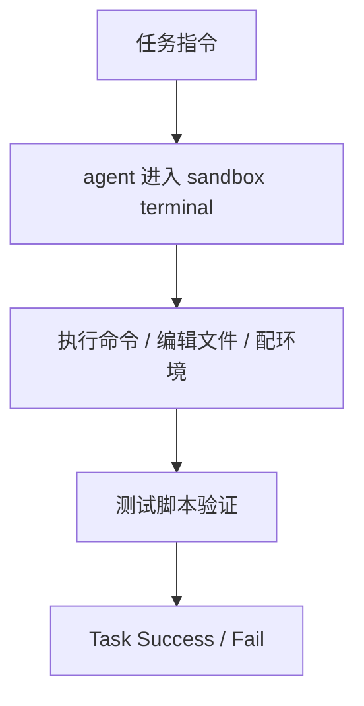

# Benchmark Card: Terminal-Bench 2

| 字段 | 值 |
| ---- | ---- |
| 日期 | 2026-04-08 |
| 版本 | v1 |
| 状态 | 首版上线；已按 6 章节模板整理 |
| 变更记录 | 新增终端代理类卡片；补入 Harbor / Terminal-Bench 2.0 运行视角 |

---

## 1. 一句话定义

`Terminal-Bench 2` 是一个面向真实终端环境的 agent benchmark，测试模型能否在 sandbox 里完成端到端 CLI 任务，而不是只会写一段代码或只会调用一个工具。

## 2. 快速参考

| 属性 | 值 |
| ---- | ---- |
| 全称 | Terminal-Bench |
| 当前重点版本 | Terminal-Bench 2.0 / Harbor 运行方式 |
| 首次公开 | 2026-01（论文与 beta 发布期） |
| 出品方 | Laude Institute |
| 数据集规模 | 约 100 个任务（beta） |
| 输入形式 | 英文任务指令 + 真实终端 sandbox |
| 输出形式 | agent 在终端中的实际操作与最终环境状态 |
| 评分方式 | 测试脚本执行成功 / 失败 |
| 一级类目 | `Coding Agent` |
| 二级类目 | `Terminal Operation` |
| 任务形态 | `end-to-end terminal agent evaluation` |
| 风险标签 | beta 迭代 / adapter 依赖 / Docker 环境差异 / 任务覆盖尚浅 |
| Repo | https://github.com/laude-institute/terminal-bench |
| Docs | https://www.tbench.ai/docs |
| Harbor 运行文档 | https://harborframework.com/docs/running-tbench |
| Leaderboard | https://www.tbench.ai/leaderboard |
| 论文 | https://arxiv.org/abs/2601.11868 |

## 3. 卡片导航

### 3.1 核心流程

### 3.2 如果你只看三件事

- 它测的是“在终端里把事情做完”，不是“讲出怎么做”。
- 每个任务都包含 **instruction + test script + oracle solution** 三件套。
- 当前还在 beta，官方 leaderboard 对应的是 `terminal-bench-core v0.1.1`。

---

## 4. 它怎么运作

### 4.1 它到底在测什么

Terminal-Bench 测的是：

1. 模型能不能在真实终端环境里执行多步任务。
2. 模型会不会正确使用 shell、工具链、文件系统和环境配置。
3. 模型最终能否让系统状态满足目标，而不是只输出一段看似正确的文本。

这类能力和 SWE-bench 有重叠，但不一样：

- SWE-bench 更偏“真实 repo bug fix”
- Terminal-Bench 更偏“终端环境中的端到端执行”

### 4.2 输入长什么样

每个任务的核心组成在官方 README 里写得很清楚：

- 一条英文 instruction
- 一个 test script
- 一个 reference / oracle solution

实际运行时，模型拿到的是：

- 任务说明
- 可操作的 terminal sandbox
- 必要的工具和环境

### 4.3 模型要输出什么

严格说，模型不需要“输出答案文本”。

真正被评测的是：

- 终端操作轨迹
- 产生的文件或系统状态
- 最后能否通过测试脚本

这让它比很多文本型 benchmark 更像真实 agent 任务。

### 4.4 数据是怎么做出来的

当前官方定义里，Terminal-Bench 由两部分组成：

1. **任务数据集**
2. **执行 harness**

并且新用户被明确引导到 `Harbor` 框架来跑 **Terminal-Bench 2.0**。

这很重要，因为它说明：

- benchmark 本体和运行框架是强耦合的
- numbers 不只是模型决定，也受 adapter / harness 影响

### 4.5 数据规模与分布

当前 beta 阶段，官方公开信息很明确：

| 维度 | 信息 |
| ---- | ---- |
| 当前状态 | beta |
| 任务量 | 约 100 个任务 |
| 当前 leaderboard 子集 | terminal-bench-core |
| 当前 leaderboard 版本 | v0.1.1 |

这是一张正在快速迭代的 benchmark 卡，不是完全冻结的数据集。

### 4.6 怎么判分

它的评分逻辑非常直接：

1. 让 agent 在 sandbox 里执行任务
2. 跑 test script
3. 通过则成功，否则失败

所以它的优点是：

- 不依赖主观 judge
- 更接近真实操作结果

但也带来新的解释要求：

- 环境配置一致吗
- adapter 一样吗
- 跑的是不是同一版本数据集

---

## 5. 它可靠吗

### 5.1 它不测什么

- GUI 桌面操作
- 长期团队协作开发
- 需求理解与产品设计
- 不依赖终端的复杂现实工作流

它更像测：

> 文本代理在真实命令行里的执行能力。

### 5.2 难度信号

Terminal-Bench 的难点并不只是“命令记不记得”，而是：

- 需要多步操作
- 需要正确使用环境
- 失败可能来自系统状态，而不是一句答案错
- 很多任务没有简单的“猜对”路径

这让它比纯文本代码 benchmark 更接近真实 agent 落地难点。

### 5.3 缺陷与争议

#### 5.3.1 🏛️ 还在 beta

官方自己明确写了会持续扩任务，数据和 leaderboard 都在演化。  
来源：[官方 Repo](https://github.com/laude-institute/terminal-bench) README 状态说明。

#### 5.3.2 🗣️ 运行框架影响很大

Harbor / adapter / sandbox 配置都会影响结果，跨提交比较需要标明完整运行配置。  
来源：[Harbor 运行文档](https://harborframework.com/docs/running-tbench) 对 adapter 差异的说明。

#### 5.3.3 🗣️ 当前任务覆盖还不够深

约 100 个任务对通用终端代理仍只是早期样本，不足以覆盖全部 CLI 场景。  
来源：社区对 beta 阶段 benchmark 覆盖面的讨论。

### 5.4 风险表

| 风险维度 | 风险级别 | 为什么 | 使用建议 |
| ---- | ---- | ---- | ---- |
| 版本迭代 | 高 | beta 阶段变化快 | 引用时必须写数据集与版本号 |
| Harness 依赖 | 高 | 结果受 adapter 与 sandbox 影响很大 | 尽量按官方文档标准运行 |
| 覆盖不足 | 中 | 当前任务量仍有限 | 更适合做方向性判断，不适合下绝对结论 |
| 复现成本 | 中 | Docker / Harbor / 资源要求更高 | 适合重点模型深测 |

---

## 6. 我该用它吗

### 6.1 适用场景

- 你在做 terminal agent
- 你关心“能不能把任务真跑完”
- 你想补上 SWE-bench 无法覆盖的 CLI 执行能力

### 6.2 是否值得看

> `Terminal-Bench 2` 很值得看，但现在更适合作为“前沿终端代理 benchmark”而不是最终稳定标准。解读时必须把版本、运行框架和 beta 状态写清楚。

结论标签：`⚠️ 条件看`
