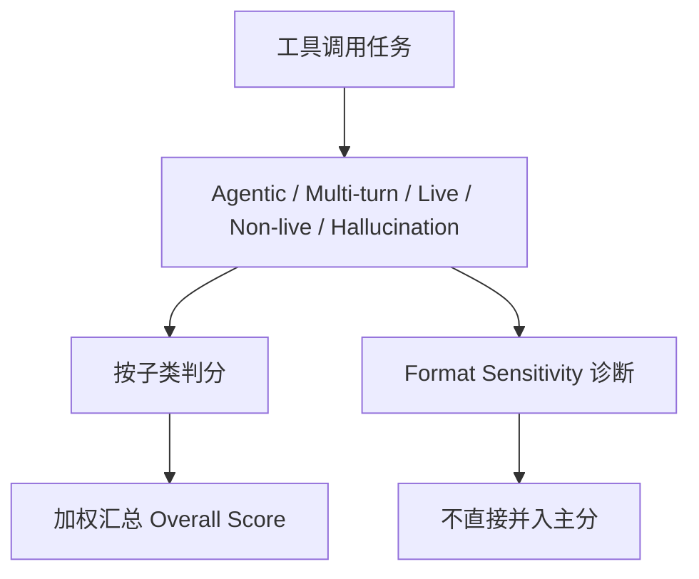

# Benchmark Card: BFCL V4

| 字段 | 值 |
| ---- | ---- |
| 日期 | 2026-04-08 |
| 版本 | v1 |
| 状态 | 首版上线；已按 6 章节模板整理 |
| 变更记录 | 新增通用 agent / tool-use 卡片；补入 V4 的 agentic 分层与加权规则 |

---

## 1. 一句话定义

`BFCL V4` 是 Berkeley Function Calling Leaderboard 的第四代版本，目标已经从“会不会单次 function calling”扩展到“模型能不能在 web search、memory、多轮工具调用和 live endpoint 上稳定完成 agentic tool use”。

## 2. 快速参考

| 属性 | 值 |
| ---- | ---- |
| 全称 | Berkeley Function Calling Leaderboard V4 |
| 首次公开 | 2025-07-17 |
| 出品方 | Berkeley Sky Computing Lab / Gorilla |
| 数据规模 | 5,088 个计分样例 + 5,200 个 format sensitivity 诊断配置 |
| 覆盖结构 | 18 类别、34 种语言、171 个场景 |
| 输入形式 | 用户请求 + 工具定义 / live endpoint / 多轮历史 / 记忆状态 |
| 输出形式 | 函数调用、参数、工具链轨迹、最终响应 |
| 评分方式 | 分项 deterministic scoring + overall weighted score |
| 一级类目 | `General Agent` |
| 二级类目 | `Tool Use` |
| 任务形态 | `agentic function calling and tool-use evaluation` |
| 风险标签 | 总分掩盖细项 / live 依赖 / schema 漂移 / format 诊断口径复杂 |
| Leaderboard | https://gorilla.cs.berkeley.edu/leaderboard |
| 项目介绍 | https://sky.cs.berkeley.edu/project/berkeley-function-calling-leaderboard/ |
| V4 Web Search | https://gorilla.cs.berkeley.edu/blogs/15_bfcl_v4_web_search.html |
| V4 Memory | https://gorilla.cs.berkeley.edu/blogs/16_bfcl_v4_memory.html |
| V4 Format Sensitivity | https://gorilla.cs.berkeley.edu/blogs/17_bfcl_v4_format_sensitivity.html |

## 3. 卡片导航

### 3.1 核心流程



### 3.2 如果你只看三件事

- BFCL V4 已经不是老式 AST function-calling 小榜，而是明确朝 `agent benchmark` 演化。
- 官方总分是**加权平均**，只看 overall 很容易掩盖具体短板。
- V4 还把 `format sensitivity` 做成了独立诊断层，这很符合真实产品问题。

---

## 4. 它怎么运作

### 4.1 它到底在测什么

BFCL V4 测的是更接近生产环境的工具调用能力：

1. 模型会不会选对工具。
2. 会不会填对参数。
3. 在多轮 / 有记忆 / 有 live endpoint 时能不能稳定完成任务。
4. 会不会凭空 hallucinate 不存在的函数或错误 schema。

它最重要的变化是：从 `single-turn function call` 走向 `holistic agentic evaluation`。

### 4.2 输入长什么样

官方 V4 现在覆盖的输入已经明显比早期 BFCL 复杂：

- 单轮工具调用
- 多轮工具调用
- Web Search
- Memory
- Live endpoints
- 多语言 schema / 请求表达

所以一个样本不只是“给你函数签名，让你吐 JSON”，而是更像真实 agent 面对的工具环境。

**公开示例**（来源：[BFCL 官方项目页](https://gorilla.cs.berkeley.edu/leaderboard) 与 Gorilla 文档）：

**User Query**

```text
What's the weather in San Francisco?
```

**Available Functions**

```json
[
  {
    "name": "get_weather",
    "description": "Get current weather for a city",
    "parameters": {
      "type": "object",
      "properties": {
        "city": { "type": "string" },
        "unit": { "type": "string", "enum": ["celsius", "fahrenheit"] }
      },
      "required": ["city"]
    }
  }
]
```

最基础的 case 看起来只是 function calling，但 V4 真正拉开差距的是多轮、memory、live endpoint 和 hallucination 子集。

### 4.3 模型要输出什么

输出通常包括：

- 结构化工具调用
- 正确参数
- 必要时的多轮调用序列
- 与 live tool / memory 状态匹配的行为

真正被评测的不是自然语言好不好看，而是：

- **动作是否正确**
- **动作序列是否合理**
- **有没有乱编工具**

### 4.4 数据是怎么做出来的

从官方 V4 公开说明可以看到几层结构：

1. 主计分集覆盖 **Agentic / Multi-turn / Live / Non-live / Hallucination**。
2. 另外还有大量 **Format Sensitivity** 配置，作为诊断层。
3. 数据覆盖 **18 类别、34 种语言、171 场景**。

它反映出一个非常清楚的设计目标：

- function calling 不该只测“标准 JSON 下的一次调用”
- 还要测真实代理系统里最容易翻车的边角

### 4.5 数据规模与分布

官方 V4 页面给出了一套很值得记的结构：

| 组成 | 作用 |
| ---- | ---- |
| Agentic | 含 Web Search 与 Memory，反映更复杂的工具工作流 |
| Multi-turn | 看多轮状态保持与调用连续性 |
| Live | 看真实 endpoint / 动态依赖 |
| Non-live | 看静态工具调用能力 |
| Hallucination | 惩罚不存在工具与错误调用 |
| Format Sensitivity | 单独诊断格式脆弱性，不直接进入主分 |

### 4.6 怎么判分

官方 overall score 不是简单平均，而是**加权汇总**：

- Agentic：40%
- Multi-turn：30%
- Live：10%
- Non-live：10%
- Hallucination：10%

另外，官方说明还提到：

- 子类内部按 unweighted average 处理
- format sensitivity 是独立诊断，不直接并入 overall

这意味着两件事：

1. 只看总分可能看不出模型是在 web search、memory 还是 multi-turn 崩。
2. 两个 overall 接近的模型，真实工具脆弱性可能完全不同。

---

## 5. 它可靠吗

### 5.1 它不测什么

- GUI 自动化
- 长时项目执行
- 真实企业后端权限体系
- 终端 / repo 级复杂编码任务

所以 BFCL V4 更像：

> 工具调用和 agentic tool-use 的中层基准。

而不是：

> 通用代理系统的最终考试。

### 5.2 难度信号

V4 的难点非常现实：

- schema 可能多语言
- 请求可能跨多轮
- 工具可能 live
- 记忆状态会影响下一步动作
- 格式稍微变一下就可能坏掉

这比早期 function calling benchmark 更接近产品里“明明功能都在，但 agent 还是翻车”的场景。

### 5.3 缺陷与争议

#### 5.3.1 🗣️ Overall score 容易掩盖真实短板

加权总分会盖住子项差异；一个模型可能 multi-turn 很强但 hallucination 很差。  
来源：[官方 Leaderboard](https://gorilla.cs.berkeley.edu/leaderboard) 的加权规则说明。

#### 5.3.2 🗣️ Live / agentic 场景的复现复杂度更高

不同运行环境、适配器与工具层都会影响结果，比 non-live 更难控制变量。  
来源：[V4 Web Search 博客](https://gorilla.cs.berkeley.edu/blogs/15_bfcl_v4_web_search.html) 对 live 测试的讨论。

#### 5.3.3 🏛️ Format sensitivity 独立于总分

这保护了总分稳定性，但也意味着只看总榜会低估格式脆弱性问题。  
来源：[V4 Format Sensitivity 博客](https://gorilla.cs.berkeley.edu/blogs/17_bfcl_v4_format_sensitivity.html)。

### 5.4 风险表

| 风险维度 | 风险级别 | 为什么 | 使用建议 |
| ---- | ---- | ---- | ---- |
| 总分误导 | 高 | overall 会盖住子项失败 | 一定先看分项再看总分 |
| 环境依赖 | 中 | live 与 agentic 运行更复杂 | 比较时尽量使用同一官方口径 |
| 口径复杂 | 中 | scoring 集与诊断集分离 | 对外解释要同时说明 diagnostics |
| 现实外推 | 中 | 仍主要围绕函数调用而非全栈代理 | 要和 Terminal-Bench / MCPMark 等结合看 |

---

## 6. 我该用它吗

### 6.1 适用场景

- 你在做 function calling / tool-use / MCP 类产品
- 你需要一个比“单次 JSON 调用”更像 agent 的 benchmark
- 你想知道模型是不是在 memory、web search、multi-turn 上真的稳

### 6.2 是否值得看

> `BFCL V4` 很值得看，但更适合“拆分项看”，不适合只拿 overall 当一句话结论。它是一张强工具调用卡，但不是通用代理总考卷。

结论标签：`⚠️ 条件看`
