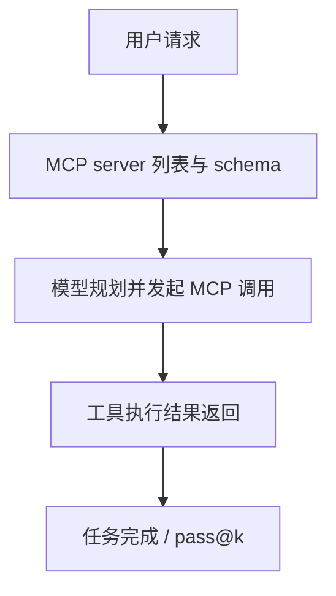

# Benchmark Card: MCPMark

| 字段 | 值 |
| ---- | ---- |
| 日期 | 2026-04-08 |
| 版本 | v1 |
| 状态 | 首版上线；按 MCP 原生工具生态整理 |
| 变更记录 | 新增 MCP benchmark 卡片；补入 5 类 MCP services、127 个任务与 `pass@k` 口径 |

---

## 1. 一句话定义

`MCPMark` 是一张专门评估 `Model Context Protocol` 工具使用能力的 benchmark，重点不是测“会不会输出 JSON”，而是测模型在真实 MCP server 环境里能不能选对工具、完成多步操作并产出正确结果。

## 2. 快速参考

| 属性 | 值 |
| ---- | ---- |
| 全称 | MCPMark |
| 首次公开 | 2025-08 |
| 出品方 | EvalSys |
| 数据集规模 | 当前标准套件 127 个任务，覆盖 5 类 MCP services（Notion / GitHub / Filesystem / Postgres / Playwright） |
| 输入形式 | 用户请求 + MCP server 能力 + 上下文状态 |
| 输出形式 | 工具调用序列、参数、最终结果 |
| 评分方式 | `pass@k` / success rate |
| 一级类目 | `General Agent` |
| 二级类目 | `MCP Tool Use` |
| 任务形态 | `native MCP tool-use evaluation` |
| 风险标签 | server 漂移 / 环境搭建依赖 / 生态变化快 / 任务覆盖仍早期 |
| Leaderboard | https://www.mcpmark.ai/leaderboard |
| Repo | https://github.com/eval-sys/mcpmark |
| 论文 | https://arxiv.org/abs/2509.24002 |

## 3. 卡片导航

### 3.1 核心流程

### 3.2 如果你只看三件事

- 这是当前少数**直接围绕 MCP 原生生态**设计的 benchmark。
- 它更适合看“会不会把 MCP 真用起来”，而不是泛化的 tool use 幻觉。
- 解释分数时要特别注意 server 版本和环境配置，因为 MCP 生态变化很快。

---

## 4. 它怎么运作

### 4.1 它到底在测什么

MCPMark 主要测三件事：

1. 模型能不能理解 MCP server 暴露的能力边界。
2. 能不能在多步任务里选对 server、选对工具、填对参数。
3. 能不能把外部工具结果真正转成正确的最终任务完成。

它最重要的定位是：

> 在 MCP 成为事实工具协议之后，评测也终于从“泛工具调用”走向“协议原生工具使用”。

### 4.2 输入长什么样

一个样本通常包含：

- 用户任务
- 一组可用 MCP servers
- 每个 server 的能力定义
- 运行上下文与工具返回结果

这和传统 function calling benchmark 的不同点在于：

- 工具是以 MCP server 形式组织的
- 调用边界更贴近真实部署生态
- 多步链路更自然

**公开示例**（来源：[MCPMark 官方 repo](https://github.com/eval-sys/mcpmark) 的 quickstart 任务与其公开任务描述 [`file_property/size_classification`](https://raw.githubusercontent.com/eval-sys/mcpmark/main/tasks/filesystem/standard/file_property/size_classification/description.md)）：

> **Task**: Use FileSystem tools to classify all files in the test directory into three categories by file size.
>
> **Objectives**:
> - create `small_files/` for files `< 300` bytes
> - create `medium_files/` for files `300-700` bytes
> - create `large_files/` for files `> 700` bytes
> - move every file into the correct subdirectory

这虽然只是 Filesystem 子集里的一个任务，但已经能体现 MCPMark 的核心：模型不是在“描述怎么做”，而是要真的通过 MCP server 把目录状态改对。

### 4.3 模型要输出什么

模型需要输出能真正执行的工具行为：

- 选择哪个 MCP server
- 调哪个工具
- 参数怎么填
- 是否需要多步串联

最终看的不是回复是否“像会用工具”，而是：

- 任务到底成没成

### 4.4 数据是怎么做出来的

官方 repo 的核心设计非常明确：

1. 使用真实 MCP server 生态，而不是抽象出来的假 schema；
2. 任务覆盖多个 server，避免只测单一工具；
3. 通过 `pass@k` 反映 agent 行为的随机性与探索性。

这让 MCPMark 和 BFCL V4 的区别很清楚：

- BFCL V4 更广义，覆盖 tool use / live / memory / multi-turn
- MCPMark 更聚焦 MCP 这一条实际正在成为标准的协议栈

### 4.5 数据规模与分布

当前官方最值得记住的结构就是：

| 维度 | 信息 |
| ---- | ---- |
| 任务量 | 127 |
| 覆盖 MCP services | 5 |
| 场景 | MCP 原生工具任务 |
| 结果口径 | `pass@k` / success rate |

所以它很适合：

- 做 MCP 工具栈上的模型筛选
- 看不同模型对原生 MCP server 的适配程度

### 4.6 怎么判分

核心逻辑是：

1. 给模型一个 MCP 任务
2. 允许它调用对应 servers
3. 检查最终任务是否成功
4. 统计 success rate 或 `pass@k`

`pass@k` 的好处是能反映：

- 这个模型是完全不会做
- 还是会做但单次稳定性不够

---

## 5. 它可靠吗

### 5.1 它不测什么

- GUI 自动化
- 长时项目执行
- 开放互联网搜索
- 非 MCP 协议下的全部工具生态

所以 MCPMark 高分更接近：

> 这个模型更会用 MCP 工具。

而不是：

> 这个模型已经是全能 agent。

### 5.2 难度信号

它的难点不是“知道 MCP 是什么”，而是：

- 真实 server 之间能力不同
- 参数和调用顺序容易出错
- 多步任务会暴露规划短板
- 工具调用正确不代表最终结果一定对

这让 MCPMark 比“静态 function schema”更贴近真实 MCP 产品问题。

### 5.3 缺陷与争议

#### 5.3.1 🏛️ MCP 生态变化很快

server、schema、部署方式都可能变化，benchmark 环境一致性是解释结果的前提。  
来源：[MCPMark Repo](https://github.com/eval-sys/mcpmark) 与官方 leaderboard。

#### 5.3.2 🗣️ 当前覆盖还属于早期规模

127 个任务、5 类 MCP services 已经很有代表性，但仍不足以覆盖整个 MCP 生态。  
来源：官方 repo 当前公开规模。

#### 5.3.3 🗣️ 协议原生不等于任务全栈

MCPMark 很强于测工具协议使用，但不覆盖 repo 修复、终端执行、开放世界业务闭环等更长链任务。  
来源：benchmark 任务边界本身。

### 5.4 风险表

| 风险维度 | 风险级别 | 为什么 | 使用建议 |
| ---- | ---- | ---- | ---- |
| 生态漂移 | 高 | MCP server 与 schema 变化快 | 报分时写清 benchmark 版本和 server 环境 |
| 覆盖不足 | 中 | 任务量仍有限 | 更适合作为协议专项 benchmark |
| 环境依赖 | 中 | 运行配置影响结果 | 复现时尽量贴近官方环境 |
| 现实外推 | 中 | 不覆盖更长链的全栈 agent 任务 | 要和 TAU2 / Terminal-Bench 等结合看 |

---

## 6. 我该用它吗

### 6.1 适用场景

- 你在做 MCP 工具栈或 MCP agent
- 你需要比较模型的 MCP 原生工具使用能力
- 你想把“支持 MCP”从营销话术变成可测能力

### 6.2 是否值得看

> `MCPMark` 很值得看，因为它终于把 MCP 这条真实协议链路拉进了 benchmark 体系。它不是通用 agent 总榜，但如果你的产品真的建立在 MCP 上，这张卡的参考价值很高。

结论标签：`★ 推荐`
