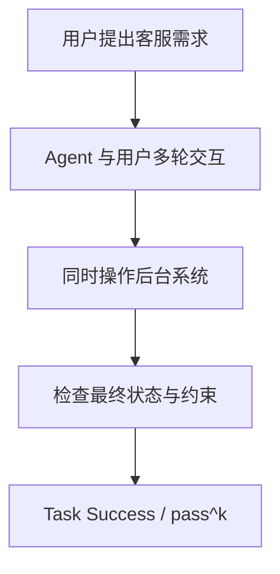

# Benchmark Card: TAU2-Bench

| 字段 | 值 |
| ---- | ---- |
| 日期 | 2026-04-08 |
| 版本 | v1 |
| 状态 | 首版上线；按官方 repo 的 dual-control 定位整理 |
| 变更记录 | 新增通用 agent 类卡片；补入 telecom customer service 与 pass^k 视角 |

---

## 1. 一句话定义

`TAU2-Bench` 是一个更接近真实业务流程的 agent benchmark，重点测模型能否在多轮客服任务里一边和用户对话、一边正确操作后台系统，而不是只会单次调用一个工具。

## 2. 快速参考

| 属性 | 值 |
| ---- | ---- |
| 全称 | τ²-Bench |
| 首次公开 | 2025-08 |
| 出品方 | Sierra |
| 核心场景 | Telecom customer service |
| 输入形式 | 用户请求 + 可调用业务工具 + 对话上下文 + 环境状态 |
| 输出形式 | 多轮对话、后台动作、最终任务状态 |
| 评分方式 | task success；官方实现支持 `pass^k` 评测 |
| 一级类目 | `General Agent` |
| 二级类目 | `Real-World Task Completion` |
| 任务形态 | `dual-control conversational agent evaluation` |
| 风险标签 | 模拟器真实性 / 业务域偏窄 / 环境依赖 / 口径持续演进 |
| Repo | https://github.com/sierra-research/tau2-bench |
| 论文 | https://arxiv.org/abs/2508.15160 |
| Leaderboard | https://www.taubench.com/ |

## 3. 卡片导航

### 3.1 核心流程

### 3.2 如果你只看三件事

- 它测的是“**对话 + 后台动作**”双控制，不是单纯 function calling。
- 它更像真实客服工作流，所以比 BFCL V4 更接近业务任务闭环。
- 但它目前仍是垂直场景 benchmark，不能拿来代替开放世界通用 agent 结论。

---

## 4. 它怎么运作

### 4.1 它到底在测什么

TAU2-Bench 想测的是现实业务 agent 的三个关键面：

1. 能不能理解用户真实意图，而不是只识别工具名。
2. 能不能在对话中正确澄清、确认和推进任务。
3. 能不能把后台系统状态真正改对。

这和纯工具调用 benchmark 的区别在于：

- 错误不只来自参数
- 还可能来自多轮沟通、状态跟踪和业务策略

### 4.2 输入长什么样

一个任务通常包含这些元素：

- 用户请求
- 多轮对话历史
- 一组业务工具或 API
- 后台账户/订单/套餐等状态

官方 repo 把它称为 `dual-control`，意思是 agent 需要同时处理两条线：

- 面向用户的自然语言交互
- 面向系统的操作动作

**公开示例**（来源：[TAU2-Bench 官方任务文件](https://raw.githubusercontent.com/sierra-research/tau2-bench/main/data/tau2/domains/telecom/tasks.json)，telecom task `"[mobile_data_issue]data_mode_off|data_usage_exceeded[PERSONA:None]"`）：

> **用户来电原因**：手机移动数据无法正常使用，希望把网速恢复到 `excellent`，不接受 poor / fair / good。
>
> **已知信息**：用户是 `John Smith`，号码 `555-123-2002`，当前位置在美国家中；不想升级套餐，但接受补充 `2.0 GB` 流量。
>
> **初始状态**：移动数据开关关闭，线路已使用 `15.1 GB` 数据。
>
> **评测要求**：agent 既要引导用户完成设备侧操作，也要完成后台 `refuel_data(..., 2.0)` 等动作，最终速度测试必须回到 `excellent`。

这类任务已经不是“调一次工具就结束”，而是要把对话澄清、用户侧操作和系统侧变更一起办完。

### 4.3 模型要输出什么

模型要输出的不只是一个最终答案，而是完整的任务行为：

- 对用户的回复
- 必要的澄清问题
- 对后台系统的操作
- 最终让任务达成的结果

所以 TAU2-Bench 更像在测：

> 真实业务任务能不能被一名 AI agent 完整办结。

### 4.4 数据是怎么做出来的

按官方说明，TAU2-Bench 的重点在于：

1. 环境围绕真实 telecom customer service 任务组织；
2. benchmark 显式建模对话与后台动作的双通道控制；
3. 官方实现支持多次运行与 `pass^k`，以反映 agent 的随机性。

这让它和更静态的 tool-use benchmark 形成明显互补：

- BFCL V4 更偏“会不会调用对工具”
- TAU2-Bench 更偏“任务闭环是否办成”

### 4.5 数据规模与分布

它当前最值得记住的不是总题量，而是分布形态：

| 维度 | 信息 |
| ---- | ---- |
| 场景 | 电信客服任务 |
| 交互形态 | 多轮对话 + 后台操作 |
| 评测方式 | 单次成功率 + `pass^k` |
| 设计重点 | 状态跟踪、业务约束、任务闭环 |

这意味着它非常适合看：

- 业务 agent 的完成度
- 多轮真实任务中的失误类型

### 4.6 怎么判分

核心不是“回复像不像人”，而是：

1. 任务最终有没有完成
2. 后台状态是否正确
3. 是否违反业务约束

官方实现还支持 `pass^k`，这点很重要，因为 agent 行为通常带随机性：

- 单次成功率反映稳定性
- `pass^k` 更像“给它几次机会能不能做成”

---

## 5. 它可靠吗

### 5.1 它不测什么

- 开放互联网检索
- GUI 自动化
- 代码仓库修复
- 跨多个企业系统的长期复杂 workflow

所以 TAU2-Bench 高分更接近：

> 这个模型更像一个能办客服业务的 agent。

而不是：

> 它已经在所有现实场景里都很强。

### 5.2 难度信号

它的难点比表面看起来更现实：

- 用户表达会变化
- 多轮对话容易丢状态
- 后台动作一步错，最终状态就可能全错
- 有些任务并不是一次工具调用就能完成

这类失败和真实企业 agent 产品里最常见的翻车点高度重合。

### 5.3 缺陷与争议

#### 5.3.1 🗣️ 业务域仍然偏窄

当前官方重点围绕 telecom customer service，外推到更广泛行业时要谨慎。  
来源：[TAU2-Bench 官方 Repo](https://github.com/sierra-research/tau2-bench) 项目说明。

#### 5.3.2 🗣️ 模拟用户与真实用户仍有差距

对话代理 benchmark 很难完全复刻真实客户的噪声、反复和异常行为。  
来源：对话式 agent benchmark 的通用局限。

#### 5.3.3 🏛️ 结果受环境与运行策略影响

不同采样预算、工具配置和运行策略会影响 `pass^k` 与成功率。  
来源：官方 repo 对 `pass^k` 与 benchmark 运行方式的说明。

### 5.4 风险表

| 风险维度 | 风险级别 | 为什么 | 使用建议 |
| ---- | ---- | ---- | ---- |
| 域外外推 | 高 | 主要聚焦电信客服 | 适合看垂直业务 agent，不适合做通用总榜 |
| 模拟器偏差 | 中 | 用户模拟与真实分布不完全一致 | 更适合看相对差异 |
| 环境依赖 | 中 | 成绩受运行配置影响 | 报分时写清预算和配置 |
| 口径演进 | 中 | 新 benchmark 仍在快速发展 | 关注官方版本说明 |

---

## 6. 我该用它吗

### 6.1 适用场景

- 你在做客服或事务办理型 agent
- 你关心任务能否真正闭环完成
- 你觉得纯 function calling benchmark 离业务现实还有距离

### 6.2 是否值得看

> `TAU2-Bench` 值得看，因为它把“对话理解”和“系统操作”绑在了一起，终于开始接近真实业务 agent 的失败模式。前提是你接受它目前还是垂直场景 benchmark，更适合作为强补充，而不是唯一总考卷。

结论标签：`⚠️ 条件看`
