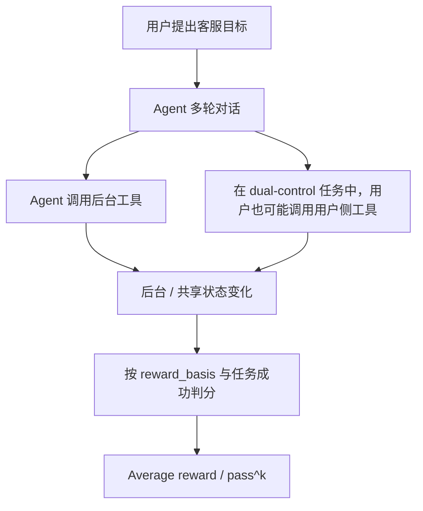

# Benchmark Card: TAU2-Bench

| 字段 | 值 |
| ---- | ---- |
| 日期 | 2026-06-29 |
| 版本 | v2 |
| 状态 | 已按当前官方 repo、arXiv / OpenReview 论文页、本地 `/mnt/hdd/work/temp/tau2-bench` diff 文档更新 |
| 变更记录 | 明确区分原始 `tau^2` telecom dual-control 口径与当前 `tau^3` repo 的知识、语音、任务修复扩展 |

---

## 1. 一句话定义

`TAU2-Bench` 用来评估对话式客服 agent 能不能把真实业务任务办结，而不只是“会不会调用工具”。它最独特的 `tau^2` 贡献是 telecom dual-control：AI agent 和模拟用户都能通过各自工具影响共享环境状态。

## 2. 快速参考

| 属性 | 值 |
| ---- | ---- |
| 全称 | `tau^2-Bench`: Evaluating Conversational Agents in a Dual-Control Environment |
| 首次论文公开 | 2025-06-09（arXiv 提交） |
| 当前论文状态 | OpenReview 页面显示为 ICML 2026 spotlight |
| 出品方 | Sierra / University of Toronto 相关作者 |
| 原始核心场景 | Telecom technical support，带用户侧工具的 dual-control 环境 |
| 当前 repo 域 | `mock`、`airline`、`retail`、`telecom`、`banking_knowledge` |
| 当前文本任务数 | `telecom`: full 2,285 / base 114；`retail`: 114；`airline`: 50；`banking_knowledge`: 97；`mock`: 10 |
| 知识库规模 | `banking_knowledge`: 当前 repo 中 698 个 policy / procedure 文档 |
| 模态 | 文本 half-duplex；语音 full-duplex realtime audio |
| 输入形式 | 用户目标、策略或知识上下文、工具、对话状态、后台/用户侧环境状态 |
| 输出形式 | 多轮对话、工具调用、后台状态变化、最终任务结果 |
| 评分方式 | average reward 与基于多次 trial 的 `pass^k` |
| 一级类目 | `General Agent` |
| 二级类目 | `Customer-Service Task Completion` |
| 风险标签 | 版本口径混用 / 模拟器依赖 / 域外外推 / retrieval 与 voice 协议依赖 |
| Repo | https://github.com/sierra-research/tau2-bench |
| 论文 | https://arxiv.org/abs/2506.07982 |
| OpenReview | https://openreview.net/forum?id=OC2z7iSQKa |
| Leaderboard | https://www.taubench.com/ |

## 3. 卡片导航

### 3.1 核心流程

### 3.2 如果你只看三件事

- 原始 `tau^2` 的重点不是“更多 function calling”，而是 **dual control**：agent 必须引导一个也能行动的用户。
- 当前 `sierra-research/tau2-bench` repo 已经比原始 telecom 论文更大：包含经典 `tau-bench` 域、`banking_knowledge` 检索域、语音 full-duplex、以及大量任务质量修复。
- 报分必须写清 domain、split、modality、retrieval config、user simulator 和 trial 数，否则很容易把不同口径的结果混在一起。

---

## 4. 它怎么运作

### 4.1 它到底在测什么

TAU2-Bench 最适合作为端到端客服 agent 评测来看。它关注模型能不能：

1. 理解用户目标和约束；
2. 在多轮对话中维护状态；
3. 正确选择并串联工具；
4. 给用户足够清楚的指令，让用户完成必要操作；
5. 最终把后台或共享环境状态改到正确结果。

Telecom dual-control 额外增加了一个现实难点：agent 不能把所有事情都自己改掉，有时必须指导用户检查或修改用户侧设备状态。

### 4.2 输入长什么样

一个任务通常会包含：

- 用户场景和来电原因；
- domain policy、workflow 或知识文档；
- agent 侧业务工具；
- telecom dual-control 中的 user-side tools；
- 初始数据库或设备状态；
- 定义目标结果的 evaluation criteria。

当前 repo 区分 domain 和 mode。文本模式是 turn-based half-duplex；语音模式是 full-duplex，并接入 realtime audio API。

### 4.3 模型要输出什么

模型输出的是可执行的客服行为：

- 对用户的自然语言回复；
- 必要的澄清问题；
- 正确的工具调用和参数；
- 会改变状态的后台动作；
- 符合策略的最终解决、拒绝或转接。

在 `banking_knowledge` 域里，agent 还必须先找到相关文档再行动。语音模式下，还要处理更接近真实通话的 turn-taking、插话和音频条件。

### 4.4 数据是怎么做出来的

这里有三层口径，不能混用：

| 层级 | 含义 |
| ---- | ---- |
| 原始 `tau-bench` | Airline / retail 等客服任务：工具使用、策略遵循、模拟用户、`pass^k` |
| `tau^2-Bench` | 新增 telecom dual-control：agent 和用户都有工具，共同影响共享环境 |
| 当前 `tau^3` repo 方向 | 新增 knowledge retrieval、voice full-duplex，以及大量 task-quality fixes |

本地 `/mnt/hdd/work/temp/tau2-bench` checkout 中，当前任务文件确认包含：telecom 2,285 个任务、retail 114 个任务、airline 50 个任务、banking_knowledge 97 个任务、mock 10 个任务；`banking_knowledge/documents` 下有 698 个 JSON 文档。

### 4.5 数据规模与分布

| 组件 | 当前 repo 规模 / 范围 | 主要用途 |
| ---- | ---- | ---- |
| `telecom` | full 2,285；`base` split 114 | Dual-control 技术支持 |
| `retail` | 114 tasks | 经典客服 tool use |
| `airline` | 50 tasks | 经典客服 tool use |
| `banking_knowledge` | 97 tasks + 698 docs | 检索 + 交易型工具执行 |
| `mock` | 10 tasks | 轻量测试 |
| Voice mode | 通过 audio-native providers 支持相关域 | Full-duplex voice-agent 评测 |

官方 leaderboard / submission 文档强调：标准评测应使用默认 `base` split，并尽量做多次 trial。

### 4.6 怎么判分

当前代码主要计算：

1. 每个任务根据 `reward_basis` 得到 task reward；
2. 跨 simulation 的 average reward；
3. 基于同一任务多次 trial 的 `pass^k`。

本地 `docs/evaluation.md` 里一个很重要的澄清是：对 airline、retail、telecom 来说，`evaluation_criteria.actions` 通常是一条参考轨迹，用来推导或诊断目标状态，不一定是 agent 必须逐步复现的脚本。真正门控 reward 的是 `reward_basis`；只有当 `ACTION` 出现在 `reward_basis` 里，完全匹配参考动作才变成硬要求。

---

## 5. 它可靠吗

### 5.1 它不测什么

- 开放互联网 research；
- GUI 自动化；
- 代码仓库修复；
- 长周期跨应用企业 workflow；
- 任意非客服场景的通用 agent 能力。

### 5.2 难度信号

它的价值在于很多失败都像真实上线失败：

- agent 解决了错误的用户目标；
- agent 知道该调什么工具，但没有把用户指导清楚；
- 用户侧状态变化和 agent 假设不一致；
- 后台状态差一点正确，但违反了 policy；
- 模型找到了正确知识文档，却误读或误用；
- 语音交互因为插话、等待或实时响应出错而失败。

### 5.3 缺陷与争议

- 名字容易混：`tau-bench`、`tau^2-Bench`、当前 `tau^3` repo feature 不是同一个评测切片。
- 原始 `tau^2` 的 dual-control 结论最强适用于 telecom technical support，不应自动外推到 repo 里所有域。
- 用户模拟器仍然是模拟器；它提高了可重复性，但不能完全代表真实用户。
- Knowledge 和 voice 结果受 retrieval config、audio provider、speech complexity、hallucination retry policy 等额外协议影响。
- Task fixes 会改变旧分数解释。旧 checkout 的成绩未必能和当前 repo 直接比较。

### 5.4 本地 diff 观察

本地 `/mnt/hdd/work/temp/tau2-bench` diff 里有 `PROJECT_GUIDE.md` 和若干 HTML 测试报告，更像一次 telecom `base` split 的调试/实验材料，不是官方 benchmark 元数据。可吸收的分析点是：

- 某些运行里出现较高转人工倾向，尤其是 agent 在没有充分确认客户或设备状态前就转接；
- 分析里出现工具参数错误，例如把地点、`unknown` 一类值误当作电话号码字段；
- 用户模拟器存在误判风险：用户可能以为任务解决了，但环境状态还没达到目标。

这些观察支持上面的风险判断：TAU2-Bench 的价值恰恰在于能暴露沟通、协作和环境状态失败；但解释分数时必须同时报告 scaffold 与运行配置。

### 5.5 风险表

| 风险维度 | 风险级别 | 为什么 | 使用建议 |
| ---- | ---- | ---- | ---- |
| 版本口径混用 | 高 | 当前 repo 已经超出原始 `tau^2` 论文范围 | 报告中写清 commit / release / domain / split |
| 域外外推 | 中到高 | 客服任务不等于开放世界通用 agent | 只把它当 customer-service agent 强信号 |
| 模拟器依赖 | 中 | 用户行为由 harness 生成和约束 | 结合人工审查或真实流量 eval |
| 环境依赖 | 中 | 工具、split、retrieval、voice、retry 配置都会影响结果 | 固定配置并随分数一起公开 |
| 旧分数可比性 | 中 | 当前 repo 包含 task fixes 和新增模态 | 不混报旧版与新版结果 |

---

## 6. 我该用它吗

### 6.1 适用场景

**适合：**

- 客服、售后、交易办理型 agent；
- 检查 tool use 是否真的带来任务闭环；
- 研究 agent 和用户共同操作环境时的 coordination 问题；
- 比较知识型客服任务里的 retrieval 方法；
- 评估 voice agent 在 full-duplex 条件下的任务完成能力。

**不适合单独用于：**

- 通用 agent 总排名；
- 开放互联网 research 能力判断；
- coding agent 能力判断；
- GUI / desktop automation 能力判断。

### 6.2 是否值得看

**值得看，但必须带口径。** TAU2-Bench 的强项是它检查任务闭环、后台状态，以及 telecom 场景里的用户-agent 协作。引用它时要明确 domain、split、版本、模态、retrieval config 和 trial 数。

结论标签：`推荐，但必须限定使用范围`

---

## 7. 事实校验记录

| 断言 | 校验状态 | 来源 |
| ---- | ---- | ---- |
| `tau^2` 论文于 2025-06-09 提交 arXiv，标题为 "Evaluating Conversational Agents in a Dual-Control Environment" | confirmed | arXiv `2506.07982`；OpenReview ICML 2026 页面 |
| `tau^2` 核心贡献是 telecom dual-control，agent 和用户都有工具 | confirmed | arXiv 摘要；OpenReview 摘要 |
| 当前 repo 域包括 `mock`、`airline`、`retail`、`telecom`、`banking_knowledge` | confirmed | 官方 GitHub README |
| 当前 repo 增加了 `banking_knowledge`、voice full-duplex 和 task-quality fixes | confirmed | 官方 GitHub README 与 release notes |
| 当前本地 checkout 的任务数为 `telecom=2285`、`retail=114`、`airline=50`、`banking_knowledge=97`、`mock=10` | confirmed from local files | `/mnt/hdd/work/temp/tau2-bench/data/tau2/domains/*/tasks.json` |
| `banking_knowledge` 有 698 个 policy / procedure 文档 | confirmed | 本地文件计数；官方 GitHub changelog |
| 本地 telecom 分析提到高转接、工具参数错误和用户模拟器误判风险 | partially_supported；这是本地运行分析，不是官方 benchmark 元数据 | `/mnt/hdd/work/temp/tau2-bench/PROJECT_GUIDE.md`；本地 HTML reports |
