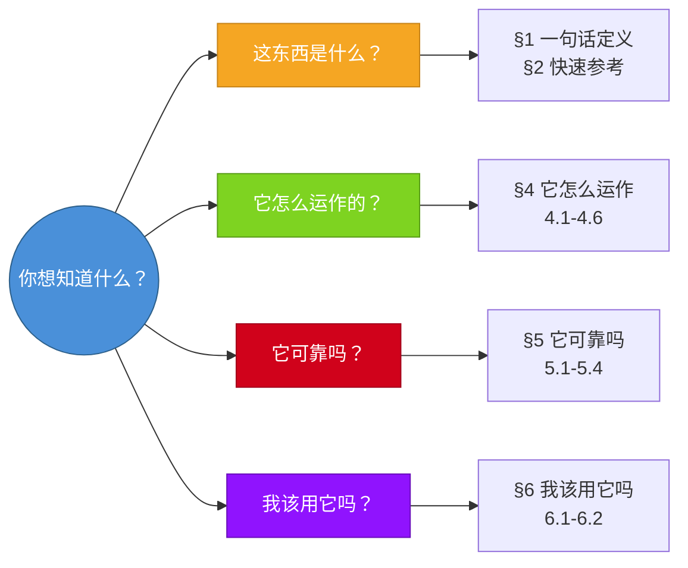

# 怎么读一张 Benchmark 卡片

每张卡片统一 **6 个顶级章节**，按 4 条读者路径分组。你不需要从头读到尾，可以按自己的问题跳读。

## 阅读路径

## 章节结构一览

| 章节 | 标题 | 内容 |
| ---- | ---- | ---- |
| §1 | 一句话定义 | 名称、出品方、发布时间、测什么 |
| §2 | 快速参考 | 元数据表格（规模、评分方式、链接等） |
| §3 | 卡片导航 | Mermaid 图表，帮你快速定位 |
| §4 | 它怎么运作 | 测什么(4.1)、输入(4.2)、输出(4.3)、数据构造(4.4)、规模(4.5)、判分(4.6) |
| §5 | 它可靠吗 | 不测什么(5.1)、难度信号(5.2)、缺陷争议(5.3)、污染风险(5.4) |
| §6 | 我该用它吗 | 适用场景(6.1)、是否值得看(6.2) + 一句话总结 |

## 关键约定

### 分数来源标注

每张卡片的模型分数都会标注：

- **数据日期**：什么时候的数据
- **数据来源**：官方论文 / 第三方排行榜 / 厂商自报
- **评测口径**：单次作答 / 多次采样 / 投票

> [!WARNING]
> 不同口径的分数不可直接比较。厂商自报分数的复现性无法保证。

> [!TIP]
> 如果你想知道这些卡片优先信哪些来源、什么时候会参考 repo wiki / DeepWiki 文档层，可以继续看[这些卡片怎么取材](/zh/cards/guide/how-we-source)。

### 争议来源标签

- 🏛️ = 官方文档/论文明确写出的边界、取舍或问题
- 🗣️ = 社区讨论或第三方研究揭示的问题

### 结论标签

| 标签   | 含义           |
| ------ | -------------- |
| ★ 推荐  | 值得参考       |
| ⚠️ 条件看 | 需要注意前提条件 |
| ❌ 不推荐 | 已过时或不可信   |
