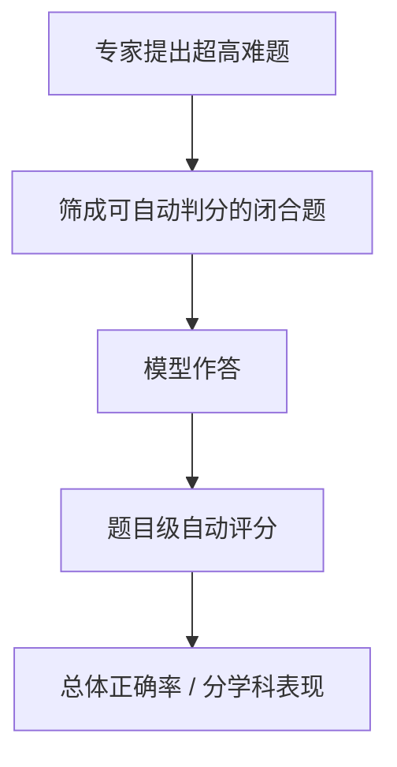

# Benchmark Card: HLE

| 字段 | 值 |
| ---- | ---- |
| 日期 | 2026-04-08 |
| 版本 | v1 |
| 状态 | 首版上线；补入 HLE / HLE-Verified 的解释边界 |
| 变更记录 | 新增 Hard Reasoning 类卡片；覆盖公开基准、自动评分约束与后续验证版脉络 |

---

## 1. 一句话定义

`HLE`（`Humanity's Last Exam`）是一张面向前沿模型的超高难度闭卷 benchmark：题目由专家编写，覆盖跨学科与部分多模态场景，目标不是测“会不会做常规题”，而是测模型在接近人类专家边界时还能不能稳定推理并给出可自动判分的答案。

## 2. 快速参考

| 属性 | 值 |
| ---- | ---- |
| 全称 | Humanity's Last Exam |
| 首次公开 | 2025-01 |
| 出品方 | Center for AI Safety / Scale AI（联合多方研究者与专家） |
| 数据集规模 | 2,500 题 |
| 题目来源 | 专家编写的高难度闭合式问题 |
| 输入形式 | 文本题、部分图像题，常带专业背景与多步约束 |
| 输出形式 | 最终短答案、数值答案或选项答案 |
| 评分方式 | 题目级自动评分（exact match / 规则化答案检查 / 选择题判断） |
| 一级类目 | `Hard Reasoning` |
| 二级类目 | `Frontier Closed-Ended Reasoning` |
| 任务形态 | `expert-level closed-ended reasoning benchmark` |
| 风险标签 | 答案边界歧义 / 版本演化 / 渐进污染 / 闭合题偏置 |
| 官方页 | https://www.lastexam.ai/ |
| Dataset | https://huggingface.co/datasets/cais/hle |
| 论文 | https://arxiv.org/abs/2501.14249 |
| 后续验证版 | https://futureoflife.org/project/hle-verified/ |

## 3. 卡片导航

### 3.1 核心流程

### 3.2 如果你只看三件事

- 它测的是 frontier 模型在**专家级闭合题**上的上限，不是日常知识问答。
- 它的关键约束是“**必须能自动判分**”，所以题目再难，也要收敛成短答案或可检查格式。
- 这张卡很有价值，但要连同 `HLE-Verified` 一起看，因为高难题天然更容易暴露答案歧义和数据卫生问题。

---

## 4. 它怎么运作

### 4.1 它到底在测什么

HLE 想测的是更靠近研究前沿和专家边界的能力：

1. 模型能不能理解专业学科里的高压缩题面。
2. 模型能不能跨知识与推理完成多步求解。
3. 在题目不能靠常见模板秒答时，模型还能不能稳定得出最终结论。

它更像在测：

> 当题目已经被推到“普通高分 benchmark 不够硬”的位置时，模型还剩多少真实推理余量。

### 4.2 输入长什么样

输入通常有这些特征：

- 题面短，但信息密度高
- 常带专业名词、公式、图像或学科背景
- 最终答案是可校验的短结果，而不是开放式长文

这和常规知识 benchmark 的差异在于：

- 难点主要来自推理链和学科深度
- 不是靠 4 选 1 或简单检索就能稳定解决
- 出题时已经预先考虑“能否自动打分”

**公开示例**（来源：[HLE 官方页](https://lastexam.ai/) 的公开样题）：

> **Classics**: Here is a representation of a Roman inscription, originally found on a tombstone. Provide a translation for the Palmyrene script.
>
> **Transliteration**: `RGYNᵓ BT ḤRY BR ᶜTᵓ ḤBL`

这类题很能体现 HLE 的风格：题目不长，但默认你已经具备非常专门的学科背景，而且最终答案必须是可校验的短结果。

### 4.3 模型要输出什么

模型最终要给出一个**可判分的最终答案**。

题目不同，答案格式会不同：

- 一个选项
- 一个数值
- 一段极短的标准答案

这意味着 HLE 虽然难，但它不是开放式 essay benchmark。

### 4.4 数据是怎么做出来的

官方公开材料强调了三件事：

1. 题目由广泛的学科专家贡献，而不是自动生成。
2. 题目目标是“足够难”，但仍要能自动评测。
3. 数据覆盖跨学科场景，并包含部分多模态题。

这套设计让 HLE 同时兼顾了两件原本很难兼得的事：

- 题目足够硬
- 评测仍能规模化

### 4.5 数据规模与分布

至少要记住下面几件事：

| 维度 | 信息 |
| ---- | ---- |
| 总规模 | 2,500 题 |
| 题型 | 闭合式短答案 / 选择题 / 可规则化答案 |
| 难度定位 | 面向 frontier 模型的上限压测 |
| 模态 | 文本为主，含部分多模态题 |

它更适合做：

- 前沿模型的高难度知识与推理比较
- 补足 MMLU-Pro / GPQA 还不够“硬”的部分
- 观察模型在顶级难题上的剩余提升空间

### 4.6 怎么判分

它的核心要求是：**每一道题都要能自动评分**。

所以实际做法通常是：

1. 模型生成最终答案
2. 按题目类型做规则化抽取
3. 使用 exact match、数值比较或题目特定检查器判分
4. 汇总总体准确率

优点是：

- 不依赖主观 LLM judge
- 适合做高难题的大规模统一对比

代价是：

- 题目必须被设计成闭合式
- 开放式研究能力不会被完整覆盖

---

## 5. 它可靠吗

### 5.1 它不测什么

- 长篇论证写作
- 工具调用与联网检索
- 多轮协商
- 长时真实任务执行

所以 HLE 高分更接近：

> 这个模型在极难闭合题上的知识与推理能力很强。

而不是：

> 它已经是通用现实世界 agent。

### 5.2 难度信号

HLE 的难度信号很直接：

- 官方定位本来就是“给 frontier 模型施压”
- 题目来自专家出题，不是通用考试题简单堆叠
- 多数题目没有明显模板化捷径

也正因此，它和 `MMLU-Pro`、`GPQA` 的关系不是替代，而是继续往更硬的位置推进。

### 5.3 缺陷与争议

#### 5.3.1 🏛️ 高难题更容易出现答案边界问题

题目越难、学科越专，答案规范化就越容易出争议。这也是为什么后续又出现了 `HLE-Verified` 这类更重数据卫生的衍生版本。  
来源：[HLE 官方页](https://www.lastexam.ai/) 与 [HLE-Verified](https://futureoflife.org/project/hle-verified/) 项目说明。

#### 5.3.2 🗣️ 闭合式设计会压缩真实研究过程

为了可自动判分，HLE 必须把问题收敛成闭合答案；这让它很强于比较模型，但也不能完整代表真实科研与开放探索。  
来源：[HLE 论文](https://arxiv.org/abs/2501.14249) 对自动评测设计的说明。

#### 5.3.3 🗣️ 前沿 benchmark 会更快面临污染与版本压力

一旦 HLE 被广泛引用，题目就更可能进入训练或提示工程经验里，解释分数时需要关心版本与后续数据治理。  
来源：前沿公开 benchmark 的通用风险；官方后续验证版也反映了这一点。

### 5.4 风险表

| 风险维度 | 风险级别 | 为什么 | 使用建议 |
| ---- | ---- | ---- | ---- |
| 答案歧义 | 高 | 高难题更难完全规范化 | 引用时最好同时参考验证版或审计说明 |
| 版本演化 | 中 | HLE / HLE-Verified 等口径在发展 | 报分时写清具体版本 |
| 闭合题偏置 | 中 | 自动评分要求限制了题型开放度 | 不能拿它替代真实研究任务 |
| 渐进污染 | 中 | 前沿 benchmark 一旦出名就更易被吸收 | 更适合看趋势和相对差异 |

---

## 6. 我该用它吗

### 6.1 适用场景

- 你想看 frontier 模型的高难度知识与推理上限
- 你觉得 `MMLU-Pro`、`GPQA` 还不够硬
- 你需要一张不依赖 LLM judge 的超高难 benchmark 卡

### 6.2 是否值得看

> `HLE` 很值得看，因为它把“前沿模型到底离专家边界还有多远”这件事压成了一个可自动比较的 benchmark。只是解释结果时，必须把答案歧义、版本演化和 `HLE-Verified` 一起纳入视野。

结论标签：`★ 推荐`
