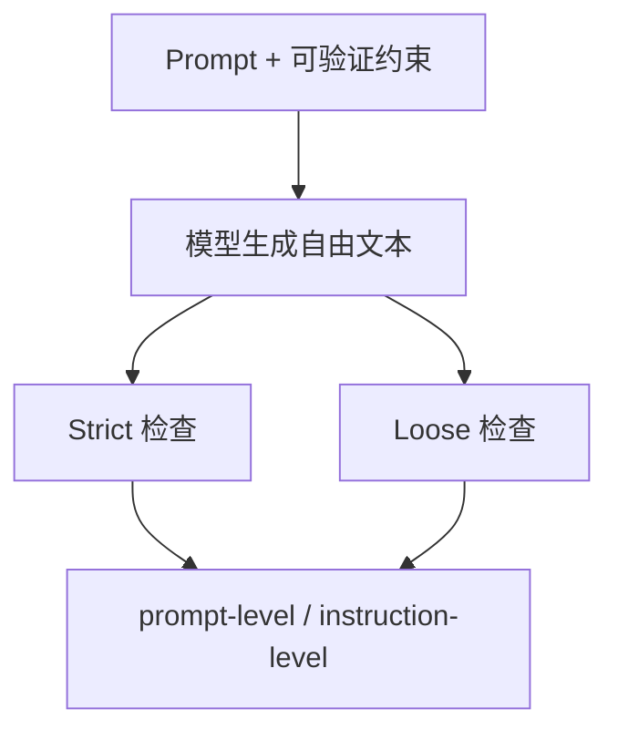

# Benchmark Card: IFEval

| 字段 | 值 |
| ---- | ---- |
| 日期 | 2026-04-08 |
| 版本 | v1 |
| 状态 | 首版上线；已按 6 章节模板整理 |
| 变更记录 | 新增指令遵循类卡片；补入 strict / loose 两种实现口径 |

---

## 1. 一句话定义

`IFEval` 是 Google Research 提出的指令遵循 benchmark，用一组**可程序化验证**的格式、长度、关键词、语言等约束，测试模型到底有没有按 prompt 做事。

## 2. 快速参考

| 属性 | 值 |
| ---- | ---- |
| 全称 | Instruction-Following Evaluation for Large Language Models |
| 首次公开 | 2023-11 |
| 出品方 | Google Research |
| 数据集规模 | 541 条 prompt |
| 指令类型 | 25 类可验证 instruction |
| 输入形式 | 自然语言 prompt，通常含 1 条或多条约束 |
| 输出形式 | 自由文本回答 |
| 评分方式 | 基于规则检查器的 strict / loose 评分 |
| 一级类目 | `Instruction Following` |
| 二级类目 | `Verifiable Constraint Satisfaction` |
| 任务形态 | `response-format and constraint compliance` |
| 风险标签 | 英文偏置 / 表面顺从 / 内容质量盲区 / taxonomy 有限 |
| 论文 | https://huggingface.co/papers/2311.07911 |
| 官方实现 | https://github.com/google-research/google-research/tree/master/instruction_following_eval |
| 输入数据 | https://github.com/google-research/google-research/tree/master/instruction_following_eval/data |

## 3. 卡片导航

### 3.1 核心流程

### 3.2 如果你只看三件事

- 它最强的地方是：约束大多能被**程序检查**，不依赖 LLM judge。
- 它测的是“有没有照做”，不是“内容有没有洞见”。
- 它非常适合补足聊天模型常见的“看起来听话，实际上漏条件”的问题。

---

## 4. 它怎么运作

### 4.1 它到底在测什么

IFEval 测的是：

1. 模型能不能识别 prompt 里的**显式约束**。
2. 模型会不会在输出时真的**满足这些约束**。
3. 当一个 prompt 同时要求多件事时，模型能不能**全部满足，而不是只满足一部分**。

它特别适合测这类失败：

- 要 3 段却写成 1 段
- 要 JSON 却写成自然语言
- 要避免某些词却还是写出来
- 要用指定语言回复却中途切回英文

### 4.2 输入长什么样

输入是自然语言 prompt，但 prompt 里嵌入的是**可验证约束**。

官方实现里的 instruction registry 大致覆盖这些簇：

- keyword
- language
- length constraints
- detectable content
- detectable format
- combination
- start / end
- case
- punctuation

这意味着 IFEval 更像在测“约束执行”，而不是测知识问答。

### 4.3 模型要输出什么

模型输出是自由文本。

但 benchmark 真正关心的是：

- 有没有满足 prompt 里的全部 instruction
- 是否满足每一条 instruction

所以它的输出可以是：

- 一段文本
- 多段文本
- 列表
- JSON

关键不在“内容题材”，而在“形式是否符合”。

### 4.4 数据是怎么做出来的

根据论文与官方实现：

- 数据集包含 **541 条 prompt**
- 覆盖 **25 类可验证 instruction**
- 每条 prompt 会绑定 instruction id 与参数
- 这些约束被设计成可以用规则检查器自动验证

官方 repo 的结构很重要，因为它把 benchmark 解释得非常具体：

- `instructions_registry.py` 定义了 instruction taxonomy
- `evaluation_lib.py` 定义了 strict / loose 两套检查逻辑
- `evaluation_main.py` 输出 prompt-level 与 instruction-level 两种报告

### 4.5 数据规模与分布

需要记住的不是“题量很大”，而是“约束类型覆盖得够清楚”。

| 维度 | 信息 |
| ---- | ---- |
| prompt 数 | 541 |
| instruction 类型 | 25 |
| 检查粒度 | prompt-level / instruction-level |
| 评测口径 | strict / loose |

所以 IFEval 的价值不在“大”，而在“干净”。

### 4.6 怎么判分

官方实现有两条主线：

#### strict

- 直接对原始回答执行规则检查
- 每条 instruction 得到一个布尔值
- 全部满足才算该 prompt 通过

#### loose

- 对回答做轻量修正后再检查
- 例如去掉星号、去掉首行 / 末行，再尝试验证
- 更像给格式噪声一点容错

最终报告至少有两个核心指标：

- **prompt-level**
- **instruction-level**

这比“只报一个总分”更有解释性。

---

## 5. 它可靠吗

### 5.1 它不测什么

- 回答是否真实
- 回答是否有洞见
- 复杂工具调用能力
- 多轮协商能力
- 非显式约束下的“默认礼貌程度”

所以 IFEval 高分更接近：

> 这个模型能比较稳定地遵守显式指令。

而不是：

> 这个模型整体回答质量一定更高。

### 5.2 难度信号

IFEval 的难点不在知识，而在**漏条件**。

它对模型很苛刻的地方在于：

- prompt 里经常不止一个约束
- 只要漏掉一条，prompt-level 就失败
- 有些 instruction 彼此存在冲突空间，要求模型精确控制输出格式

这种失败在真实产品里很常见，所以它的工程价值很高。

### 5.3 缺陷与争议

#### 5.3.1 🗣️ 偏重“表面可验证约束”

如果模型把格式做对了但内容空洞，IFEval 不会惩罚。  
来源：社区对 rule-based 评测的通用批评；[论文](https://arxiv.org/abs/2311.07911) 也承认只测“可验证指令”。

#### 5.3.2 🗣️ 主要是英文 prompt 语境

对多语种 instruction following 的覆盖很有限，检查器围绕英文习惯设计。  
来源：[官方 instruction registry](https://github.com/google-research/google-research/tree/master/instruction_following_eval) 设计。

#### 5.3.3 🏛️ Loose 口径会放大“边缘合格”

strict 与 loose 分数不能混着比较，loose 做了轻量修正后再验证。  
来源：[官方 evaluation_lib.py](https://github.com/google-research/google-research/tree/master/instruction_following_eval) 中的 strict/loose 双实现。

### 5.4 风险表

| 风险维度 | 风险级别 | 为什么 | 使用建议 |
| ---- | ---- | ---- | ---- |
| 内容质量盲区 | 高 | 只要形式对，内容一般也可能过关 | 必须和事实性 / 推理 benchmark 组合看 |
| 英文偏置 | 中 | instruction 设计和检查器主要围绕英文习惯 | 多语产品不能只看它 |
| 指令覆盖有限 | 中 | 25 类很清楚，但远不是现实世界全部 prompt 形态 | 当成下限测试，不要当全集 |
| 口径混用 | 中 | strict / loose 不是同一个分数 | 对外引用必须标明是哪一种 |

---

## 6. 我该用它吗

### 6.1 适用场景

- 你在做聊天产品、助手产品、写作工具
- 你最怕“模型不照要求做”
- 你想把 instruction following 从主观感受变成可量化指标

### 6.2 是否值得看

> `IFEval` 是一张非常实用的“服从性基线卡”。它不负责告诉你模型有没有知识，但很适合告诉你模型会不会把明确要求做对。

结论标签：`★ 推荐`
