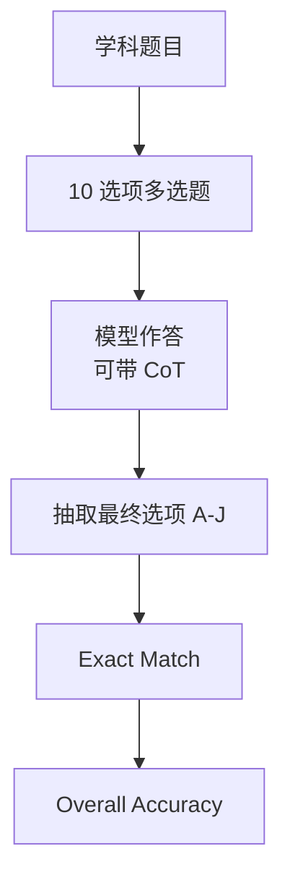

# Benchmark Card: MMLU-Pro

| 字段 | 值 |
| ---- | ---- |
| 日期 | 2026-04-08 |
| 版本 | v1 |
| 状态 | 首版上线；已按 6 章节模板整理 |
| 变更记录 | 新增知识类 benchmark 卡片；来源同时覆盖官方 repo、论文与 repo 文档层 |

---

## 1. 一句话定义

`MMLU-Pro` 是对原版 `MMLU` 的强化版多学科选择题 benchmark，重点不只是测“记不记得知识点”，而是测模型能否在更低猜中率、更高推理负担下稳定完成跨学科问答。

## 2. 快速参考

| 属性 | 值 |
| ---- | ---- |
| 全称 | MMLU-Pro: A More Robust and Challenging Multi-Task Language Understanding Benchmark |
| 首次公开 | 2024-06 |
| 出品方 | TIGER Lab / Waterloo 团队 |
| 数据集规模 | 12,000+ 题 |
| 领域覆盖 | 14 个领域 |
| 输入形式 | 多项选择题，通常 10 个选项 |
| 输出形式 | 最终答案字母或带答案标记的文本 |
| 评分方式 | 答案抽取后做 exact match / accuracy |
| 一级类目 | `Knowledge` |
| 二级类目 | `Robust Multi-Subject QA` |
| 任务形态 | `expert-level multiple-choice reasoning` |
| 风险标签 | 训练污染 / 多选题饱和 / prompt 口径差异 / answer extraction 影响 |
| 官方 Repo | https://github.com/TIGER-AI-Lab/MMLU-Pro |
| 论文 | https://arxiv.org/abs/2406.01574 |
| Dataset | https://huggingface.co/datasets/TIGER-Lab/MMLU-Pro |
| Leaderboard | https://huggingface.co/spaces/TIGER-Lab/MMLU-Pro |

## 3. 卡片导航

### 3.1 核心流程

### 3.2 如果你只看三件事

- 它比原版 `MMLU` 更难，核心做法是把选项从 4 个扩到 10 个，并增加推理型题目。
- 它仍然是多选题 benchmark，所以高分不等于真实开放式专家推理已经解决。
- 官方 repo 文档层已经把 answer extraction、prompt 风格和 CoT 影响显式暴露出来，解读时不能只看一张 leaderboard。

---

## 4. 它怎么运作

### 4.1 它到底在测什么

MMLU-Pro 测的不是“百科记忆小游戏”，而是两件事的组合：

1. 模型是否具备较强的**跨学科知识覆盖**。
2. 模型能否在低随机命中率下完成**稳定的多步推理**。

它相对原版 MMLU 的目标非常明确：

- 降低“4 选 1”带来的猜中成分。
- 提高题目的 reasoning 密度。
- 降低分数对 prompt 形式的脆弱性。

### 4.2 输入长什么样

每个样本基本是标准选择题：

- 一个题干
- 一组选项
- 正确答案标签

与原版 MMLU 的关键差异是：

- 题目更偏 academic exam / textbook 风格
- 选项通常扩展到 **10 个**
- repo 的评测脚本按 `A-J` 进行统一答案抽取

### 4.3 模型要输出什么

从 benchmark 定义上说，模型最终只需要给出正确选项。

但从**实际评测实现**看，repo 更鼓励模型输出：

- 带推理过程的回答
- 一个可被正则或规则抽取的最终答案字母

这意味着它既是“多选题 benchmark”，又有一点“答案格式工程”的成分。

### 4.4 数据是怎么做出来的

官方 repo 与论文给出的关键信息有三条：

1. 数据规模超过 **12,000** 题。
2. 来源覆盖 **14 个领域**，包括 Biology、Chemistry、Computer Science、Law、Math、Physics 等。
3. 设计目标是让题目比原版 MMLU 更偏 reasoning，并减少 prompt 小改动带来的大幅波动。

repo 文档层还补了一个重要视角：

- 评测系统会同时考虑本地模型和 API 模型的统一跑法。
- 输出后处理与 answer extraction 被当成正式的一环，而不是隐藏细节。

### 4.5 数据规模与分布

你至少应该记住下面几件事：

| 维度 | 信息 |
| ---- | ---- |
| 总规模 | 12,000+ |
| 学科数 | 14 个领域 |
| 题型 | 多项选择题 |
| 选项数 | 典型是 10 选项 |
| prompt 研究 | 论文测试了 24 种 prompt 风格 |

这使它很适合做：

- 通用知识与专家知识的基线评测
- 不同 prompt / CoT 策略的稳健性比较

### 4.6 怎么判分

核心指标是 **accuracy**。

实际流程通常是：

1. 模型生成回答
2. 脚本从回答中抽取最终字母答案
3. 与标准答案做 exact match
4. 汇总总体与分学科准确率

repo 文档层显示，官方实现对 answer extraction 设计了多级 fallback，这说明：

- 它不是纯“字符串完全一致”的幼稚比较
- 但结果仍会受输出格式影响

---

## 5. 它可靠吗

### 5.1 它不测什么

- 开放式长答案写作
- 工具调用与检索能力
- 多轮交互澄清
- 真实世界任务执行
- 非选择题的创造性问题求解

所以高分更适合解读成：

> 这个模型在“多学科选择题知识 + 推理”上很强。

而不是：

> 它已经具备通用专家代理能力。

### 5.2 难度信号

官方给出的几个难度信号很有价值：

- 相比原版 MMLU，很多模型准确率会下降 **16% 到 33%**
- 论文测试的 24 种 prompt 风格下，分数波动约 **2%**，低于原版 MMLU 常见的 4% 到 5%
- 使用 CoT 的模型在 MMLU-Pro 上通常更占优，这和原版 MMLU 的结论不同

这说明它不只是“换皮 MMLU”，而是在往更稳定、更重推理的方向推进。

### 5.3 缺陷与争议

#### 5.3.1 🗣️ 多选题天然和“考试技巧”绑定

多选题比开放回答更易自动评分，但也更容易被“排除干扰项”等策略破解，高分不等于真正理解。  
来源：社区对 MMLU 系列的长期批评；MMLU-Pro [论文](https://arxiv.org/abs/2406.01574) 本身也以此为改进动机。

#### 5.3.2 🏛️ Answer extraction 仍会带来细小误差

官方 repo 专门讨论了不同抽取机制的影响，并设计了多级 fallback，说明团队知道输出格式会影响结果。  
来源：[MMLU-Pro 官方 Repo](https://github.com/TIGER-AI-Lab/MMLU-Pro) 的 answer extraction 实现。

#### 5.3.3 🗣️ Thinking model / harness 适配问题影响复现

社区在 `lm-evaluation-harness` 侧讨论过 MMLU-Pro 对 thinking 模型的适配偏差，不同 harness 跑出的分数可能不一致。  
来源：lm-evaluation-harness 社区 issue 讨论。

### 5.4 风险表

| 风险维度 | 风险级别 | 为什么 | 使用建议 |
| ---- | ---- | ---- | ---- |
| 训练污染 | 中 | 数据来自学术题与教材，热门题型可能早已进入训练语料 | 更适合看相对差异，不适合神化绝对分数 |
| 题型饱和 | 中 | 顶级模型在多选题上会逐渐逼近天花板 | 要和 GPQA、LongBench v2 这类更难题结合看 |
| 输出格式敏感 | 中 | answer extraction 不是零影响 | 对比结果时要说明 prompt 与提取口径 |
| 现实外推 | 中 | 高分不直接代表开放任务能力 | 不能拿它替代 agent benchmark |

---

## 6. 我该用它吗

### 6.1 适用场景

- 你要看一个模型的通用知识 + 学科推理底盘
- 你想替代原版 MMLU 这种更容易被“猜对”污染的指标
- 你需要一个多学科、低人工评分成本的 baseline

### 6.2 是否值得看

> `MMLU-Pro` 仍然是今天最值得保留的一张“知识底盘卡”，前提是你把它当成**更稳的多选题 benchmark**，而不是当成现实世界智能的总代表。

结论标签：`★ 推荐`
