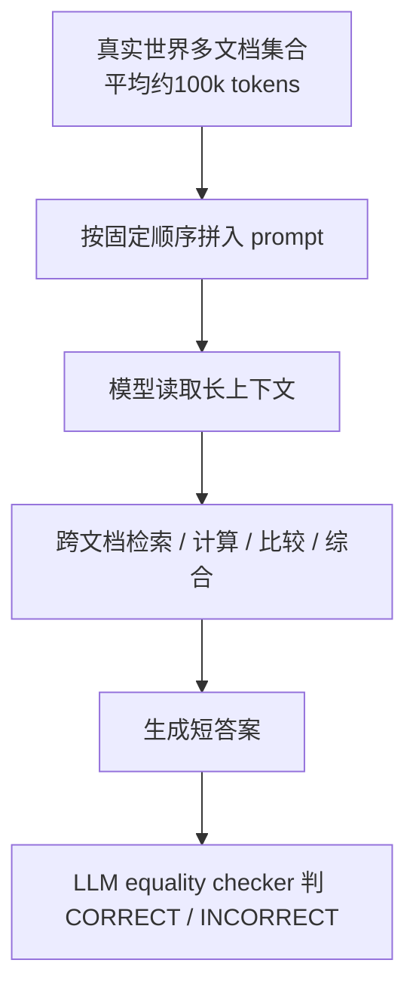

# Benchmark Card: AA-LCR

| 字段 | 值 |
| ---- | ---- |
| 日期 | 2026-05-29 |
| 版本 | v1 |
| 状态 | 首版上线；按 Artificial Analysis 与 Hugging Face 数据集卡整理 |
| 变更记录 | 新增长上下文多文档推理卡片 |

---

## 1. 一句话定义

`AA-LCR` 是 Artificial Analysis 的长上下文推理 benchmark，全称是 `Artificial Analysis Long Context Reasoning`。它用真实世界多文档集合构造约 100k tokens 的输入，要求模型跨多个文档抽取、计算、比较和综合信息，而不是只做直接检索。

## 2. 快速参考

| 属性 | 值 |
| ---- | ---- |
| 全称 | Artificial Analysis Long Context Reasoning Benchmark |
| 常用简称 | `AA-LCR` |
| 出品方 | Artificial Analysis |
| 数据集规模 | 100 个问题；30 个 document sets；234 份文档 |
| 上下文规模 | 平均每个 document set 约 99,325 tokens；总计约 2,979,757 tokens |
| 文档类型 | 公司报告、行业报告、政府咨询文件、学术论文、法律文件、营销材料、调查报告 |
| 输入 | 多份真实文档全文 + 一个问题 |
| 输出 | 短答案、数值、实体列表或可核验结论 |
| 评分方式 | LLM-based equality checker；数据集卡说明使用 Qwen3 235B A22B 2507 Non-reasoning |
| 一级类目 | `Long Context` |
| 二级类目 | `Multi-Document Long-Context Reasoning` |
| 风险标签 | 样本少 / judge 依赖 / 长上下文与推理混杂 / 文档抽取与顺序敏感 / 公开文档污染 |
| 评测页 | https://artificialanalysis.ai/evaluations/artificial-analysis-long-context-reasoning |
| Dataset | https://huggingface.co/datasets/ArtificialAnalysis/AA-LCR |

## 3. 卡片导航

### 3.1 核心流程

### 3.2 如果你只看三件事

- 它比普通 needle-in-a-haystack 更难，因为答案通常不能从某一句原文直接复制，需要跨文档推理或计算。
- 它比 LongBench v2 更贴近知识工作者阅读真实材料的场景，例如公司年报、政策咨询、法律材料和研究报告。
- 它只有 100 道题，适合做高质量长上下文压力测试，不适合单独当作稳定总榜裁判。

---

## 4. 它怎么运作

### 4.1 它到底在测什么

AA-LCR 主要测模型在约 100k tokens 输入下能否完成这些工作：

1. 在多个真实文档之间定位相关证据；
2. 抽取表格、段落、定义、条件和数值；
3. 做财务、法律、政策或研究类比较；
4. 执行简单到中等复杂度的数学计算；
5. 把分散证据合成一个可核验答案。

它不是单纯测“上下文窗口能不能塞得下”。更准确地说，它测：

> 模型在接近真实知识工作材料长度下，能不能把长上下文读懂并推理出来。

### 4.2 输入长什么样

官方数据集卡说明会把同一题相关的多个文档按 `data_source_filenames` 的顺序放入 prompt。每份文档用 `BEGIN DOCUMENT ... END DOCUMENT` 包起来，然后附上问题。

这意味着 document order、文本抽取质量、prompt 包装方式都会影响最终分数。复现实验时不能只说“跑了 AA-LCR”，还要写清楚是否使用官方 extracted text 和官方 prompt 结构。

### 4.3 题目类型

数据集卡列出的典型问题包括：

- 财务分析和比较指标；
- 法律与监管解释；
- 多文档信息综合；
- 时间和条件逻辑；
- 研究、分类和相关文件识别。

这些题往往需要同时做到“找得到”和“想得对”。模型如果只做关键词搜索，容易漏掉条件、时间范围或跨文档计算。

### 4.4 数据规模与分布

| 类别 | 问题数 | Document sets | 文档数 | 平均 tokens / set |
| ---- | ----: | ----: | ----: | ----: |
| Company Documents | 63 | 16 | 92 | 92,265 |
| Industry Reports | 8 | 4 | 18 | 102,675 |
| Government Consultations | 11 | 3 | 60 | 108,418 |
| Academia | 5 | 2 | 14 | 111,888 |
| Legal | 6 | 2 | 23 | 116,525 |
| Marketing | 6 | 2 | 16 | 108,847 |
| Survey Reports | 1 | 1 | 11 | 93,046 |
| **合计** | **100** | **30** | **234** | **99,325** |

公司报告占比很高，所以它对财务、经营指标、报告型文档理解特别敏感。

### 4.5 数据是怎么做出来的

官方数据集卡描述了一个多阶段流程：

1. 先选择真实世界长文档集合；
2. 由学生标注者围绕这些材料写问题；
3. 用非前沿模型辅助验证题目难度，避免只针对某个前沿模型设计；
4. 由人工答题和复核来确认问题有清晰、可辩护的答案；
5. 失败或不清楚的问题会被修订或丢弃。

这个流程让 AA-LCR 更像“高难知识工作阅读测验”，而不是随机拼接长文本。

### 4.6 怎么判分

官方数据集卡给出的评分方式是 LLM equality checker：

- 输入包含题目、官方答案和候选答案；
- evaluator 只输出 `CORRECT` 或 `INCORRECT`；
- 官方说明使用 `Qwen3 235B A22B 2507 Non-reasoning` 作为 equality checker。

因此引用结果时要写清 evaluator、prompt、抽取文本版本和模型是否能完整接收上下文。

---

## 5. 它可靠吗

### 5.1 它不测什么

- 长期会话记忆；
- 用户偏好更新；
- 开放网页搜索；
- 工具调用 agent；
- 多模态图表原图理解；
- 隐私、授权和企业数据治理。

AA-LCR 测的是文本长上下文下的多文档推理，不是完整办公 agent。

### 5.2 难度信号

它的难点主要来自：

- 上下文长度接近真实长报告阅读；
- 多数问题需要跨多个文件；
- 数值、时间、条件和定义容易被模型读错；
- 答案很短，但推理路径很长；
- 小样本高难题会放大单题波动。

### 5.3 缺陷与争议

#### 5.3.1 样本量小

只有 100 道题。它很适合做高难专项压测，但不适合单独代表“全部长上下文能力”。

#### 5.3.2 长上下文能力和推理能力混在一起

模型失败可能是因为没读到证据，也可能是读到了但不会计算或比较。最好和 retrieval diagnostics、short-context oracle 或人工错误分类一起看。

#### 5.3.3 评分依赖 LLM equality checker

短答案也会有表达差异、单位差异和部分正确问题。只看自动判分可能掩盖边界样本。

#### 5.3.4 公开文档存在污染风险

文档来自公开材料，模型训练中可能见过部分内容。好处是真实，坏处是不能完全排除数据污染。

### 5.4 风险表

| 风险维度 | 风险级别 | 为什么 | 使用建议 |
| ---- | ---- | ---- | ---- |
| 样本量 | 高 | 100 题导致单题影响大 | 看置信区间和错误样本 |
| Judge 依赖 | 高 | equality checker 会影响边界题 | 抽样人工复核 |
| 口径复现 | 中到高 | 文档顺序、抽取文本和 prompt 都影响结果 | 使用官方 extracted text 和 prompt |
| 能力拆分 | 中 | 长上下文和推理失败不易分离 | 加 oracle / 短上下文对照 |
| 领域偏置 | 中 | 公司报告占比高 | 不要外推到所有文档类型 |

---

## 6. 我该用它吗

### 6.1 适用场景

- 你想比较模型在约 100k tokens 真实文档上的长上下文推理；
- 你关心财报、政策、法律、研究报告等知识工作材料；
- 你不满足于 needle retrieval，希望测试跨文档综合和计算；
- 你想要一个小而难、可人工复核的长上下文专项集。

### 6.2 不适合单独使用的场景

- 评估长期用户记忆；
- 评估聊天个性化；
- 评估搜索 agent；
- 评估代码 agent；
- 需要大样本稳定排名。

### 6.3 是否值得看

> `AA-LCR` 值得加入长上下文评测集合。它的价值在于把“能塞下长上下文”推进到“能在真实长材料中做跨文档推理”。但它样本少、judge 依赖强，最好作为 LongBench v2 的补充，而不是替代。

结论标签：`★ 推荐`
