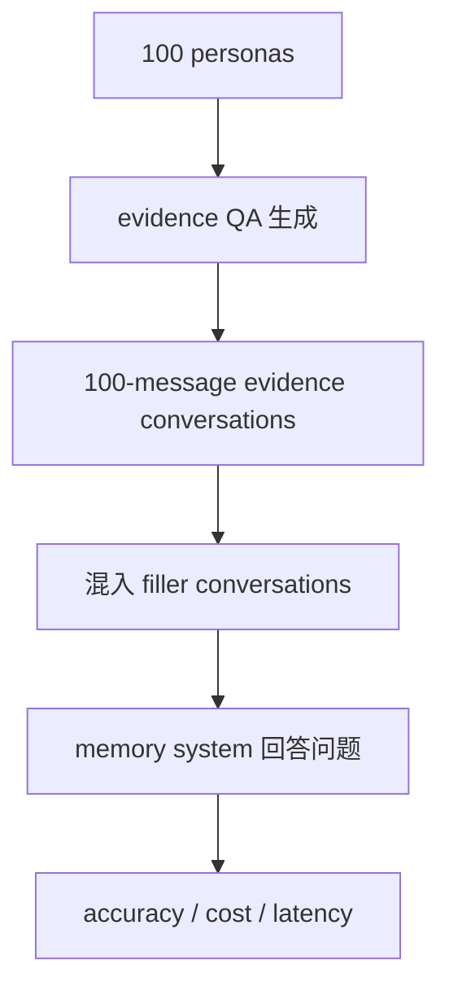

# Benchmark Card: ConvoMem

| 字段 | 值 |
| ---- | ---- |
| 日期 | 2026-05-29 |
| 版本 | v1 |
| 状态 | 首版上线；按 Salesforce 官方 repo 与 Hugging Face dataset card 整理 |
| 变更记录 | 新增大规模会话记忆 benchmark；补入 6 类 evidence、100 personas 和 75,336 QA 规模 |

---

## 1. 一句话定义

`ConvoMem` 是 Salesforce AI Research 发布的大规模会话记忆 benchmark，用 75,336 个问答对测试模型在多轮对话中记住用户事实、助手事实、变化信息、偏好、隐式连接，并在无答案时拒答的能力。

## 2. 快速参考

| 属性 | 值 |
| ---- | ---- |
| 全称 | ConvoMem Benchmark: Why Your First 150 Conversations Don't Need RAG |
| 首次公开 | 2025-11-13（arXiv） |
| 出品方 | Salesforce AI Research |
| 数据集规模 | 75,336 question-answer pairs |
| Personas | 100 个专业背景 persona |
| Filler conversations | 40,000 条 filler conversations |
| Evidence 类别 | user facts / assistant facts / changing facts / abstention / preferences / implicit connections |
| 上下文规模 | 官方材料围绕 1-300 或 2-300 个会话/交互规模的 pre-mixed test cases；论文重点讨论 30、150、300 附近的切换点 |
| 任务形式 | evidence conversations + filler conversations + question |
| 评分方式 | category-specific accuracy；preference 类有 rubric；可记录成本和 latency |
| 一级类目 | `Long Context` |
| 二级类目 | `Conversational Memory` |
| 风险标签 | 合成 CRM 场景 / 评测框架复杂 / messages 与 conversations 术语混用 / 2025 新 benchmark |
| 论文 | https://arxiv.org/abs/2511.10523 |
| Repo | https://github.com/SalesforceAIResearch/ConvoMem |
| Dataset | https://huggingface.co/datasets/Salesforce/ConvoMem |

## 3. 卡片导航

### 3.1 核心流程

### 3.2 如果你只看三件事

- 它比 LoCoMo / LongMemEval 更大，重点是统计稳定性和可控 category 覆盖。
- 它明确把会话记忆拆成 6 类 evidence，适合测试“到底是哪种记忆失败”。
- 论文核心结论不是“RAG 永远没用”，而是：在前几十到约 150 条会话内，简单 long-context 往往很强；超过这个范围成本和 latency 才更容易推动 hybrid / RAG 方案。

---

## 4. 它怎么运作

### 4.1 它到底在测什么

ConvoMem 测的是 conversational memory 的六类能力：

| 类别 | 测什么 |
| ---- | ---- |
| User Facts | 用户明确说过的个人或工作事实 |
| Assistant Facts | 助手自己先前说过的信息 |
| Changing Facts | 信息随对话变化后，模型是否使用最新状态 |
| Abstention | 历史中没有答案时是否拒答 |
| Preferences | 用户偏好能否用于新建议 |
| Implicit Connections | 跨消息多跳连接与隐式关系 |

这让它比只测“从长历史里找一句话”的 benchmark 更接近真实助手记忆。

### 4.2 输入长什么样

Hugging Face dataset card 给出的核心字段包括：

- `question`
- `answer`
- `messages`
- `evidence_type`
- `persona`

每个 evidence item 会嵌入到一段较自然的对话中，再和无关 filler conversations 混合，形成不同上下文规模的 test case。

### 4.3 数据规模

官方数据集卡和 README 给出的关键规模：

| 维度 | 数值 |
| ---- | ---- |
| QA pairs | 75,336 |
| Personas | 100 |
| Filler conversations | 40,000 |
| Evidence categories | 6 |
| Multi-message evidence | 约 60% |
| Single-message evidence | 约 40% |

6 类 evidence 的数量分别是：

| 类别 | 数量 |
| ---- | ---- |
| User Facts | 16,733 |
| Assistant Facts | 12,745 |
| Changing Facts | 18,323 |
| Abstention | 14,910 |
| Preferences | 5,079 |
| Implicit Connections | 7,546 |

### 4.4 数据是怎么做出来的

官方 README 描述的是一条程序化、模块化 pipeline：

1. 生成 100 个专业 persona；
2. 为 persona 生成 use cases；
3. 生成 evidence QA；
4. 用多模型 answerability / necessity validation 检查 QA；
5. 把 evidence 自然嵌入约 100-message conversation；
6. 混入 filler conversations 形成不同上下文规模；
7. 用统一 evaluation framework 测 memory system。

这和 LoCoMo 的小规模人工核验长会话不同：ConvoMem 更强调可扩展、可控类别和统计量。

### 4.5 怎么判分

ConvoMem repo 的评测框架会：

- 把 conversations 加入 memory system；
- 用问题查询；
- 记录 accuracy、cost、latency 和逐题结果；
- 按 evidence type 与上下文规模汇总；
- 对 preference 类使用 scoring rubrics。

论文摘要报告的一个关键观察是：简单 full-context 方法在最难的 multi-message evidence case 上仍有约 70%-82% accuracy，而 Mem0 这类 RAG-based memory system 在 150 interactions 以下约 30%-45%。这个结论应按论文设置解读，不能泛化成所有 RAG 场景都弱。

---

## 5. 它可靠吗

### 5.1 它不测什么

- 真实个人隐私记忆治理；
- 开放网页搜索；
- 工具调用 agent；
- 多模态记忆；
- 长期真实用户关系里的情绪和行为漂移。

它主要测：

> 在可控、多轮、以 CRM / 专业 persona 为主的对话历史中，记忆系统能不能找出、更新、连接和拒答。

### 5.2 难度信号

ConvoMem 的难点在于：

- 75k+ QA 足够做更稳定的分项比较；
- 60% evidence 分布在多条消息中；
- changing facts 直接测试“最新状态”；
- abstention 直接测试幻觉控制；
- implicit connections 测跨消息关系；
- 上下文规模可逐步增加，适合看 long-context 到 RAG / hybrid 的转折。

### 5.3 缺陷与争议

#### 5.3.1 🏛️ 术语口径需要写清楚

官方材料同时使用 messages、conversations、interactions 描述上下文规模；论文标题和 README 重点是前 150 conversations / interactions 的 memory-RAG 分界。  
来源：[官方 Repo](https://github.com/SalesforceAIResearch/ConvoMem)、[Dataset Card](https://huggingface.co/datasets/Salesforce/ConvoMem)、[论文](https://arxiv.org/abs/2511.10523)。

#### 5.3.2 🗣️ 场景偏 CRM / 专业 persona

数据的 persona 和用例明显偏 Salesforce / CRM / sales / support 等业务环境，不能直接代表所有个人助手长期记忆。

#### 5.3.3 🗣️ 程序化生成带来模板偏差

规模和可控性是优势，但也可能让模型学到生成模式，而不是真实用户长期表达的噪声。

#### 5.3.4 🏛️ 新 benchmark 仍需社区复现

ConvoMem 是 2025-11 的较新 benchmark，leaderboard 生态和第三方复现还不如老牌数据集成熟。

### 5.4 风险表

| 风险维度 | 风险级别 | 为什么 | 使用建议 |
| ---- | ---- | ---- | ---- |
| 场景偏置 | 中 | CRM / 专业 persona 占比高 | 不要外推到所有个人记忆 |
| 生成偏差 | 中 | pipeline 生成数据有模板痕迹 | 和自然会话数据组合看 |
| 口径混用 | 中 | messages / conversations / interactions 容易混 | 报分写清 context size 定义 |
| 工程复杂度 | 中 | 评测需 memory system 接口和成本记录 | 先跑小子集验证 harness |
| 新鲜度 | 中 | 2025 新数据集，第三方经验少 | 保留论文设置和 commit / dataset 版本 |

---

## 6. 我该用它吗

### 6.1 适用场景

- 你需要大规模会话记忆 benchmark；
- 你想分项比较 user facts、changing facts、abstention、preferences 等能力；
- 你在比较 long-context、RAG、Mem0、hybrid memory；
- 你想研究“多少会话之后才值得上 RAG”。

### 6.2 是否值得看

> `ConvoMem` 值得加入，因为它补上了长期会话记忆评测里“规模、分项和成本曲线”的一块。它不替代 LoCoMo / LongMemEval，而是更适合做可重复的大样本 memory-system 对比。

结论标签：`★ 条件推荐`
