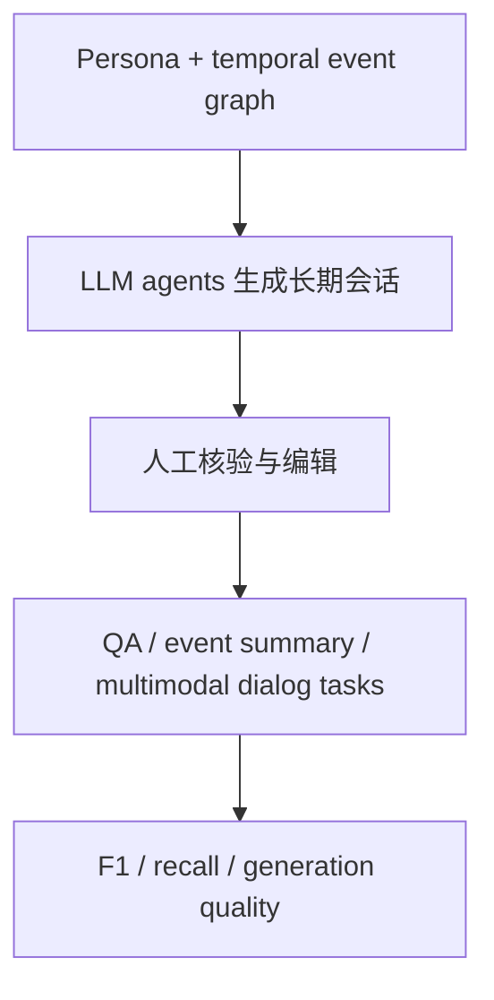

# Benchmark Card: LoCoMo

| 字段 | 值 |
| ---- | ---- |
| 日期 | 2026-05-29 |
| 版本 | v1 |
| 状态 | 首版上线；按官方 repo 当前 `locomo10.json` release 口径整理 |
| 变更记录 | 新增长期会话记忆数据集卡片；区分论文初版 50 条会话与当前 10 条高质量子集 |

---

## 1. 一句话定义

`LoCoMo` 是一个面向**超长期开放域会话记忆**的 benchmark，用带 persona、时间事件图和多会话历史的长对话，测试模型能否做问答、事件总结和多模态对话生成。

## 2. 快速参考

| 属性 | 值 |
| ---- | ---- |
| 全称 | LoCoMo / Evaluating Very Long-Term Conversational Memory of LLM Agents |
| 首次公开 | 2024-02-27（arXiv）；ACL 2024 论文 |
| 出品方 | Adyasha Maharana 等；Snap / UNC / Meta 等 |
| 当前 repo 数据规模 | 10 条 long conversations；`locomo10.json` 中约 1,986 个 QA annotation |
| 论文描述规模 | 每条会话平均约 300 turns、9K tokens、最多 35 sessions；初版曾释放 50 条会话 |
| 任务 | question answering / event summarization / multimodal dialog generation |
| QA 类型 | single-hop / multi-hop / temporal / open-domain / adversarial |
| 评分方式 | QA 用 F1 / partial F1 / adversarial refusal；RAG 可看 evidence recall |
| 一级类目 | `Long Context` |
| 二级类目 | `Long-Term Conversational Memory` |
| 风险标签 | 小样本 / 版本口径 / 合成会话偏差 / 多模态图片不可复现 / 总结任务实现未完整发布 |
| 项目页 | https://snap-research.github.io/locomo/ |
| 论文 | https://arxiv.org/abs/2402.17753 |
| Repo / Dataset | https://github.com/snap-research/locomo |

> [!NOTE]
> 官方 README 说明：当前 release 是初版 50 条会话中的子集，选择了最长且标注质量更高的 10 条会话，以降低闭源模型评测成本。因此引用 LoCoMo 分数时要写清楚是论文初版规模，还是当前 `locomo10.json` 口径。

## 3. 卡片导航

### 3.1 核心流程

### 3.2 如果你只看三件事

- 它比普通多轮聊天数据更长：论文定位是 very long-term conversations，强调跨 session、时间和因果关系。
- 当前官方 repo 的主数据文件是 `data/locomo10.json`，不是初版 50 条全量会话。
- 它适合作为长期会话记忆的小而难诊断集，不适合单独做大规模 leaderboard。

---

## 4. 它怎么运作

### 4.1 它到底在测什么

LoCoMo 关注模型是否能理解长期会话中的：

1. 单条证据事实；
2. 跨多条证据的组合关系；
3. 时间顺序和事件演化；
4. 开放域背景知识与会话事实的结合；
5. adversarial / 不应回答的问题；
6. 长期事件图中的因果与时间连接。

它和 LongMemEval 的差别是：

| Benchmark | 更像在测什么 |
| ---- | ---- |
| LoCoMo | 长期开放域会话理解、事件总结和多模态生成 |
| LongMemEval | 聊天助手记忆系统的检索、阅读、更新和拒答 |

### 4.2 输入长什么样

当前 release 的每个 sample 包含：

- `sample_id`
- `conversation`
- `observation`
- `session_summary`
- `event_summary`
- `qa`

`conversation` 里按 `session_<num>` 组织会话，并有对应的 `session_<num>_date_time`。每个 turn 包含 speaker、dialog id 和文本；如果涉及图片，还包含图片 URL、BLIP caption 和检索 query。

### 4.3 QA 任务

`qa` 标注包含：

- `question`
- `answer`
- `category`
- `evidence`，在可定位时给出包含答案的 dialog ids

官方项目页把 QA 问题分成五类：single-hop、multi-hop、temporal、open-domain、adversarial。评测代码对不同 category 使用不同评分逻辑，例如 multi-hop 会拆分子答案做 partial F1，adversarial 问题会检查模型是否拒答。

### 4.4 数据构造

LoCoMo 的构造流程是：

1. 为 agent 分配 persona；
2. 为 agent 建立 temporal event graph；
3. 用 LLM-agent 框架生成跨多天、多 session 的会话；
4. 加入图片分享与图片反应，形成多模态对话元素；
5. 由人工 annotators 核验和编辑，保证长程一致性与事件图 grounding；
6. 对会话补充 QA、事件总结等标注。

### 4.5 数据规模与版本

| 口径 | 信息 |
| ---- | ---- |
| 论文摘要 | 每条会话平均约 300 turns、9K tokens、最多 35 sessions |
| 当前 repo release | 10 条 long conversations |
| 当前 `locomo10.json` | 约 1,986 个 QA annotation、272 个 session key |
| 初版 release | README 说明初版曾包含 50 条会话 |

所以它的价值不在大样本量，而在单个样本足够长、任务标注较细。

### 4.6 怎么判分

QA 任务主要通过 `task_eval/evaluation.py` 计算：

- category 2 / 3 / 4：F1；
- category 1：拆分子答案后的 partial F1；
- category 5：检查是否给出类似“not mentioned / no information available”的拒答；
- RAG 设置下可附带 evidence recall。

事件总结和多模态对话生成在论文和项目页中是 benchmark 组成部分，但官方 README 当前仍把 event summarization 和 MiniGPT-5 多模态生成评测标为 “Coming soon”。

---

## 5. 它可靠吗

### 5.1 它不测什么

- 大规模统计稳定性；
- 真实线上用户长期记忆；
- 可控隐私删除和记忆授权；
- 工具调用或外部系统操作；
- 纯文本之外的可复现图片内容本身。

它主要测：

> 模型能否在非常长的开放域会话中追踪事件、时间、因果和多跳事实。

### 5.2 难度信号

LoCoMo 难在：

- 会话跨多个 session；
- 问题包含时间和多跳推理；
- 事件图要求理解长期因果和时间连接；
- adversarial 问题会暴露模型在长上下文里乱猜；
- RAG、long-context 和 observation / summary database 可以横向比较。

### 5.3 缺陷与争议

#### 5.3.1 🏛️ 当前 release 是 10 条子集

官方 README 明确说明当前 release 是初版 50 条会话的子集。  
来源：[官方 Repo](https://github.com/snap-research/locomo)。

#### 5.3.2 🏛️ 多模态图片不可完全复现

官方 README 说明不释放图片本体，只提供图片 URL、caption 和 search query。  
来源：[官方 Repo](https://github.com/snap-research/locomo)。

#### 5.3.3 🏛️ 部分任务代码仍未完整发布

README 当前把 event summarization 和 multimodal dialog generation 的评测部分标为 “Coming soon”。  
来源：[官方 Repo](https://github.com/snap-research/locomo)。

#### 5.3.4 🗣️ 合成 agent 会话和真实用户聊天有距离

LoCoMo 的长期会话是通过 LLM-agent pipeline 生成并人工核验的，高质量但仍不是自然采集的真实长期用户历史。

### 5.4 风险表

| 风险维度 | 风险级别 | 为什么 | 使用建议 |
| ---- | ---- | ---- | ---- |
| 样本量 | 高 | 当前 release 只有 10 条长会话 | 更适合诊断，不适合单独排名 |
| 版本口径 | 高 | 论文初版 50 条与 repo 当前 10 条不同 | 报分写清 `locomo10.json` |
| 多模态复现 | 中 | 图片不随数据释放 | 多模态结果需谨慎复验 |
| 合成偏差 | 中 | 会话由 agent pipeline 构造 | 与真实长期用户样本组合看 |
| 任务完整性 | 中 | 部分任务评测代码未完整开放 | 当前优先使用 QA 任务 |

---

## 6. 我该用它吗

### 6.1 适用场景

- 你关心 very long-term dialogue memory；
- 你想压测 temporal / causal / multi-hop 会话理解；
- 你想比较 long-context、RAG、session summary、observation database；
- 你需要一个小而难、适合人工看错因的长期会话集。

### 6.2 是否值得看

> `LoCoMo` 值得保留，但要把它当成**高质量长期会话诊断集**，不是大规模 leaderboard。当前最稳的用法是看 QA 任务，并明确写清 `locomo10.json` 版本口径。

结论标签：`★ 条件推荐`
