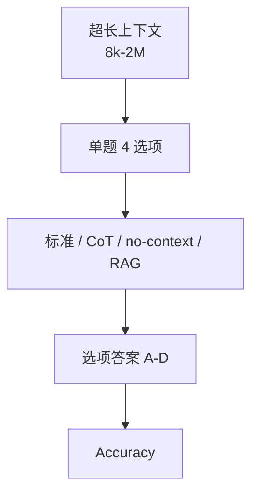

# Benchmark Card: LongBench v2

| 字段 | 值 |
| ---- | ---- |
| 日期 | 2026-04-08 |
| 版本 | v1 |
| 状态 | 首版上线；已按 6 章节模板整理 |
| 变更记录 | 新增长上下文类卡片；补入 repo 文档层对评测模式的解释 |

---

## 1. 一句话定义

`LongBench v2` 是 THUDM 推出的长上下文 benchmark，重点测试模型在**真实长材料**上做深度理解与推理，而不是只做“在长文里找一句原文”的浅检索。

## 2. 快速参考

| 属性 | 值 |
| ---- | ---- |
| 全称 | LongBench v2: Towards Deeper Understanding and Reasoning on Realistic Long-context Multitasks |
| 首次公开 | 2024-12-20 |
| 出品方 | THUDM / 清华系团队 |
| 数据集规模 | 503 题 |
| 上下文长度 | 8k 到 2M words |
| 任务形式 | 统一为多项选择题 |
| 评分方式 | 正确选项 exact match / accuracy |
| 一级类目 | `Long Context` |
| 二级类目 | `Deep Long-Context Reasoning` |
| 任务形态 | `realistic long-context multiple-choice reasoning` |
| 风险标签 | 多选题约束 / 长度与推理混杂 / no-context 混淆 / 高成本复现 |
| 项目页 | https://longbench2.github.io |
| 论文 | https://arxiv.org/abs/2412.15204 |
| Repo | https://github.com/THUDM/LongBench |
| Dataset | https://huggingface.co/datasets/THUDM/LongBench-v2 |

## 3. 卡片导航

### 3.1 核心流程

### 3.2 如果你只看三件事

- 它不只是“needle in a haystack”，而是六类现实长上下文任务的组合。
- 它把题型统一成多选题，是为了**可靠判分**，不是为了让任务变简单。
- repo 文档层已经把 `--cot`、`--no_context`、`--rag` 三种模式做成正式对照，这对解释长上下文分数非常重要。

---

## 4. 它怎么运作

### 4.1 它到底在测什么

LongBench v2 测的是：

1. 模型能否读懂**很长**的上下文。
2. 模型能否在长材料中做**跨段整合与推理**。
3. 模型是否真的在利用上下文，而不是只靠参数记忆。

它覆盖的六大任务类目是：

- single-document QA
- multi-document QA
- long in-context learning
- long-dialogue history understanding
- code repo understanding
- long structured data understanding

### 4.2 输入长什么样

单个样本字段很清楚：

- `question`
- `choice_A` 到 `choice_D`
- `answer`
- `context`
- 以及 `domain / sub_domain / difficulty / length`

这意味着它虽然是长上下文 benchmark，但输入结构仍然比较规整，便于横向比较。

### 4.3 模型要输出什么

从 benchmark 角度，模型只需要输出正确选项。

但官方 repo 允许多种评测模式：

- 标准模式
- `--cot`
- `--no_context`
- `--rag N`

所以它不只是给一个分数，还可以看：

- 给模型完整上下文时表现怎样
- 让模型先显式推理是否更好
- 去掉上下文后性能掉多少
- 用检索替代全量上下文时表现怎样

### 4.4 数据是怎么做出来的

官方 README 给出的几个设计点很关键：

1. 一共 **503** 道挑战题。
2. 上下文长度从 **8k 到 2M words**。
3. 数据来自接近 **100 位**高教育背景贡献者。
4. 题目统一为 multiple-choice，以提高评测可靠性。

这说明它不是纯合成 benchmark，而是试图在“难度、现实性、可判分”之间做平衡。

### 4.5 数据规模与分布

LongBench v2 的价值主要来自“覆盖结构”而不是单纯题量：

| 维度 | 信息 |
| ---- | ---- |
| 总题量 | 503 |
| 长度范围 | 8k-2M words |
| 主要任务类 | 6 类 |
| 题型 | 统一 4 选项 |
| 难度标注 | easy / hard |

官方还给了一个强信号：

- 人类专家在 **15 分钟限制** 下准确率约 **53.7%**
- 最强直接回答模型约 **50.1%**
- `o1-preview` 在长推理设置下约 **57.7%**

### 4.6 怎么判分

由于题型统一为多选题，核心指标是 **accuracy**。

但真正值得注意的是官方提供的几种评测对照：

- 标准：给完整上下文
- CoT：鼓励显示推理
- no-context：看模型不读材料时能答多少
- RAG：只给 top-N 检索结果

这让 LongBench v2 比很多长上下文榜单更可解释，因为你能拆出：

- 是上下文窗口不够
- 还是推理链不够
- 还是模型其实在吃先验记忆

---

## 5. 它可靠吗

### 5.1 它不测什么

- 开放式长文写作质量
- 真实多轮代理工作流
- 网页导航与工具操作
- 长期任务记忆管理

它更像测：

> 给你一大坨真实材料，你到底能不能读懂并推出正确结论。

### 5.2 难度信号

LongBench v2 的难点很真实：

- 上下文非常长
- 任务不止一种
- 题目是“理解 + 推理”而不是“定位一句原文”
- no-context 和标准模式可直接比较，能显著暴露“假长上下文能力”

如果一个模型在这里高分，通常说明：

- 它至少在读取与整合长材料上没有明显短板

### 5.3 缺陷与争议

#### 5.3.1 🏛️ 多选题统一格式会压缩任务开放度

这是官方为保证可判分做的妥协，作者明确说明此设计选择。  
来源：[论文](https://arxiv.org/abs/2412.15204) 对题型统一化的讨论。

#### 5.3.2 🗣️ 长度和推理难度混在一起

分数高低不一定能拆清是“上下文窗口强”还是“推理强”。  
来源：社区对长上下文 benchmark 的通用批评。

#### 5.3.3 🗣️ 复现成本高

需要大上下文部署、vLLM 和较高资源预算，不像 MMLU 那样轻。  
来源：[官方 Repo](https://github.com/THUDM/LongBench) 评测脚本资源要求。

### 5.4 风险表

| 风险维度 | 风险级别 | 为什么 | 使用建议 |
| ---- | ---- | ---- | ---- |
| 复现成本 | 高 | 长上下文推理本身就昂贵 | 更适合做重点模型对比，不适合大量全量扫榜 |
| 题型妥协 | 中 | 多选题牺牲了一部分开放任务真实性 | 要和真实代理 benchmark 组合看 |
| 记忆混淆 | 中 | no-context 能答出的部分可能来自训练记忆 | 解读结果时要一起看 no-context 对照 |
| 长度外推 | 中 | 高分不等于 2M 所有场景都稳 | 最好按长度段分开看 |

---

## 6. 我该用它吗

### 6.1 适用场景

- 你在评估长上下文模型
- 你想比较“长窗口”到底有没有转化成真实理解收益
- 你关心多文档、长对话、代码库理解这类现实长输入

### 6.2 是否值得看

> `LongBench v2` 是目前很值得保留的一张长上下文卡，因为它不只看长度，还把“深理解”和“可解释对照实验”一起做进来了。

结论标签：`★ 推荐`
