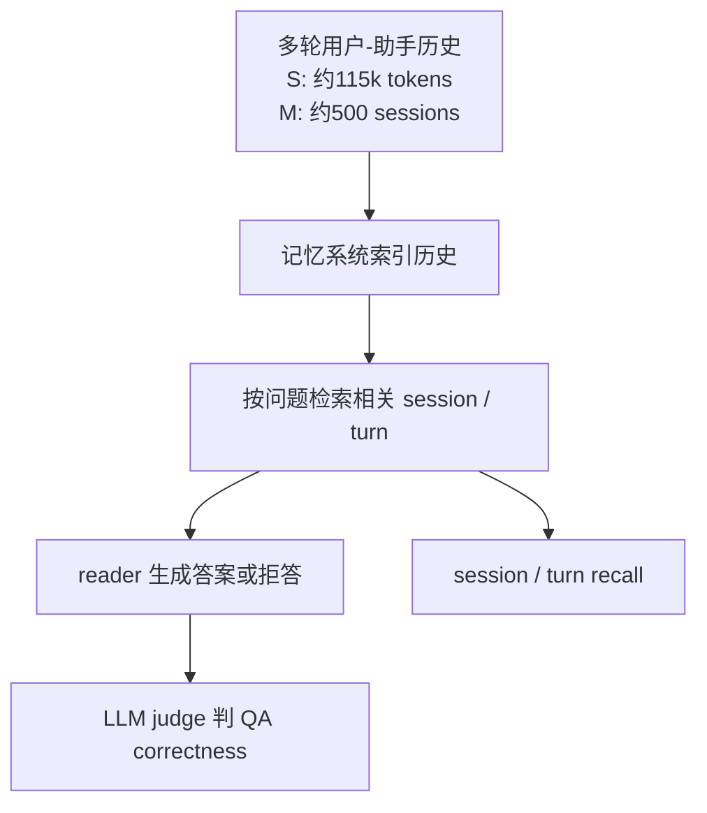

# Benchmark Card: LongMemEval

| 字段 | 值 |
| ---- | ---- |
| 日期 | 2026-05-29 |
| 版本 | v1 |
| 状态 | 首版上线；按当前官方 README 的 cleaned 数据集口径整理 |
| 变更记录 | 新增长期记忆类长上下文卡片；补入 cleaned 数据集替代原始数据集的状态说明 |

---

## 1. 一句话定义

`LongMemEval` 是一个面向聊天助手的长期交互记忆 benchmark，测试模型或记忆系统能否在很长的用户-助手历史会话中**记住、找回、更新、按时间推理，并在不知道时拒答**。

## 2. 快速参考

| 属性 | 值 |
| ---- | ---- |
| 全称 | LongMemEval: Benchmarking Chat Assistants on Long-Term Interactive Memory |
| 首次公开 | 2024-10（arXiv 提交日期为 2024-10-14；ICLR 2025 论文） |
| 出品方 | Di Wu 等；UCLA / Tencent AI Lab Seattle / UC San Diego |
| 数据集规模 | 500 个高质量问题；cleaned 数据集每个 split 含 500 个 evaluation instances |
| 标准 split | `longmemeval_s_cleaned` / `longmemeval_m_cleaned` / `longmemeval_oracle` |
| 历史长度 | `S` 约 115k tokens / 约 30-40 个会话；`M` 约 500 个会话 / 约 1.5M tokens |
| 任务形式 | 时间戳用户-助手会话历史 + 问题 |
| 核心能力 | information extraction / multi-session reasoning / knowledge updates / temporal reasoning / abstention |
| 评分方式 | QA correctness 的 LLM judge；memory retrieval 的 session / turn recall |
| 一级类目 | `Long Context` |
| 二级类目 | `Long-Term Interactive Memory` |
| 风险标签 | LLM judge 依赖 / 合成历史偏差 / cleaned 版本口径 / 记忆系统实现差异 / 隐私外推 |
| 项目页 | https://xiaowu0162.github.io/long-mem-eval/ |
| 论文 | https://arxiv.org/abs/2410.10813 |
| ICLR 2025 | https://proceedings.iclr.cc/paper_files/paper/2025/hash/d813d324dbf0598bbdc9c8e79740ed01-Abstract-Conference.html |
| Repo | https://github.com/xiaowu0162/LongMemEval |
| Dataset | https://huggingface.co/datasets/xiaowu0162/longmemeval-cleaned |

> [!NOTE]
> 截至 2026-05-29，官方 README 指向 `longmemeval-cleaned`，并说明原始 Hugging Face 数据集已被替代。2026-05 还出现了 `LongMemEval-V2`，但它是 agentic context 下的后续 benchmark，不等同于这张卡里的原版 LongMemEval。

## 3. 卡片导航

### 3.1 核心流程

### 3.2 如果你只看三件事

- 它不是普通长文阅读 benchmark，而是专门测**长期聊天记忆**：历史来自多次交互，会出现偏好、更新、时间顺序和不可回答问题。
- 官方当前推荐用 `longmemeval-cleaned`；引用结果时要写清楚是否是 cleaned 版本、`S` / `M` / `oracle` 哪个 split。
- 它既可以测端到端问答正确率，也可以拆开看 memory retrieval recall；这让它比只看最终回答的长上下文测试更适合分析记忆系统。

---

## 4. 它怎么运作

### 4.1 它到底在测什么

LongMemEval 测的是聊天助手的长期记忆链路：

1. **记住**历史中出现过的信息；
2. **找回**和当前问题有关的 session 或 turn；
3. **整合**跨会话证据；
4. **处理更新**，例如用户信息发生变化后用最新事实回答；
5. **按时间推理**，使用显式时间表达和会话时间戳；
6. **拒答**，当历史里没有答案时不要编。

这和 LongBench v2 的差别很大：

| Benchmark | 更像在测什么 |
| ---- | ---- |
| LongBench v2 | 单次给很长上下文，模型能不能读懂并推理 |
| LongMemEval | 长期会话持续累积后，系统能不能记忆、检索和更新用户相关事实 |

### 4.2 输入长什么样

一个样本会包含：

- `question_id`
- `question_type`
- `question`
- `answer`
- `question_date`
- `haystack_session_ids`
- `haystack_dates`
- `haystack_sessions`
- `answer_session_ids`

`haystack_sessions` 是带时间顺序的用户-助手聊天历史。包含证据的 turn 会带 `has_answer: true`，`answer_session_ids` 标出证据 session，便于评估检索是否找对位置。

### 4.3 任务类型

官方 README 中的数据字段列出这些基础 `question_type`：

- `single-session-user`
- `single-session-assistant`
- `single-session-preference`
- `temporal-reasoning`
- `knowledge-update`
- `multi-session`

如果 `question_id` 以 `_abs` 结尾，则属于 abstention 问题。官方 retrieval 评估会跳过 30 个 abstention instances，因为这类问题通常没有可定位的 ground-truth answer location。

### 4.4 标准 split

LongMemEval 当前官方 cleaned 数据集包含三个主要 split：

| Split | 主要用途 | 解释 |
| ---- | ---- | ---- |
| `longmemeval_s_cleaned` | 标准长上下文 / 记忆评测 | 历史约 115k tokens，适合 128k 上下文模型或记忆系统对比 |
| `longmemeval_m_cleaned` | 更长历史压力测试 | 每题约 500 个 history sessions，项目页给出的量级约 1.5M tokens |
| `longmemeval_oracle` | reader / 上限对照 | 只包含 evidence sessions，用来分离“检索没找对”和“读到了也不会答” |

这三个 split 每个都有 500 个 evaluation instances，但难度和评测目的不同。

### 4.5 数据是怎么做出来的

论文和项目页给出的核心构造方式是：

1. 先人工创建问题、答案和证据；
2. 用 attribute-controlled pipeline 生成连贯、带时间戳、可扩展长度的聊天历史；
3. 把证据埋进多轮用户-助手交互中；
4. 再加入 filler sessions，让模型必须在大历史中定位相关信息。

所以它不是简单把长文拼接起来，而是在模拟“一个助手和同一用户长期相处后积累记忆”的环境。

### 4.6 怎么判分

LongMemEval 有两层常用评估：

| 层级 | 指标 | 说明 |
| ---- | ---- | ---- |
| 端到端 QA | LLM judge correctness / accuracy | 官方评测脚本读取 `question_id` 和 `hypothesis`，给出 `autoeval_label` 并汇总正确率 |
| 记忆检索 | session-level / turn-level recall | 根据 `answer_session_ids` 和 `has_answer` 判断检索是否找到了证据位置 |

官方示例命令使用 `gpt-4o` 作为 QA evaluator。引用分数时应写清楚 evaluator、split、history format、reader 模型和 retrieval 设置。

---

## 5. 它可靠吗

### 5.1 它不测什么

- 开放网页搜索能力；
- 工具调用 agent 是否能完成外部操作；
- 真实用户的隐私治理、授权和删除机制；
- 长篇创作质量；
- 多模态记忆。

它主要测：

> 在长期用户-助手文字历史中，系统能不能准确记住、检索、更新并利用事实。

### 5.2 难度信号

LongMemEval 的难点来自几层叠加：

- 历史足够长，`S` 已接近 128k 上下文边界，`M` 明显超出多数直接塞上下文方案；
- 问题可能需要跨 session 组合信息；
- 用户偏好和事实可能随时间变化；
- abstention 迫使模型在没有证据时克制；
- 它把 retrieval 和 reading 拆开评估，能定位失败发生在哪一段。

论文报告长上下文 LLM 在 `LongMemEval_S` 上会出现约 30%-60% 的性能下降；项目页也强调商业聊天助手和长上下文 LLM 在长期记忆场景下仍有明显落差。

### 5.3 缺陷与争议

#### 5.3.1 🏛️ 原始数据集已被 cleaned 版本替代

官方 README 在 2025-09 说明进一步清理了 history sessions，以避免 noisy sessions 干扰答案正确性。  
来源：[官方 Repo](https://github.com/xiaowu0162/LongMemEval) 与 [cleaned dataset card](https://huggingface.co/datasets/xiaowu0162/longmemeval-cleaned)。

#### 5.3.2 🏛️ 端到端 QA 依赖 LLM judge

答案不是纯 exact match，官方评测脚本使用模型判断 correctness。  
来源：[官方 Repo](https://github.com/xiaowu0162/LongMemEval) 的 evaluation 命令与脚本说明。

#### 5.3.3 🗣️ 合成历史和真实用户记忆仍有距离

LongMemEval 的历史是可控构造出来的，适合稳定评测，但不能完全覆盖真实用户的口语噪声、隐私请求、长期行为漂移和多设备上下文。

#### 5.3.4 🗣️ 记忆系统实现差异会强烈影响结果

同一个 reader 模型，如果 indexing、retrieval、history format、top-k、时间扩展策略不同，分数可能差很多。  
来源：[论文](https://arxiv.org/abs/2410.10813) 对 indexing、retrieval、reading 三阶段的实验拆解。

### 5.4 风险表

| 风险维度 | 风险级别 | 为什么 | 使用建议 |
| ---- | ---- | ---- | ---- |
| 版本口径 | 高 | 原始 HF 数据集已 deprecated，cleaned 版本替代 | 报分必须写 `longmemeval-cleaned` 及 split |
| Judge 依赖 | 高 | QA correctness 依赖 LLM evaluator | 写清 evaluator，并抽样人工复核 |
| 实现漂移 | 高 | 检索、索引、reader prompt 都会影响结果 | 同时报告 retrieval recall 与 QA accuracy |
| 现实外推 | 中 | 合成长期历史不等于真实产品记忆 | 用真实用户许可样本补测 |
| 成本 | 中到高 | `M` split 历史极长，端到端跑全量成本高 | 先用 oracle / S 做诊断，再扩展到 M |

---

## 6. 我该用它吗

### 6.1 适用场景

- 你在做聊天助手长期记忆；
- 你要比较 memory retrieval、summary memory、vector memory、time-aware memory；
- 你想知道模型是否能处理用户信息更新；
- 你想把“检索到了没有”和“读到了会不会答”分开看；
- 你觉得单纯长上下文阅读 benchmark 不足以代表真实助手记忆。

### 6.2 不适合单独使用的场景

- 评估通用知识底盘；
- 评估开放网页搜索；
- 评估工具调用 agent；
- 评估完整隐私合规能力；
- 评估多模态个人记忆。

### 6.3 是否值得看

> `LongMemEval` 很值得保留，因为它把长上下文问题推进到了更接近真实聊天助手的长期记忆链路：索引、检索、阅读、更新和拒答都在同一张测试里出现。前提是必须使用 cleaned 数据集口径，并把 evaluator 与 memory-system 设置写清楚。

结论标签：`★ 推荐`
