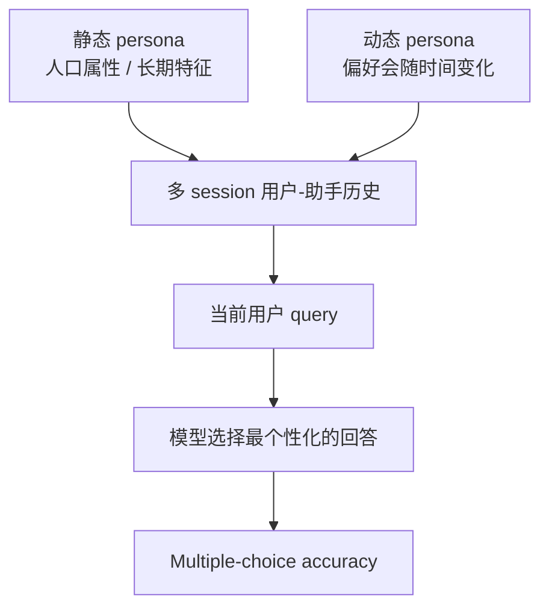

# Benchmark Card: PersonaMem

| 字段 | 值 |
| ---- | ---- |
| 日期 | 2026-05-29 |
| 版本 | v1 |
| 状态 | 首版上线；按 arXiv、GitHub 与 Hugging Face 数据集卡整理 |
| 变更记录 | 新增个性化会话记忆与动态用户画像卡片 |

---

## 1. 一句话定义

`PersonaMem` 是一个面向个性化聊天助手的长期记忆 benchmark，测试模型能否从多 session 用户-助手历史中理解用户画像、追踪偏好变化，并在新场景里选择最符合当前用户状态的回答。

## 2. 快速参考

| 属性 | 值 |
| ---- | ---- |
| 全称 | Know Me, Respond to Me: Benchmarking LLMs for Dynamic User Profiling and Personalized Responses at Scale |
| 常用简称 | `PersonaMem` |
| 首次公开 | arXiv 2025-04-19；GitHub 标注 COLM 2025 |
| 出品方 | Bowen Jiang 等；University of Pennsylvania 等 |
| 数据规模 | 论文摘要称 180+ 个模拟 user-LLM interaction histories；每个最多 60 个多轮 sessions |
| Context splits | `32k` / `128k` / `1M` |
| 数据文件 | `questions_[SIZE].csv` + `shared_contexts_[SIZE].jsonl` |
| 任务形式 | 给定长交互历史和第一人称用户 query，从候选回答中选最符合用户当前画像的答案 |
| 主题范围 | 论文摘要称 15 个个性化真实任务；当前 repo 生成脚本列出 18 个话题 |
| 核心能力 | 用户事实记忆 / 偏好更新 / 偏好演化 / 个性化推荐 / 跨场景泛化 |
| 评分方式 | Multiple-choice accuracy |
| 一级类目 | `Long Context` |
| 二级类目 | `Personalized Conversational Memory` |
| 风险标签 | 合成用户 / 多选题口径 / 隐私外推 / v1-v2 混用 / 个性化与记忆混杂 |
| 论文 | https://arxiv.org/abs/2504.14225 |
| Repo | https://github.com/bowen-upenn/PersonaMem |
| Dataset | https://huggingface.co/datasets/bowen-upenn/PersonaMem |
| Project | https://zhuoqunhao.github.io/PersonaMem.github.io/ |

> [!NOTE]
> 官方 Hugging Face 页面提示了后续 `PersonaMem-v2` / `ImplicitPersona`，它聚焦更隐式的用户偏好。本文卡片说的是原始 `PersonaMem`，引用时不要把两个版本混用。

## 3. 卡片导航

### 3.1 核心流程

### 3.2 如果你只看三件事

- 它不是只问“用户以前说过什么”，而是问模型能不能用历史形成当前用户画像。
- 它特别看偏好变化：用户喜欢什么、后来为什么变了、现在应该按哪个状态回答。
- 它是多选评测，适合稳定比较，但不能完全代表真实产品中的自由生成个性化质量。

---

## 4. 它怎么运作

### 4.1 它到底在测什么

PersonaMem 主要测三件事：

1. **internalize**：模型能否记住用户长期画像和用户分享过的事实；
2. **track**：模型能否跟踪用户偏好如何随时间变化；
3. **respond**：模型能否在当前新问题中选择符合最新用户画像的回答。

这和 LongMemEval 的差别是：

| Benchmark | 更像在测什么 |
| ---- | ---- |
| LongMemEval | 长期会话历史里的事实检索、更新、时间推理与拒答 |
| PersonaMem | 用户画像和偏好演化能否驱动个性化回答 |

### 4.2 输入长什么样

每个 split 有两类文件：

- `questions_[SIZE].csv`：问题、选项、正确答案、距离最近偏好证据的位置等元数据；
- `shared_contexts_[SIZE].jsonl`：用户-模型交互序列。

`questions` 文件包含字段如：

- `persona_id`
- `question_id`
- `question_type`
- `topic`
- `context_length_in_tokens`
- `distance_to_ref_in_tokens`
- `user_question_or_message`
- `correct_answer`
- `all_options`
- `shared_context_id`
- `end_index_in_shared_context`

模型需要读到指定长度的交互历史，再从候选回答中选择最符合用户当前状态的一项。

### 4.3 七类 query

官方数据集卡列出 7 类 in-situ user queries：

1. `recall_user_shared_facts`：回忆用户分享过的事实；
2. `suggest_new_ideas`：按用户要求给未出现过的新建议；
3. `acknowledge_latest_user_preferences`：识别最新偏好；
4. `track_full_preference_evolution`：追踪完整偏好演化；
5. `revisit_reasons_behind_preference_updates`：回忆偏好变化原因；
6. `provide_preference_aligned_recommendations`：给出符合当前偏好的推荐；
7. `generalize_to_new_scenarios`：把用户画像迁移到新任务场景。

这让 PersonaMem 比普通记忆 QA 更贴近“个性化助手是否真的了解我”。

### 4.4 Context splits

| Split | 文件 | 主要用途 |
| ---- | ---- | ---- |
| `32k` | `questions_32k.csv` / `shared_contexts_32k.jsonl` | 中等长上下文个性化测试 |
| `128k` | `questions_128k.csv` / `shared_contexts_128k.jsonl` | 长上下文主测试 |
| `1M` | `questions_1M.csv` / `shared_contexts_1M.jsonl` | 超长历史压力测试 |

当前公开文件中，问题行数以 Hugging Face CSV 为准；不要把不同 split 的样本数或上下文长度混在一起报。

### 4.5 数据是怎么做出来的

官方 repo 描述了一个合成 pipeline：

1. 先生成用户 persona；
2. 围绕不同话题生成多 session 对话；
3. 让用户偏好随时间发生变化；
4. 为每个场景生成可评分问题和候选回答；
5. 将交互历史拼接成不同上下文长度版本。

这种设计的好处是可控、规模化、能覆盖偏好演化；问题是它仍然是合成用户，不等于真实用户长期数据。

### 4.6 怎么判分

PersonaMem 的问题是多选题。模型根据历史和当前 query 选择最合适的选项，最后用 accuracy 统计。

论文和 repo 的结果强调：即使是前沿模型，在长上下文个性化设置中整体准确率也大约只在 50% 左右徘徊。这说明“能读长上下文”不等于“能正确维护用户画像”。

---

## 5. 它可靠吗

### 5.1 它不测什么

- 真实用户数据治理；
- 记忆删除、授权、可解释同意；
- 自由生成回答的风格质量；
- 开放网页搜索；
- 工具调用；
- 多模态个人记忆。

它主要测文本会话历史里的个性化画像使用。

### 5.2 难度信号

PersonaMem 的难点来自：

- 用户偏好可能会变化；
- 最新偏好可能离当前 query 很远；
- 不同场景之间需要迁移用户画像；
- 干扰对话很多，模型容易抓错旧偏好；
- 多选项可能只有细微差别。

### 5.3 缺陷与争议

#### 5.3.1 合成 persona 不等于真实用户

合成 pipeline 能控制变量，但真实用户的偏好表达更模糊、矛盾、带隐私约束，也更容易出现删除或授权问题。

#### 5.3.2 多选题会简化产品难度

真实助手需要自由生成回答，还要处理语气、解释、拒绝、隐私边界。多选 accuracy 只测“能不能识别最合适答案”。

#### 5.3.3 个性化和记忆能力混杂

模型答错可能是没记住事实，也可能是没理解偏好变化，或者不会把偏好迁移到新场景。

#### 5.3.4 v1 和 v2 容易混用

`PersonaMem-v2` / `ImplicitPersona` 已公开，侧重点不同。比较结果时必须写清版本。

### 5.4 风险表

| 风险维度 | 风险级别 | 为什么 | 使用建议 |
| ---- | ---- | ---- | ---- |
| 版本口径 | 高 | v1、v2、ImplicitPersona 名称容易混 | 明确写 `PersonaMem` 与 split |
| 合成偏差 | 高 | 用户、对话和偏好变化由 pipeline 生成 | 不要直接当真实产品用户研究 |
| 多选简化 | 中到高 | 真实回答不是选项题 | 搭配自由生成与人工评测 |
| 上下文口径 | 中到高 | 32k / 128k / 1M 难度不同 | 分 split 报告 |
| 隐私外推 | 中 | benchmark 不等于隐私合规 | 另测授权、删除和数据治理 |

---

## 6. 我该用它吗

### 6.1 适用场景

- 你在做个性化聊天助手；
- 你关心用户偏好会随时间变化；
- 你想测试模型是否能跨场景使用用户画像；
- 你要比较长上下文直接读历史、summary memory、profile memory 或 retrieval memory；
- 你想知道模型在 32k、128k、1M 历史长度下是否退化。

### 6.2 不适合单独使用的场景

- 评估通用长文档推理；
- 评估开放搜索；
- 评估工具调用；
- 评估代码 agent；
- 证明产品已经满足隐私和记忆治理要求。

### 6.3 是否值得看

> `PersonaMem` 值得加入会话记忆类评测。它补上了 LongMemEval、LoCoMo、ConvoMem 较少覆盖的一点：用户画像、偏好演化和个性化回答。使用时要记住它是合成、多选、版本敏感的 benchmark。

结论标签：`★ 推荐`
