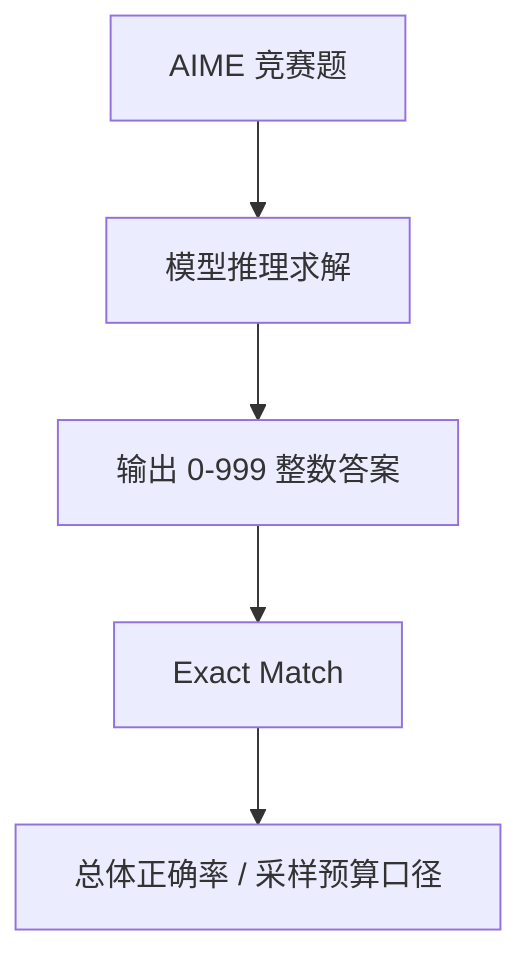

# Benchmark Card: AIME

| 字段 | 值 |
| ---- | ---- |
| 日期 | 2026-04-08 |
| 版本 | v1 |
| 状态 | 首版上线；按 MathArena 的当前评测口径整理 |
| 变更记录 | 新增 Math 类卡片；覆盖 AIME 竞赛题与 MathArena 的引用习惯 |

---

## 1. 一句话定义

`AIME` 在大模型评测语境里，通常指基于美国数学邀请赛题目的闭合式数学 benchmark，主要关注模型能否在极小样本、高难度、答案唯一的竞赛题上完成严肃数学推理。

## 2. 快速参考

| 属性 | 值 |
| ---- | ---- |
| 全称 | American Invitational Mathematics Examination |
| 当前常见引用口径 | MathArena 上的 `AIME 2025 / 2026` 等年度竞赛集 |
| 原始竞赛组织方 | MAA |
| 当前常见评测平台 | MathArena |
| 数据规模 | 每场 15 题；AIME I + II 合并常见为 30 题 |
| 输入形式 | 一道竞赛数学题 |
| 输出形式 | `0-999` 的整数最终答案 |
| 评分方式 | exact match；部分报告还会带采样预算或 `pass@k` |
| 一级类目 | `Math` |
| 二级类目 | `Competition Math` |
| 任务形态 | `closed-ended olympiad-style mathematical reasoning` |
| 风险标签 | 样本小 / 方差大 / 答案制偏置 / 年份口径混用 |
| MathArena | https://matharena.ai/competitions |
| Repo | https://github.com/eth-sri/matharena |

## 3. 卡片导航

### 3.1 核心流程

### 3.2 如果你只看三件事

- AIME 最大的价值是：**答案唯一、题目很硬、样本很小**，很适合当数学推理尖刀测试。
- 它测的是“最终能不能做出来”，不测证明写得漂不漂亮。
- 引用时一定要写清是哪一年、哪一场，以及有没有采样预算或 `pass@k`。

---

## 4. 它怎么运作

### 4.1 它到底在测什么

AIME 更接近纯数学推理压测：

1. 能不能理解竞赛题里的隐藏结构。
2. 能不能在多步推导后得到唯一整数答案。
3. 遇到无法靠表面模式匹配解决的问题时，推理是否仍然稳定。

这让它和一般数学 benchmark 的差异很明显：

- 常常需要多步推导
- 输出形态是闭合式最终答案，不覆盖开放式证明写作
- 核心看高难题上的最终求解能力

### 4.2 输入长什么样

输入通常就是一题完整的竞赛数学题：

- 题干往往很短
- 条件压缩度高
- 没有候选选项
- 最终答案必须是 `0-999` 的整数

它的难点主要在于：

- 题目常需要构造、分类讨论或数论/组合/几何技巧
- 中间过程很长，但最后答案只有一个整数

**公开示例**（来源：[MathArena/aime_2026_I](https://huggingface.co/datasets/MathArena/aime_2026_I)，Problem 1）：

> Patrick started walking at a constant rate along a straight road from school to the park. One hour after Patrick left, Tanya started running along the same road from school to the park. One hour after Tanya left, Jose started bicycling along the same road from school to the park. Tanya ran at a constant rate of `2` miles per hour faster than Patrick walked, Jose bicycled at a constant rate of `7` miles per hour faster than Tanya ran, and all three arrived at the park at the same time. The distance from the school to the park is `m/n` miles, where `m` and `n` are relatively prime positive integers. Find `m + n`.
>
> **Answer**: `277`

这就是 AIME 的典型形态：没有选项，没有部分分，最后只收一个 `0-999` 的整数答案。

### 4.3 模型要输出什么

从 benchmark 角度，模型最终只需要输出正确整数答案。

这有一个很明显的后果：

- 评分很干净
- 但中间过程是否严谨，不会被直接奖励

所以 AIME 主要关注：

> “最终做对了吗”的数学压测；证明写作风格不在评测范围内。

### 4.4 数据是怎么做出来的

AIME 本身来自人工编写的竞赛数学题；在当前大模型评测里，常见做法是：

1. 直接使用公开年份的 AIME 题目；
2. 在 MathArena 等平台上按年份组织评测；
3. 用统一的答案提取和预算口径比较模型。

MathArena 的价值在于它更强调：

- 使用较新的竞赛题，减少污染
- 统一比较不同模型的同年题目表现

### 4.5 数据规模与分布

这张卡最容易被误读的地方，就是“题不多，所以没意义”。其实恰好相反：

| 维度 | 信息 |
| ---- | ---- |
| 每场题量 | 15 题 |
| 常见年度口径 | AIME I + II 合计 30 题 |
| 题型 | 无选项、闭合式整数答案 |
| 价值 | 小样本但极高难度的数学尖刀测试 |

所以 AIME 更适合：

- 看数学上限
- 看模型在顶级竞赛题上的稳定性

不适合：

- 拿个位数差距下绝对结论

### 4.6 怎么判分

基本规则很简单：

1. 模型输出最终整数答案
2. 与标准答案做 exact match
3. 统计正确题数

但现实里常见两个额外口径：

- 单次作答准确率
- 带采样预算时的 `pass@k`

所以看分数前一定要先问：

- 是单次结果，还是多次采样后的最好结果？

---

## 5. 它可靠吗

### 5.1 它不测什么

- 数学证明写作质量
- 工具辅助求解流程
- 真实科研中的探索式数学工作
- 广谱知识问答

所以 AIME 高分主要说明：

> 这个模型在高难闭合式数学题上很强。

不要直接把它解读为：

> 这个模型已经完成了通用数学研究。

### 5.2 难度信号

AIME 的难度信号有三层：

- 题目本身来自高强度竞赛
- 没有选项，猜测空间极低
- 题量小，稳定发挥要求很高

这也是为什么很多模型在一般数学 benchmark 上看起来不错，但到 AIME 上会明显拉开差距。

### 5.3 缺陷与争议

#### 5.3.1 🗣️ 样本太小，方差天然大

每年就这些题，单题波动对总分影响很大。  
来源：AIME 题量结构本身，以及 MathArena 对年度竞赛集的组织方式。

#### 5.3.2 🗣️ 只看最终答案，不看推理过程

过程错但蒙对、过程对但提取错，都会被压成同一种结果。  
来源：闭合式数学 benchmark 的通用局限。

#### 5.3.3 🏛️ 年份与预算口径容易混用

`AIME 2025`、`AIME 2026`、单次作答、`pass@k` 不是同一个分数。  
来源：[MathArena](https://matharena.ai/competitions) 当前按年份和预算展示结果。

### 5.4 风险表

| 风险维度 | 风险级别 | 为什么 | 使用建议 |
| ---- | ---- | ---- | ---- |
| 样本方差 | 高 | 题量小，单题权重大 | 不迷信 1-2 题差距 |
| 口径混用 | 高 | 年份和采样预算差异很大 | 报分时写清年份与预算 |
| 过程盲区 | 中 | 只看最终整数答案 | 需要与 proof-style benchmark 互补 |
| 污染风险 | 中 | 老年份题更可能被训练覆盖 | 优先关注较新的年度集 |

---

## 6. 我该用它吗

### 6.1 适用场景

- 你关心模型数学推理上限
- 你需要一个闭合式、自动评分很干净的高难 math benchmark
- 你想补上 `MATH` 一类 benchmark 已经不够锋利的问题

### 6.2 是否值得看

> `AIME` 很值得看，因为它是今天最直观的“高难度闭合式数学推理”尖刀指标之一。前提是你接受它样本很小、方差很大，因此更适合看档位差，不适合盯单题级差距。

结论标签：`★ 推荐`
