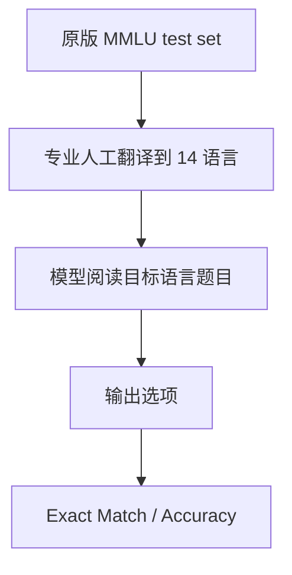

# Benchmark Card: MMMLU

| 字段 | 值 |
| ---- | ---- |
| 日期 | 2026-04-08 |
| 版本 | v1 |
| 状态 | 首版上线；已按 6 章节模板整理 |
| 变更记录 | 新增多语种类卡片；采用官方 dataset card 与 eval repo 作为主来源 |

---

## 1. 一句话定义

`MMMLU` 是把原版 `MMLU` 测试集用专业人工翻译到 14 种语言后的多语种 benchmark，用来测试模型的**跨语言知识保持**，而不是测试它会不会说得更自然。

## 2. 快速参考

| 属性 | 值 |
| ---- | ---- |
| 全称 | Multilingual Massive Multitask Language Understanding |
| 首次公开 | 2024 |
| 出品方 | OpenAI |
| 数据集规模 | 57 学科，14 种语言 |
| 输入形式 | 翻译后的 MMLU 多项选择题 |
| 输出形式 | 选项答案 |
| 评分方式 | exact match / accuracy |
| 一级类目 | `Multilingualism` |
| 二级类目 | `Multilingual QA` |
| 任务形态 | `translated multilingual multiple-choice knowledge benchmark` |
| 风险标签 | 原版 MMLU 继承缺陷 / 翻译痕迹 / 非原生题目 / 文化覆盖有限 |
| Dataset | https://huggingface.co/datasets/openai/MMMLU |
| Eval Repo | https://github.com/openai/simple-evals |
| 原始 MMLU 论文 | https://arxiv.org/abs/2009.03300 |

## 3. 卡片导航

### 3.1 核心流程

### 3.2 如果你只看三件事

- 它最适合测的是**同一知识题在不同语言下还能不能保持性能**。
- 它不等于原生多语 benchmark，因为题目不是各语言本地编写的。
- 它对低资源语言特别有价值，因为官方强调用了专业人工翻译。

---

## 4. 它怎么运作

### 4.1 它到底在测什么

MMMLU 测的是：

1. 模型在不同语言下是否仍保留原本知识能力。
2. 语言切换后，多项选择题理解能力是否显著掉点。
3. 低资源语言上的知识迁移是否可靠。

它测的重点不是：

- 风格自然度
- 长文生成质量
- 多语言对话能力

而是更基础的：

> 语言换了以后，知识问答底盘还在不在。

### 4.2 输入长什么样

输入是翻译后的 MMLU test question：

- 同样的题目结构
- 同样的多项选择形式
- 但语言变为目标 locale

官方 dataset card 明确列出了 14 个 locale，包括：

- Arabic
- Bengali
- German
- Spanish
- French
- Hindi
- Indonesian
- Italian
- Japanese
- Korean
- Portuguese
- Swahili
- Yoruba
- Simplified Chinese

### 4.3 模型要输出什么

模型最终输出正确选项即可。

由于 benchmark 保持了 MMLU 的多项选择结构，所以它的分数解释相对简单：

- 主要看正确率
- 很适合做跨语言横向比较

### 4.4 数据是怎么做出来的

官方 dataset card 写得非常明确：

1. 以原版 MMLU 的 **test set** 为底。
2. 用**专业人工翻译**翻到 14 种语言。
3. 公开翻译结果与配套评测代码。

这类做法的好处是：

- 不同语言之间题目尽量对齐
- 便于看“语言切换导致的纯能力差”

### 4.5 数据规模与分布

你至少应该记住：

| 维度 | 信息 |
| ---- | ---- |
| 原始任务来源 | MMLU test set |
| 学科数 | 57 |
| 语言数 | 14 |
| 题型 | 多项选择题 |
| 特点 | 同题跨语言可比性强 |

这让 MMMLU 很适合看：

- 同一模型在多语言上的掉点曲线
- 低资源语言与高资源语言的差距

### 4.6 怎么判分

它基本继承 MMLU 的判分方式：

1. 模型读取目标语言题面
2. 输出答案
3. 做 exact match
4. 汇总 accuracy

优点是简单清楚。

局限也很明显：

- 仍然是多选题
- 仍然主要是知识问答

---

## 5. 它可靠吗

### 5.1 它不测什么

- 原生多语 instruction following
- 各语言真实本地知识体系
- 多语写作质量
- 跨语言 agent 工作流

它主要测的是：

> 同一套知识题翻译后，模型在各语言上的稳态表现。

### 5.2 难度信号

MMMLU 的价值不在“题更难”，而在“语言切换造成的损失是否可控”。

尤其对：

- 低资源语言
- 训练数据分布不均的语言
- 中文 / 日语 / 阿拉伯语等非英语脚本

它能直接暴露模型多语知识能力是否失衡。

### 5.3 缺陷与争议

#### 5.3.1 🗣️ 继承了原版 MMLU 的结构性局限

包括多选题饱和、知识分布偏置与现实外推等 MMLU 本身的已知问题。  
来源：[MMLU 原始论文](https://arxiv.org/abs/2009.03300) 及社区长期讨论。

#### 5.3.2 🏛️ 是翻译题，不是原生题

高分不等于模型真正懂本地文化语境，题目不是各语言本地编写的。  
来源：[HuggingFace Dataset Card](https://huggingface.co/datasets/openai/MMMLU) 明确说明为人工翻译。

#### 5.3.3 🗣️ 翻译本身会改变题感

哪怕是专业人工翻译，也可能让某些语言更自然或更拗口，影响公平性。  
来源：多语 NLP 社区对 translated benchmark 的通用批评。

### 5.4 风险表

| 风险维度 | 风险级别 | 为什么 | 使用建议 |
| ---- | ---- | ---- | ---- |
| 原版继承缺陷 | 高 | 本质仍是 MMLU 变体 | 不要单独拿它代表多语综合能力 |
| 翻译痕迹 | 中 | 题目不是本地原生写作 | 更适合做语言差异对照，不适合做文化能力判断 |
| 现实外推 | 中 | 多选题无法覆盖真实多语任务 | 要和真实多语 benchmark 配合 |
| 低资源语言解释 | 中 | 低分可能来自翻译和训练双因素 | 需要结合其他多语 benchmark 验证 |

---

## 6. 我该用它吗

### 6.1 适用场景

- 你要看模型多语言知识保持
- 你想比较英语和非英语掉点
- 你关心低资源语言能力是否“只是宣传词”

### 6.2 是否值得看

> `MMMLU` 值得保留，但它更像“多语言知识迁移基线”，不是完整的多语智能 benchmark。最好把它和原生多语任务一起看。

结论标签：`⚠️ 条件看`
