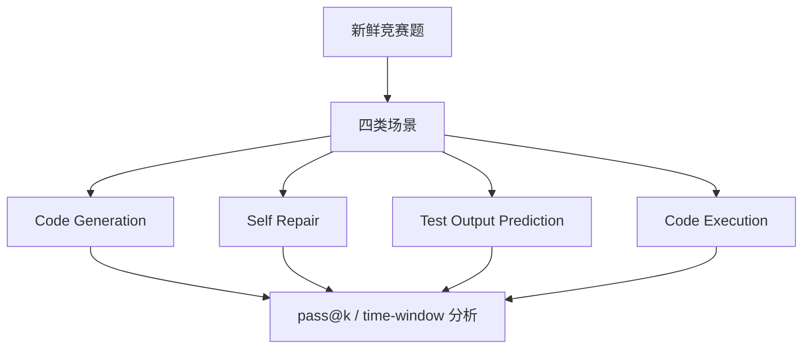

# Benchmark Card: LiveCodeBench

| 字段 | 值 |
| ---- | ---- |
| 日期 | 2026-04-08 |
| 版本 | v1 |
| 状态 | 首版上线；已按 6 章节模板整理 |
| 变更记录 | 新增代码推理类卡片；补入版本演化、errata 和时间窗评测信息 |

---

## 1. 一句话定义

`LiveCodeBench` 是一个持续更新的代码 benchmark，重点不只是测代码生成，还要在**时间上尽量防污染**，并同时评估 code generation、self-repair、test output prediction 和 code execution。

## 2. 快速参考

| 属性 | 值 |
| ---- | ---- |
| 全称 | LiveCodeBench: Holistic and Contamination Free Evaluation of Large Language Models for Code |
| 首次公开 | 2024 |
| 出品方 | LiveCodeBench 团队 |
| 数据集规模 | 从 `release_v1` 的 400 题增长到 `release_v6` 的 1055 题 |
| 数据来源 | LeetCode / AtCoder / CodeForces 持续采集 |
| 输入形式 | 竞赛题描述、测试与场景配置 |
| 输出形式 | 代码样本、修复代码、测试输出预测、执行结果 |
| 评分方式 | 代码题主要看 `pass@1` / `pass@5`；其他场景按对应正确率 |
| 一级类目 | `Reasoning` |
| 二级类目 | `Code Reasoning` |
| 任务形态 | `fresh-code benchmark with multi-scenario evaluation` |
| 风险标签 | 版本漂移 / 竞赛题偏置 / errata 噪声 / lite-full 口径差异 |
| 官网 | https://livecodebench.github.io/ |
| Repo | https://github.com/LiveCodeBench/LiveCodeBench |
| Dataset | https://huggingface.co/livecodebench/ |
| Errata | https://github.com/LiveCodeBench/LiveCodeBench/blob/main/ERRATA.md |

## 3. 卡片导航

### 3.1 核心流程

### 3.2 如果你只看三件事

- 它的最大卖点是**按发布时间切窗**，主动对抗污染。
- 它比 HumanEval 更接近“代码能力簇”，因为不只测 code generation。
- 它自己公开维护 `ERRATA`，说明团队承认自动化评测依旧会有噪声。

---

## 4. 它怎么运作

### 4.1 它到底在测什么

LiveCodeBench 测的是更广义的代码能力：

1. **Code Generation**：能不能从题面生成正确代码。
2. **Self Repair**：第一次错了以后，能不能根据失败信息修复。
3. **Test Output Prediction**：能不能只靠阅读程序推断输出。
4. **Code Execution**：能不能正确跟踪代码执行。

所以它应被解读为一组代码能力测试。

### 4.2 输入长什么样

不同场景输入不同，但基本都围绕“真实编程题”展开：

- 题目描述
- 测试或运行上下文
- 版本信息
- 场景配置

相比 SWE-bench，这里的输入更接近竞赛题 / 算法题工作流。

**公开示例**（来源：[livecodebench/code_generation_lite](https://huggingface.co/datasets/livecodebench/code_generation_lite)，题目原始来源为公开竞赛平台）：

> **题目描述**：给定一个整数数组 `nums` 和一个整数 `k`，返回所有长度为 `k` 的子数组中的最大元素之和。
>
> **输入格式**：第一行两个整数 `n, k`；第二行 `n` 个整数
> **输出格式**：一个整数

这里的关键在于题目来自较新的竞赛时间窗，能更好地压低训练数据污染。

### 4.3 模型要输出什么

按场景不同，模型输出可能是：

- 代码解答
- 修复后的代码
- 测试输出
- 执行过程相关答案

其中 code generation 场景默认采用多样本生成，因此官方重点报告：

- `pass@1`
- `pass@5`

### 4.4 数据是怎么做出来的

官方 README 给出的关键机制有三条：

1. 持续从 **LeetCode / AtCoder / CodeForces** 采集新题。
2. 按发布时间形成不同 `release_version`。
3. 支持按 `start_date / end_date` 做时间窗口评测，用来识别污染。

repo 文档层进一步说明：

- runner 架构是可扩展的
- 每个场景有独立 prompt 和评测逻辑
- 结果可以按时间段再聚合，支持超越单张静态总榜的解读

### 4.5 数据规模与分布

目前官方公开的版本演化如下：

| 版本 | 时间范围 | 题量 |
| ---- | ---- | ---- |
| release_v1 | 2023-05 到 2024-03 | 400 |
| release_v2 | 2023-05 到 2024-05 | 511 |
| release_v3 | 2023-05 到 2024-07 | 612 |
| release_v4 | 2023-05 到 2024-09 | 713 |
| release_v5 | 2023-05 到 2025-01 | 880 |
| release_v6 | 2023-05 到 2025-04 | 1055 |

这意味着你看到的 `LiveCodeBench` 分数，必须先问一句：

- 跑的是哪个 release？

### 4.6 怎么判分

在 code generation 场景，官方主要使用：

- `pass@1`
- `pass@5`

并通过修改过的 APPS checker 运行测试。

另外两个解释分数时必须注意的点：

1. 官方支持按时间窗重算分数，这直接影响“污染防御”。
2. 默认 benchmark 已引入 `code_generation_lite`，而 full benchmark 需要额外切换。

所以 `LiveCodeBench` 的分数需要拆开看：

- release 版本
- 场景
- lite / full
- 时间窗口

共同决定的结果。

---

## 5. 它可靠吗

### 5.1 它不测什么

- 真实仓库级修复任务
- 长期多轮软件工程协作
- 产品需求理解与架构设计
- GUI 或终端 agent 工作流

它主要测：

> 新鲜代码题上的广义代码推理能力。

### 5.2 难度信号

LiveCodeBench 的难点主要来自：

- 新鲜题减少记忆污染
- 四类场景迫使模型暴露不同短板
- 论文与官网都强调：HumanEval 高分不保证这里也高分

这点很重要，因为它能拆穿一类常见错觉：

- “会写小函数”不等于“代码能力全面”。

### 5.3 缺陷与争议

#### 5.3.1 🏛️ 官方 errata 已公开列出多类问题

包括 multiple valid outputs、interactive problems、erroneous test cases。  
来源：[官方 ERRATA.md](https://github.com/LiveCodeBench/LiveCodeBench/blob/main/ERRATA.md)。

#### 5.3.2 🏛️ 默认 benchmark 已做 test case pruning

`code_generation_lite` 更快，但与 full benchmark 不是同一口径。  
来源：[官方 Repo README](https://github.com/LiveCodeBench/LiveCodeBench) 对 lite/full 的说明。

#### 5.3.3 🗣️ 竞赛题分布有明显偏置

它很强于测算法 / 竞赛式推理，不等于真实工程开发。  
来源：社区对竞赛题 benchmark 的通用批评。

### 5.4 风险表

| 风险维度 | 风险级别 | 为什么 | 使用建议 |
| ---- | ---- | ---- | ---- |
| 版本漂移 | 高 | v1-v6 差异很大 | 报分时必须写 release_version |
| 评测噪声 | 中 | errata 和 timeout 会引入少量噪声 | 关注趋势和相对差异，不迷信个位数差距 |
| 竞赛题偏置 | 中 | 题目主要来自竞赛平台 | 不能代替 SWE-bench / Terminal-Bench |
| 口径混用 | 高 | lite、full、time-window 容易混淆 | 对外引用必须带完整配置 |

---

## 6. 我该用它吗

### 6.1 适用场景

- 你要看代码模型的“新鲜题”表现
- 你担心 HumanEval 这类老 benchmark 污染严重
- 你希望同时看生成、修复、执行、输出预测

### 6.2 是否值得看

> `LiveCodeBench` 非常值得看，尤其适合当“代码能力的新鲜度与多维度基线”。但一定要把 release、场景和 lite / full 口径写清楚。

结论标签：`★ 推荐`
