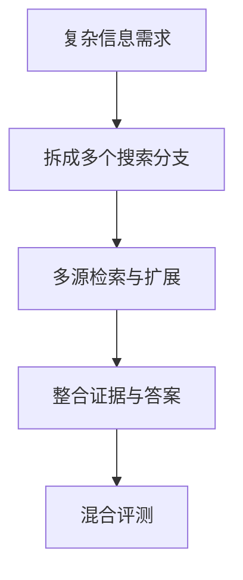

# Benchmark Card: WideSearch

| 字段 | 值 |
| ---- | ---- |
| 日期 | 2026-04-08 |
| 版本 | v1 |
| 状态 | 首版上线；按官方项目页与数据卡整理 |
| 变更记录 | 新增搜索代理类卡片；补入“广度优先”搜索任务与分层能力解释 |

---

## 1. 一句话定义

`WideSearch` 是一张强调**搜索广度**的信息寻求 benchmark，重点不是在开放网页里追一条极绕的线索，而是看模型能不能为复杂信息需求主动扩展搜索空间、组织多源证据并给出完整回答。

## 2. 快速参考

| 属性 | 值 |
| ---- | ---- |
| 全称 | WideSearch |
| 首次公开 | 2025-08 |
| 出品方 | ByteDance Seed |
| 数据集规模 | 200 个信息需求 |
| 输入形式 | 复杂信息需求 / 研究任务 |
| 输出形式 | 多源整合后的答案与证据 |
| 评分方式 | 结合自动检查与 judge 的混合评测 |
| 一级类目 | `Search Agent` |
| 二级类目 | `Broad Information-Seeking` |
| 任务形态 | `breadth-first web information seeking` |
| 风险标签 | judge 参与 / 网络漂移 / 覆盖广但样本仍小 / 任务定义偏研究型 |
| 官方页 | https://widesearch-seed.github.io/ |
| Dataset | https://huggingface.co/datasets/ByteDance-Seed/WideSearch |
| 论文 | https://arxiv.org/abs/2508.07999 |

## 3. 卡片导航

### 3.1 核心流程

### 3.2 如果你只看三件事

- 它测的是“**搜得够广不够广**”，不是只看能不能沿一条路径追到唯一短答案。
- 它和 `BrowseComp` 互补：一个更偏广度型信息搜集，一个更偏极难事实追索。
- 如果你的产品是 deep research / research assistant，这张卡比普通 browsing QA 更贴近目标形态。

---

## 4. 它怎么运作

### 4.1 它到底在测什么

WideSearch 关注的是更像研究助手的问题：

1. 模型能不能识别一个复杂需求需要从哪些方向搜。
2. 能不能主动扩展搜索空间，而不是过早收敛。
3. 能不能把不同来源的信息拼成结构完整的回答。

它测的不是：

- 单跳网页问答
- 唯一事实的极限追踪

而是更接近：

> 面对复杂信息需求，模型有没有“广搜 + 组织”的能力。

### 4.2 输入长什么样

输入通常不是一句简单 factoid question，而更像：

- 一个研究需求
- 一个需要多角度覆盖的问题
- 一个必须汇总多源信息的任务

官方项目页直接把重点放在：

- broad information-seeking
- search space expansion
- evidence organization

这说明 WideSearch 从设计上就不是“短答案题库”。

**公开示例**（来源：[ByteDance-Seed/WideSearch](https://huggingface.co/datasets/ByteDance-Seed/WideSearch)，任务 `ws_en_001`）：

> 帮我整理 `QS World University Rankings by Subject 2025` 五个 broad subjects 的前五所大学，并同时补齐这些学校在 `QS World University Rankings 2025`、`Times Higher Education World University Rankings 2025`、官网首页、常规申请截止日期和申请费中的信息，最后输出成一张 Markdown 表。

这个例子很典型：难点不在某个单一事实，而在于要跨多个来源把一整张表补完整，而且尽量不能漏列、漏字段或填错学校。

### 4.3 模型要输出什么

模型需要输出的不只是最终结论，还要体现：

- 找到了哪些关键信息源
- 是否覆盖了需求的不同方面
- 能否把材料组织成完整答案

所以它比传统短答案 browsing benchmark 更像一个 research workflow benchmark。

### 4.4 数据是怎么做出来的

根据官方页与数据卡，WideSearch 的核心意图是：

1. 构造 200 个复杂信息需求；
2. 让任务天然需要“广度优先”搜索；
3. 通过多维评测判断模型是否真的扩展了搜索，而不是只抓到局部信息。

这让它和 BrowseComp 的差异非常清楚：

- BrowseComp：答案短、验证快、求解难
- WideSearch：需求复杂、覆盖更广、组织更难

### 4.5 数据规模与分布

你至少应该记住：

| 维度 | 信息 |
| ---- | ---- |
| 总规模 | 200 |
| 任务类型 | 复杂信息需求 |
| 设计重点 | 广搜、覆盖、信息组织 |
| 适用对象 | 搜索代理 / deep research agent |

这意味着它更适合：

- 看 research assistant 型产品
- 看模型会不会只搜到第一层就停

### 4.6 怎么判分

WideSearch 使用的是更混合的评测思路：

1. 检查回答是否覆盖信息需求的关键方面
2. 检查多源搜索与组织效果
3. 对难以完全机械化的部分使用 judge 或人工式标准

优点是：

- 更贴近复杂 research 任务

代价是：

- 不像 exact match 那样完全干净
- 会受到网络漂移和 judge 口径影响

---

## 5. 它可靠吗

### 5.1 它不测什么

- 终端执行
- 工具调用协议正确性
- 真实代码修复
- 单一唯一答案的极限事实追踪

它更像测：

> 复杂信息需求下的广搜与整合。

### 5.2 难度信号

WideSearch 的难点主要来自：

- 不能只靠一个 query 成功
- 要主动扩展搜索分支
- 要避免只抓到局部信息
- 要把结果组织成有用答案

这种难点和真实 deep research 产品的需求很接近。

### 5.3 缺陷与争议

#### 5.3.1 🗣️ 仍然会受网络漂移影响

只要任务建立在开放网页上，页面变化和索引变化就不可避免。  
来源：开放互联网搜索 benchmark 的通用局限。

#### 5.3.2 🏛️ 部分维度难以纯自动评分

覆盖是否充分、组织是否完整，往往需要混合式评判。  
来源：[WideSearch 官方页](https://widesearch-seed.github.io/) 对任务定位的说明。

#### 5.3.3 🗣️ 当前样本量不算大

200 个任务已经够看趋势，但还不足以代表所有 research 场景。  
来源：[WideSearch Dataset Card](https://huggingface.co/datasets/ByteDance-Seed/WideSearch) 当前公开规模。

### 5.4 风险表

| 风险维度 | 风险级别 | 为什么 | 使用建议 |
| ---- | ---- | ---- | ---- |
| judge 依赖 | 中 | 复杂覆盖度不易完全机械化 | 关注维度定义与评测脚本 |
| 网络漂移 | 中 | 开放网页会变化 | 更适合看同窗对比 |
| 样本规模 | 中 | 当前只有 200 个需求 | 用来定方向，不要神化小差距 |
| 任务偏置 | 中 | 更偏 research / deep search 任务 | 与 BrowseComp 组合看更稳 |

---

## 6. 我该用它吗

### 6.1 适用场景

- 你在做 deep research / 搜索代理产品
- 你关心模型会不会扩展搜索空间
- 你觉得短答案式 browsing benchmark 太窄

### 6.2 是否值得看

> `WideSearch` 值得看，因为它把搜索 benchmark 从“找对唯一事实”推向了“能否组织复杂信息需求”。如果你的产品目标是 research assistant，这张卡的参考价值会明显高于普通网页 QA 榜单。

结论标签：`★ 推荐`
