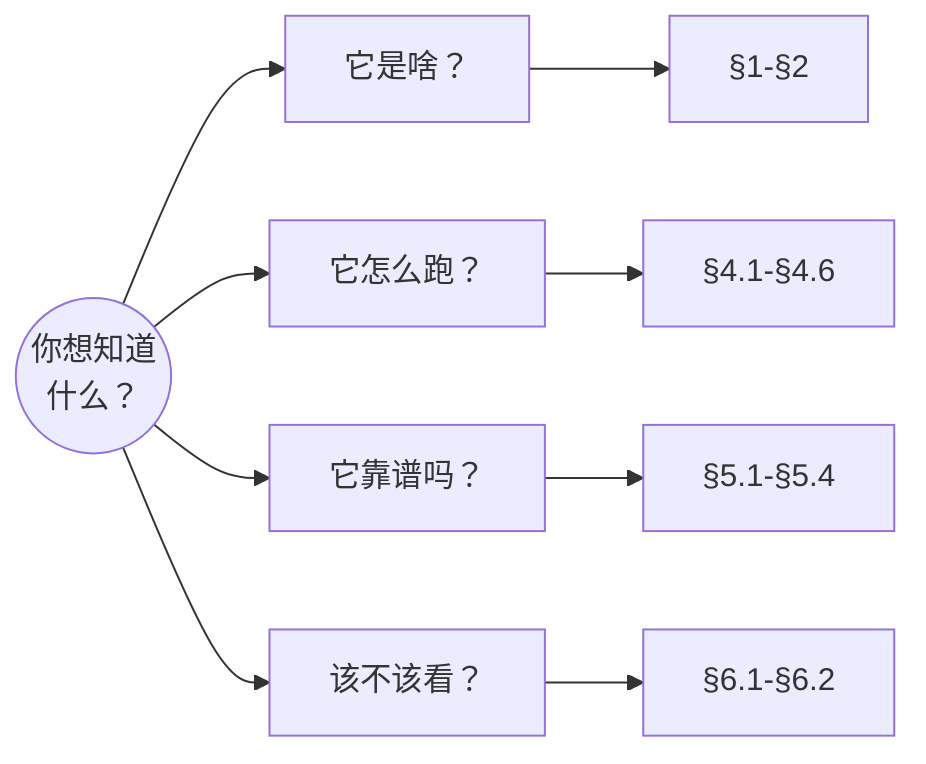
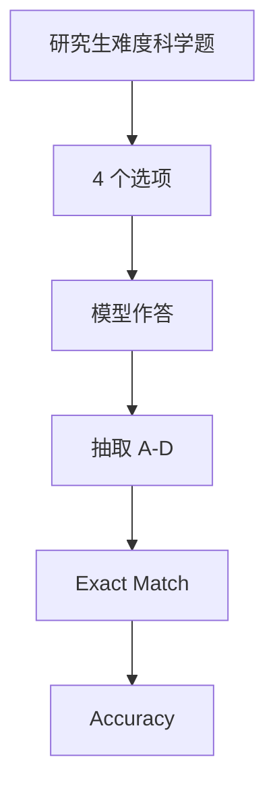

# Benchmark Card: GPQA

| 字段 | 值 |
| ---- | ---- |
| 日期 | 2026-04-08 |
| 版本 | v1 |
| 状态 | 首版上线；已按 6 章节模板整理 |
| 变更记录 | 新增 STEM 类卡片；补入官方 repo 的 closed-book / open-book 运行视角 |

---

## 1. 一句话定义

`GPQA` 是一个面向研究生难度科学问答的 benchmark，目标是构造那种**即使熟练的非专家拿着 Google 也不容易稳定答对**的问题。

## 2. 快速参考

| 属性 | 值 |
| ---- | ---- |
| 全称 | GPQA: A Graduate-Level Google-Proof Q&A Benchmark |
| 首次公开 | 2023-11 |
| 出品方 | David Rein、Samuel R. Bowman 等（NYU） |
| 数据集规模 | 448 题（常被引用的是 Diamond 子集） |
| 学科范围 | Biology / Physics / Chemistry 为主 |
| 输入形式 | 4 选 1 多项选择题 |
| 输出形式 | 最终答案字母 |
| 评分方式 | exact match / accuracy |
| 一级类目 | `STEM` |
| 二级类目 | `Graduate Science QA` |
| 任务形态 | `expert-level science multiple-choice reasoning` |
| 风险标签 | 学科覆盖窄 / 多选题饱和 / 训练污染 / 子集混用 |
| 论文 | https://arxiv.org/abs/2311.12022 |
| OpenReview | https://openreview.net/forum?id=Ti67584b98 |
| 官方 Repo | https://github.com/idavidrein/gpqa |
| Dataset | https://huggingface.co/datasets/idavidrein/gpqa |
| 参考实现 | https://github.com/openai/simple-evals/blob/main/gpqa_eval.py |

## 3. 卡片导航

### 3.1 按你的问题跳读

### 3.2 核心流程

### 3.3 如果你只看三件事

- 它是少数把“Google-proof”明确写进定位里的 benchmark。
- 它主要覆盖高难度自然科学，而不是通识 STEM 拼盘。
- 你引用 GPQA 时，必须说明到底是哪个子集、哪种 prompt、有没有 open-book。

---

## 4. 它怎么运作

### 4.1 它到底在测什么

GPQA 测的是：

1. 模型是否具备接近高阶学科训练的**科学知识**。
2. 模型是否能在干扰选项下完成**严肃推理**。
3. 模型能否处理那种**搜索并不能立刻抄答案**的问题。

“Google-proof”的含义不是“绝对搜不到”，而是：

- 对于熟练的非专家来说，拿着普通搜索也不容易稳定做对。

### 4.2 输入长什么样

GPQA 的输入很传统：

- 一道科学问题
- 四个候选答案

但题目的难点不在格式，而在题面本身：

- 常要求学科内推理
- 干扰项更强
- 直接记忆命中率更低

### 4.3 模型要输出什么

模型最终输出一个选项。

无论是官方 repo 还是 `simple-evals` 参考实现，本质都在做同一件事：

- 打乱答案顺序
- 让模型输出 A/B/C/D
- 用 exact match 计分

这使它非常容易跑，但也意味着：

- prompt 细节
- CoT
- answer extraction

都会影响最终数字。

### 4.4 数据是怎么做出来的

根据官方定位，GPQA 的关键设计点是：

1. 问题由领域专家撰写。
2. 问题面向研究生难度。
3. 目标是避免被普通网页搜索直接击穿。

官方 repo 还保留了两种很有价值的运行视角：

- closed-book baseline
- retrieval / retrieval_content baseline

这说明作者自己也很清楚：

- GPQA 不是单纯测“记忆”
- 也想看搜索增强到底能帮多少

### 4.5 数据规模与分布

现阶段最常被引用的是：

| 维度 | 信息 |
| ---- | ---- |
| 题量 | 448 |
| 题型 | 4 选 1 |
| 主要学科 | Biology / Physics / Chemistry |
| 常见子集 | GPQA Diamond |

你必须注意：

- 不同文章常引用的并不一定是同一个 GPQA 子集
- 有人报 closed-book，有人报带检索或特殊 prompt

### 4.6 怎么判分

核心指标是 **accuracy**。

在 `simple-evals` 参考实现里，典型流程是：

1. 题目四个答案随机打乱
2. 模型输出 A-D
3. 抽取最终字母
4. 与正确字母 exact match

优点：

- 判分清晰
- 很容易大规模比较

局限：

- 多选题对真实科学推理的表达有限
- 评分不关心解释质量

---

## 5. 它可靠吗

### 5.1 它不测什么

- 开放式科研写作
- 文献检索与证据整合
- 实验设计能力
- 多轮科学协作

所以 GPQA 更像：

> 高难度科学选择题 benchmark。

而不是：

> 通用科研代理 benchmark。

### 5.2 难度信号

GPQA 的难点来自三层：

- 题目本身更偏专家知识
- 干扰项更强
- “搜一下就能抄”这条路被刻意压缩

它很适合用来区分：

- 通识很好但高阶科学不稳的模型
- 真的有较强 STEM 推理底盘的模型

### 5.3 缺陷与争议

#### 5.3.1 🏛️ 学科覆盖并不宽

重点是生物、物理、化学，而不是全学科 STEM。  
来源：[论文](https://arxiv.org/abs/2311.12022) 数据来源说明。

#### 5.3.2 🗣️ 不同子集常被混用

GPQA、GPQA Diamond、Extended 等子集彼此不能直接混，但厂商宣传常不标明。  
来源：[HuggingFace 数据集](https://huggingface.co/datasets/idavidrein/gpqa) 子集描述。

#### 5.3.3 🗣️ 多选题不等于真实科研能力

高分只说明模型在高难度科学选择题上表现好，不等于能做真实研究工作。  
来源：社区对所有 MCQ benchmark 的通用批评。

### 5.4 风险表

| 风险维度 | 风险级别 | 为什么 | 使用建议 |
| ---- | ---- | ---- | ---- |
| 子集混用 | 高 | 不同榜单不一定跑同一版本 | 报分时必须写清具体子集 |
| 学科偏窄 | 中 | 主要聚焦自然科学 | 不能拿它代表全部 STEM |
| 训练污染 | 中 | 高质量学术题仍可能出现在训练语料 | 更适合看高质量相对比较 |
| 现实外推 | 中 | 多选题不等于科研工作流 | 需要和 agent / long-context benchmark 配合 |

---

## 6. 我该用它吗

### 6.1 适用场景

- 你要看模型的高阶 STEM 推理能力
- 你不满足于普通通识 benchmark
- 你想在“容易搜到答案”和“真实科研任务”之间找一个中间层

### 6.2 是否值得看

> `GPQA` 很值得看，但前提是把它当成“高难度科学选择题 benchmark”，并严格标明你看的到底是哪个子集与哪种运行口径。

结论标签：`★ 推荐`
