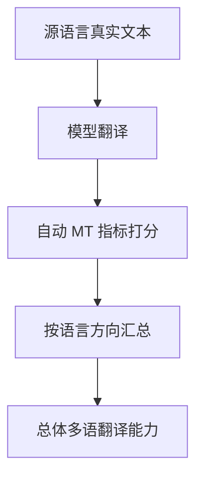

# Benchmark Card: WMT24++

| 字段 | 值 |
| ---- | ---- |
| 日期 | 2026-04-08 |
| 版本 | v1 |
| 状态 | 首版上线；按数据卡与论文整理 |
| 变更记录 | 新增 Translation 类卡片；补入 55 语言方向、真实文档与自动指标解释 |

---

## 1. 一句话定义

`WMT24++` 是一个面向多语言机器翻译的大规模 benchmark，它把真实文档、更多语言方向和统一自动指标放进同一评测框架里，用于观察模型跨语言翻译的稳定性。

## 2. 快速参考

| 属性 | 值 |
| ---- | ---- |
| 全称 | WMT24++ |
| 首次公开 | 2025-02 |
| 出品方 | WMT / Google Research 等 |
| 数据集规模 | 55 个语言方向，每方向约 998 句 |
| 数据来源 | 171 篇文档，覆盖 5 个文本域 |
| 输入形式 | 源语言真实文本片段 |
| 输出形式 | 目标语言翻译结果 |
| 评分方式 | 自动 MT 指标（如 COMET 类指标及配套评分） |
| 一级类目 | `Translation` |
| 二级类目 | `Multilingual Machine Translation` |
| 任务形态 | `many-language machine translation benchmark` |
| 风险标签 | 自动指标偏置 / 文档域差异 / 翻译质量与知识能力混淆 / 高低资源不可直接混比 |
| Dataset | https://huggingface.co/datasets/synquid/wmt24pp |
| 论文 | https://arxiv.org/abs/2502.12404 |
| 结果与指标 | https://github.com/google-deepmind/mt-metrics-eval |

## 3. 卡片导航

### 3.1 核心流程

### 3.2 如果你只看三件事

- 它是少数真正把**55 个语言方向**放进同一口径里的翻译 benchmark。
- 它聚焦翻译质量，不覆盖知识保持或指令遵循。
- 解释分数时必须记住：自动 MT 指标很有用，但仍无法完整代表人工偏好或业务可用性。

---

## 4. 它怎么运作

### 4.1 它到底在测什么

WMT24++ 测的是：

1. 模型能不能把源语言内容翻成目标语言。
2. 面对不同语言方向时质量是否稳定。
3. 在高资源与低资源语对之间是否存在明显失衡。

它的评测边界很清楚：

- 多语知识保持
- 多语聊天服从性
- 原生本地文化理解

它主要关注：

> 多语言机器翻译能力本身。

### 4.2 输入长什么样

输入通常是来自真实文档的文本片段：

- 有明确源语言和目标语言
- 覆盖多个文本域
- 常来自真实文档片段，长度和语境通常比玩具句子更接近真实使用

数据卡给出的关键信息是：

- 171 篇文档
- 5 个文本域
- 55 个语言方向

这让它比只测少数主流语对的 MT benchmark 更接近真实多语产品场景。

**公开示例**（来源：[synquid/wmt24pp](https://huggingface.co/datasets/synquid/wmt24pp)，语言方向 `en-ar_EG`，news 域公开样本）：

> **Source**: `Siso's depictions of land, water center new gallery exhibition`
>
> **Target**: `رسومات سيسو عن الأرض والمية في معرضه الجديد`

这只是一个真实文档里的单句片段。WMT24++ 的实际评测就是把这种分布在新闻、社交、演讲、文学等域里的句段，按不同语言方向系统性翻译并打分。

### 4.3 模型要输出什么

模型需要输出目标语言译文。

从 benchmark 角度看，关注的是：

- 译文是否忠实
- 是否流畅
- 是否在不同语对上保持稳定

所以它和 MMMLU、MaXIFE 关注的是不同能力：

- 那些更偏知识或指令
- WMT24++ 更偏翻译本身

### 4.4 数据是怎么做出来的

公开数据卡与论文说明的重点包括：

1. 数据来自真实文档，样本分布比少量人工玩具样本更接近真实应用；
2. 覆盖大量语言方向，强调 many-language 评测；
3. 同时提供自动指标分数，便于统一横向比较。

这使它特别适合作为：

- 多语翻译能力的主 benchmark
- 检查高资源/低资源差距的基线

### 4.5 数据规模与分布

最值得记住的是它的覆盖面：

| 维度 | 信息 |
| ---- | ---- |
| 语言方向 | 55 |
| 每方向样本量 | 约 998 |
| 文档数 | 171 |
| 文本域 | 5 |

这意味着它比很多翻译 benchmark 更适合做：

- 多语总体画像
- 语言方向间掉点分析

### 4.6 怎么判分

WMT24++ 主要依赖自动 MT 指标。

这类流程通常是：

1. 模型生成译文
2. 与参考译文或评测框架对比
3. 用统一自动指标汇总得分

优点是：

- 跨 55 个语言方向时，自动化是现实可行的

局限是：

- 自动指标不等于人工最终偏好
- 某些低资源或高形态差异语言上，分数解释会更微妙

---

## 5. 它可靠吗

### 5.1 它不测什么

- 多语知识问答
- 多语 instruction following
- 长文对话
- 工具调用

所以 WMT24++ 高分主要说明：

> 这个模型翻译更强。

不要直接把它解读为：

> 这个模型在所有多语能力上都更强。

### 5.2 难度信号

它的难点主要来自：

- 语言方向非常多
- 文档域不止一种
- 高资源和低资源语对差异大

这让它比只看少数大语种的翻译榜更有信息量。

### 5.3 缺陷与争议

#### 5.3.1 🗣️ 自动指标与人工偏好仍有差距

尤其在风格、语气、细粒度可读性上，自动指标总有盲点。  
来源：机器翻译评测的通用局限；WMT 体系也长期围绕指标与人工评测关系展开。

#### 5.3.2 🗣️ 不同语言方向不能简单横比

高资源语对和低资源语对的分数分布天生不同，直接拿绝对值横比会误导。  
来源：many-language MT benchmark 的通用解释边界。

#### 5.3.3 🏛️ 翻译质量不等于知识保持或本地理解

模型翻译好，不代表多语知识问答或指令遵循同样好。  
来源：任务边界本身。

### 5.4 风险表

| 风险维度 | 风险级别 | 为什么 | 使用建议 |
| ---- | ---- | ---- | ---- |
| 指标偏置 | 高 | 自动 MT 指标不覆盖全部质量维度 | 重要语对最好辅以人工抽检 |
| 语对异质性 | 中 | 不同语言方向难度差异大 | 更适合同语对纵向比较 |
| 能力混淆 | 中 | 翻译高分不等于知识/指令高分 | 要和 MMMLU / MaXIFE 区分开看 |
| 文本域差异 | 中 | 不同 domain 会影响表现 | 留意具体领域结果 |

---

## 6. 我该用它吗

### 6.1 适用场景

- 你要看模型多语翻译质量
- 你需要一个覆盖大量语言方向的统一 benchmark
- 你想补上站内原本完全缺失的 Translation 类目

### 6.2 是否值得看

> `WMT24++` 值得看，因为它是站内当前最直接、最系统的多语言翻译能力卡。只是它解决的是“翻得好不好”，不是“懂不懂知识”或“会不会按要求做”，所以必须和 MMMLU、MaXIFE 分开解释。

结论标签：`⚠️ 条件看`
