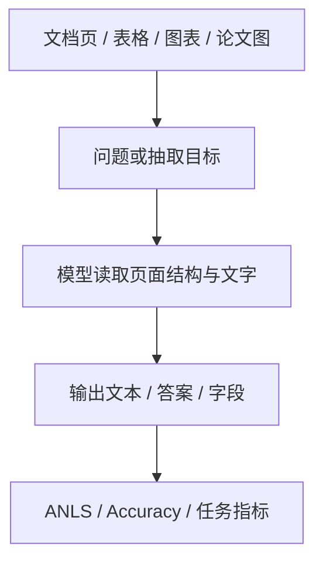

# Benchmark Card: Vision Document / OCR / Chart Benchmarks

| 字段 | 值 |
| ---- | ---- |
| 日期 | 2026-05-13 |
| 版本 | v2 |
| 状态 | 已按 6 章节模板重写 |
| 变更记录 | v1 为综述卡；v2 补入示例、来源维度、风险表与完整章节结构 |

---

## 1. 一句话定义

这张专题卡覆盖截图里的文档、OCR 与图表相关 benchmark：`OCRBench`、`OCRBench_v2_EN`、`OCRBench_v2_CN`、`OmniDocBench_v1.5`、`DocVQA_VAL`、`CharXiv_Reasoning`，主要关注模型在**认字、读版面、做文档问答、读科研图**上的能力。

## 2. 快速参考

| 属性 | 值 |
| ---- | ---- |
| 覆盖对象 | `OCRBench` / `OCRBench_v2_EN` / `OCRBench_v2_CN` / `OmniDocBench_v1.5` / `DocVQA_VAL` / `CharXiv_Reasoning` |
| 主要能力 | OCR / 页面理解 / 文档问答 / 图表与科研图 reasoning |
| 常见输入 | 扫描页、截图、表格、票据、论文图表 |
| 常见输出 | 文本、短答案、字段值 |
| 常见评分 | accuracy / ANLS / benchmark-specific metrics |
| 一级类目 | `Vision / Multimodal` |
| 二级类目 | `Document / OCR / Chart` |
| 任务形态 | `document understanding and chart reasoning` |
| 风险标签 | OCR 与 reasoning 混杂 / 语言 split 混用 / 版式依赖 |
| 代表来源 | `DocVQA` 官方站点、`OCRBench` / `OmniDocBench` 官方公开资料 |

## 3. 卡片导航

### 3.1 核心流程

### 3.2 如果你只看三件事

- `OCRBench` 更像 OCR 能力扫面图，不等于完整文档理解。
- `DocVQA` 与 `OmniDocBench` 更接近真实文档 AI 产品任务。
- `CharXiv_Reasoning` 不是“认字题”，它更偏 `CharXiv` 家族里的 reasoning 子集。

## 4. 它怎么运作

### 4.1 它到底在测什么

这组 benchmark 合起来主要测四件事：

1. 模型能否读出图片里的文字。
2. 模型能否理解页面结构、表格、版式和字段关系。
3. 模型能否基于文档内容回答问题。
4. 模型能否对科研图、图表和可视化内容做推理。

组内分工大致是：

- [`OCRBench`](#ocrbench--ocrbench-v2)：OCR 评测谱系
- [`OmniDocBench`](#omnidocbench-v15)：更完整的 document understanding
- [`DocVQA_VAL`](#docvqa-val)：文档问答
- [`CharXiv_Reasoning`](#charxiv-reasoning)：`CharXiv` 的 reasoning 子集

#### OCRBench / OCRBench_v2

截图里的 `OCRBench` 是旧一代 benchmark；`OCRBench_v2_EN`、`OCRBench_v2_CN` 属于改进后的 `OCRBench v2` 双语评测口径。它们属于同一评测谱系，但不能当成完全同一套数据。

#### OmniDocBench_v1.5

`OmniDocBench_v1.5` 更偏完整文档任务。

#### DocVQA_VAL

`DocVQA_VAL` 是文档问答验证集口径。

#### CharXiv_Reasoning

`CharXiv_Reasoning` 更准确地说是 `CharXiv` 家族里的 reasoning 子集，而不是独立于 `CharXiv` 的另一张 benchmark。

### 4.2 输入长什么样

常见输入包括：

- 扫描文档页
- 手机拍照页
- 表格截图
- 票据、海报、表单
- 论文图与可视化图

**典型样式示例**：

#### `OCRBench` 风格

> 给一张包含多行文字的图片，要求读出指定字段，或判断某段文本内容。  
> 难点通常是字体、清晰度、排版和混合语言。

#### `DocVQA` 风格

> 给一张发票、表单或文档页，问题可能是“总金额是多少？”或“发票日期是什么？”  
> 这里看的是“读懂文档再回答”，不是纯 OCR。

#### `CharXiv_Reasoning` 风格

> 给一张论文图表，问题可能是“哪条曲线在高温区间增长更快？”  
> 这时模型不仅要读图，还要理解图上变量关系。

### 4.3 模型要输出什么

输出通常是：

- 一段文本
- 一个字段值
- 一个短答案

工程上最关键的是：

- OCR 类任务常受空格、符号、大小写影响
- 文档问答类任务更依赖 answer normalization

### 4.4 数据是怎么做出来的

这组 benchmark 的构造路线并不相同：

- `OCRBench`：更偏多种 OCR 场景聚合
- `OCRBench v2`：改进后的双语 OCR benchmark
- `OmniDocBench`：更偏文档任务聚合
- `DocVQA`：围绕问答组织
- `CharXiv_Reasoning`：围绕 `CharXiv` 的 reasoning 子集组织

因此它们合起来能回答的问题是：

> 这个模型到底是只会认字，还是能真正读懂文档和图表？

### 4.5 数据规模与分布

这一组最重要的是记住“功能位”：

| 项目 | 更适合记住什么 |
| ---- | ---- |
| `OCRBench` | 旧一代 OCR 总览入口 |
| `OCRBench_v2_EN/CN` | 改进版双语 OCR split |
| `OmniDocBench_v1.5` | 文档理解综合任务 |
| `DocVQA_VAL` | 文档问答验证集口径 |
| `CharXiv_Reasoning` | 科研图与图表 reasoning |

### 4.6 怎么判分

这一组常见评分方式包括：

- `accuracy`
- `ANLS`
- benchmark-specific task metrics

优点：

- 很适合看 OCR / 文档理解基础能力

局限：

- 版式、图片质量、字段归一化会明显影响分数
- OCR 对不代表 reasoning 对

## 5. 它可靠吗

### 5.1 它不测什么

- GUI 操作定位
- 长视频理解
- 多图聚合
- 通用视觉常识

所以它更适合解读为：

> 文档与图表理解 benchmark。

### 5.2 难度信号

这一组 benchmark 的难点通常来自：

- 图片质量差
- 版面复杂
- 文本与结构要一起读
- 问答需要跨区域定位信息

而 `CharXiv_Reasoning` 还会额外要求：

- 读变量关系
- 理解图上趋势

### 5.3 缺陷与争议

#### 5.3.1 🏛️ OCR 分数不等于文档任务完成度

只会读字，不代表会做表单问答、结构理解或图表推理。  
来源：OCR、DocVQA、Chart reasoning 任务边界本身。

#### 5.3.2 🗣️ `EN/CN` split 不能直接压成一个绝对能力结论

不同语言字体、版式和内容分布差异会显著影响结果。  
来源：跨语言 OCR benchmark 的通用解释风险。

#### 5.3.3 🗣️ 图表与科研图任务很容易被误当成 OCR

其实它更接近 reasoning，而不是简单文本识别。  
来源：`CharXiv_Reasoning` 任务边界本身。

### 5.4 风险表

| 风险维度 | 风险级别 | 为什么 | 使用建议 |
| ---- | ---- | ---- | ---- |
| OCR / reasoning 混用 | 高 | 认字与读懂图表是两条能力线 | 分开看 `OCRBench`/`DocVQA` 与 `CharXiv` |
| 语言 split 误读 | 中 | `EN`、`CN` 数据分布不一致 | 不要简单平均 |
| 版式依赖 | 中 | 文档样式变化会显著影响结果 | 报分时说明页面类型 |
| 现实外推 | 中 | benchmark 页面不等于真实业务文档流 | 需要结合真实样本试跑 |

## 6. 我该用它吗

### 6.1 适用场景

- 你要判断模型能不能做 OCR
- 你关心票据、表单、报告、论文图表理解
- 你需要区分“只会认字”和“真的会做文档任务”

### 6.2 是否值得看

> 这组 benchmark 很值得看，前提是你把 `OCR`、`DocQA`、`Chart reasoning` 三条能力线分开理解，而不是把所有文档任务压成一个总分。

结论标签：`★ 推荐`
