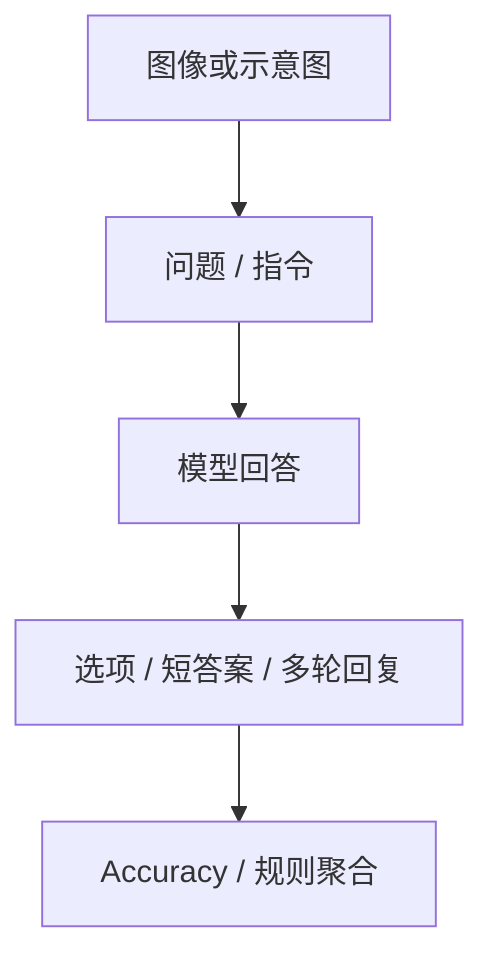

# Benchmark Card: Vision General Benchmarks

| 字段 | 值 |
| ---- | ---- |
| 日期 | 2026-05-13 |
| 版本 | v2 |
| 状态 | 已按 6 章节模板重写 |
| 变更记录 | v1 为综述卡；v2 补入元数据、示例、4.1-4.6 展开与风险表 |

---

## 1. 一句话定义

这张专题卡覆盖截图里的通用视觉 benchmark：`MMBench EN v1.1`、`MMBench CN v1.1`、`MMStar`、`AI2D`、`MMT-Bench`，主要关注模型在**一般图文理解、示意图理解和多任务视觉问答**上的基础能力。

## 2. 快速参考

| 属性 | 值 |
| ---- | ---- |
| 覆盖对象 | `MMBench EN v1.1` / `MMBench CN v1.1` / `MMStar` / `AI2D` / `MMT-Bench` |
| 代表 benchmark 家族 | `MMBench` / `MMStar` / `AI2D` / `MMT-Bench` |
| 主要能力 | 通用图文理解 / 轻推理 / 示意图理解 / 多任务视觉问答 |
| 常见输入 | 单图 + 问题；教材图 + 问题；多项选择视觉题 |
| 常见输出 | 选项、短答案 |
| 常见评分 | accuracy / exact match / benchmark-specific aggregate |
| 一级类目 | `Vision / Multimodal` |
| 二级类目 | `General` |
| 任务形态 | `general image understanding and multimodal QA` |
| 风险标签 | 语言 split 混用 / 总分掩盖子能力 / 单轮与多轮口径混用 |
| 代表来源 | `MMBench` 官方 repo、`MMStar` 官方 repo、AllenAI `AI2D` 项目页 |

## 3. 卡片导航

### 3.1 核心结构

### 3.2 如果你只看三件事

- `MMBench` 是这组里最宽口径的通用视觉总览；`EN v1.1` 和 `CN v1.1` 是 language split。
- `AI2D` 很窄，但在“教材图、箭头、标注关系能不能看懂”上特别有解释力。
- `MMT-Bench` 是多任务、多选题的综合视觉 benchmark，不是多轮对话 benchmark。

## 4. 它怎么运作

### 4.1 它到底在测什么

这组 benchmark 合起来主要看四类能力：

1. 模型能否把图像感知和文本理解结合起来。
2. 模型能否在一般图文题上做出稳定判断，而不是只看局部线索。
3. 模型能否理解教材图、示意图、箭头、标注和局部结构关系。
4. 模型能否在多任务视觉题上跨任务保持稳定表现。

更具体地说：

- [`MMBench`](#mmbench)：通用图文问答总览
- [`MMStar`](#mmstar)：更紧凑、更偏综合能力的通用多模态信号
- [`AI2D`](#ai2d)：diagram understanding
- [`MMT-Bench`](#mmt-bench)：multimodal multitask benchmark

#### MMBench

截图里的 `MMBench EN v1.1` 与 `MMBench CN v1.1` 都属于 `MMBench` 家族。

#### MMStar

`MMStar` 更像高密度通用视觉综合题。

#### AI2D

`AI2D` 是经典教材示意图理解任务。

#### MMT-Bench

`MMT-Bench` 更偏多任务、多选题视觉评测。

### 4.2 输入长什么样

这组 benchmark 的输入并不统一，但大体可以分成三类：

- **单图 + 单问题**：`MMBench`、`MMStar`
- **示意图 + 问题**：`AI2D`
- **多项选择视觉题**：`MMT-Bench`

**典型样式示例**：

#### `MMBench` / `MMStar` 风格

> 给一张图片，问题可能是“图中人物接下来更可能在做什么？”或“下列哪项最符合图中关系？”  
> 模型通常需要从若干选项中选一个，或者给一个短答案。

#### `AI2D` 风格

> 给一张教材示意图，例如带箭头、框注和局部放大图的科学插图；问题可能是“箭头所指部位的作用是什么？”  
> 难点不是识别自然图像对象，而是理解图解结构。

#### `MMT-Bench` 风格

> 给一张图片和一道多项选择题，问题可能涉及识别、关系理解、常识或轻推理；模型需要从给定选项中选择最合适的答案。  
> 这里看的是跨任务覆盖与稳定性，而不是多轮连续对话。

### 4.3 模型要输出什么

输出通常是下面三种之一：

- 选项字母
- 短文本答案
- 可抽取的多项选择答案

这意味着：

- `MMBench` / `MMStar` 更接近标准 VQA 或 MCQ
- `AI2D` 更偏 diagram QA
- `MMT-Bench` 更偏多任务覆盖与综合视觉能力

### 4.4 数据是怎么做出来的

这组 benchmark 的构造思路各不相同：

- `MMBench`：用多类视觉问答题覆盖较宽的通用视觉能力面
- `MMStar`：压缩成更高密度的综合能力集合
- `AI2D`：来源于教材和科学示意图，重点在人工绘制图解
- `MMT-Bench`：围绕多任务、多选题视觉评测组织任务

所以这张卡本质上不是一张“单机制 benchmark 卡”，而是一张**通用视觉入口卡**。

### 4.5 数据规模与分布

你至少应该记住下面几件事：

| 项目 | 更适合记住什么 |
| ---- | ---- |
| `MMBench` | 宽覆盖通用视觉题；分 `EN`、`CN` 等 split |
| `MMStar` | 更紧凑的综合能力 benchmark |
| `AI2D` | 经典示意图理解数据集，不是自然图像总榜 |
| `MMT-Bench` | 多任务多选题视觉 benchmark，不是多轮对话 |

因此报分时最重要的不是只写一个总分，而是要写清：

- benchmark 家族
- 语言 split
- 具体 benchmark 家族与任务类型

### 4.6 怎么判分

这组 benchmark 的评分一般包括：

- `accuracy`
- `exact match`
- 对多任务结果做 benchmark-specific aggregation

它们的共同点是：

1. 都比较适合做横向模型比较
2. 都会受到 prompt 与 answer extraction 影响
3. 总分会掩盖子能力差异

---

## 5. 它可靠吗

### 5.1 它不测什么

- 文档 OCR
- GUI grounding
- 长视频理解
- 多图整合
- 严肃数学 / 科学专项推理

所以它更适合解释为：

> 通用视觉底盘 benchmark。

不要直接把它解释成：

> 完整多模态系统能力 benchmark。

### 5.2 难度信号

这组 benchmark 的难点来自不同地方：

- `MMBench` / `MMStar`：宽覆盖导致模型很难靠单一技巧吃满
- `AI2D`：结构关系、箭头、局部标注理解
- `MMT-Bench`：多任务覆盖与题型跨度

### 5.3 缺陷与争议

#### 5.3.1 🏛️ `MMBench` 的 split 不能随便混

`EN` 与 `CN` 不是同一题面直接翻译后的完全等价口径，解读时应分别看。  
来源：`MMBench` benchmark 家族本身的语言 split 设计。

#### 5.3.2 🗣️ 通用总分容易掩盖模型真实短板

一个模型可能在 `AI2D` 很强、在多轮对话很弱，但通用总分看起来还不错。  
来源：通用多模态 benchmark 的常见解释风险。

#### 5.3.3 🗣️ 多轮 benchmark 更受 prompt 模板影响

`MMT-Bench` 一类多项选择视觉 benchmark 仍会受 prompt、选项格式和 answer extraction 影响。  
来源：多项选择视觉 benchmark 的通用工程特性。

### 5.4 风险表

| 风险维度 | 风险级别 | 为什么 | 使用建议 |
| ---- | ---- | ---- | ---- |
| split 混用 | 高 | `MMBench EN/CN`、单轮/多轮口径不同 | 报分时把 split 写清楚 |
| 总分误导 | 中 | 综合分数会掩盖子能力差异 | 至少和 `AI2D`、多轮类结果一起看 |
| prompt 敏感 | 中 | 多选题与短答抽取都受模板影响 | 保留 prompt 与 extraction 说明 |
| 现实外推 | 中 | 通用视觉题不等于真实产品任务 | 需与 OCR、GUI、Video 等专项 benchmark 组合看 |

## 6. 我该用它吗

### 6.1 适用场景

- 你要先看一个模型的通用视觉底盘
- 你需要快速判断模型在一般图文理解上是否过关
- 你想区分“通用视觉强”与“示意图强 / 多任务综合强”

### 6.2 是否值得看

> 这组 benchmark 值得保留，但正确用法是把它当成**视觉总览层**，而不是把它当成文档、GUI、视频、数学等所有多模态能力的总代表。

结论标签：`★ 推荐`
