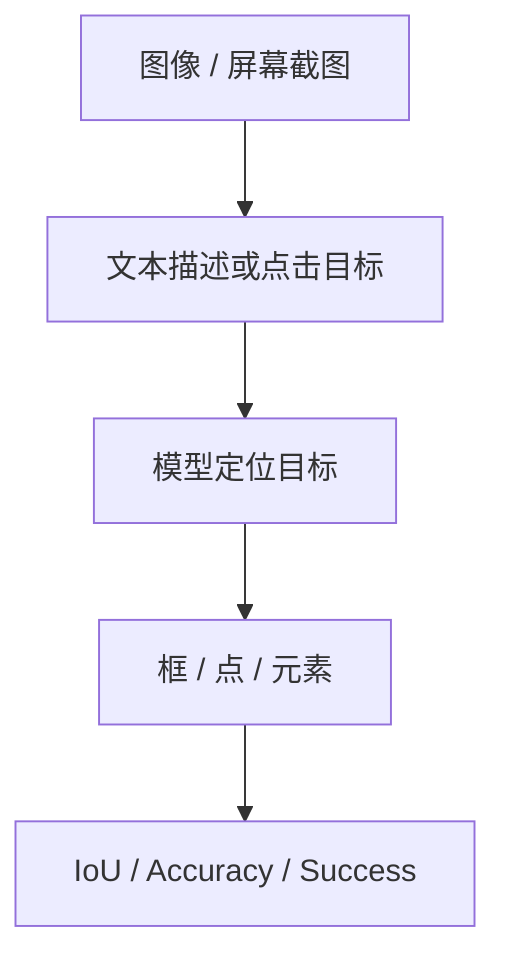

# Benchmark Card: Vision Grounding and GUI Benchmarks

| 字段 | 值 |
| ---- | ---- |
| 日期 | 2026-05-13 |
| 版本 | v2 |
| 状态 | 已按 6 章节模板重写 |
| 变更记录 | v1 为综述卡；v2 补入示例、4.1-4.6、风险表 |

---

## 1. 一句话定义

这张专题卡覆盖截图里的 `RefCOCO` 与 `ScreenSpot`，分别代表**自然图像指代 grounding** 和 **GUI 屏幕元素定位** 两条能力线。

## 2. 快速参考

| 属性 | 值 |
| ---- | ---- |
| 覆盖对象 | `RefCOCO` / `ScreenSpot_Mobile` / `ScreenSpot_Desktop` / `ScreenSpot_Web` |
| 主要能力 | 指代表达理解 / 目标定位 / GUI grounding |
| 常见输入 | 图像或屏幕截图 + 文本指令 |
| 常见输出 | 边框、坐标、目标区域、目标元素 |
| 常见评分 | IoU / accuracy / success rate |
| 一级类目 | `Vision / Multimodal` |
| 二级类目 | `Grounding / GUI` |
| 任务形态 | `referring expression grounding and GUI target localization` |
| 风险标签 | 自然图像与 GUI 域差异大 / 分辨率敏感 / grounding 与 planning 易混 |
| 代表来源 | `RefCOCO` 官方数据页、`ScreenSpot` 官方公开资料 |

## 3. 卡片导航

### 3.1 核心流程

### 3.2 如果你只看三件事

- `RefCOCO` 更偏经典视觉 grounding，不是 GUI benchmark。
- `ScreenSpot` 更接近“看着屏幕找按钮/输入框”的真实 GUI 任务。
- `Mobile`、`Desktop`、`Web` 三个 split 不能直接当成同一数据域。

## 4. 它怎么运作

### 4.1 它到底在测什么

这组 benchmark 主要关注：

1. 模型能否把自然语言描述对齐到视觉目标。
2. 模型能否在屏幕或图像中准确找到被提到的对象。
3. 模型能否处理 GUI 场景中抽象、密集、低语义冗余的界面元素。

具体来说：

- [`RefCOCO`](#refcoco)：自然图像中的 referring expression grounding
- [`ScreenSpot`](#screenspot)：GUI 截图中的 target localization

#### RefCOCO

`RefCOCO` 是经典自然图像 grounding 参考。

#### ScreenSpot

截图里的 `ScreenSpot_Mobile`、`ScreenSpot_Desktop`、`ScreenSpot_Web` 都属于 `ScreenSpot` 家族。

### 4.2 输入长什么样

输入一般是：

- 一张图片或屏幕截图
- 一句文本描述

**典型样式示例**：

#### `RefCOCO` 风格

> 图中有多个人和多个物体；指令是“站在桌子左边的那个人”或“右下角那个蓝色杯子”。  
> 模型需要定位这个对象。

#### `ScreenSpot` 风格

> 给一张移动端或网页截图；指令是“点击搜索框”“打开右上角设置”或“选择购物车图标”。  
> 模型核心任务是把目标点对，而不是生成长答案。

### 4.3 模型要输出什么

输出一般是：

- 边框
- 坐标点
- 目标元素 ID 或区域

这意味着：

- `RefCOCO` 更偏视觉 grounding 基础能力
- `ScreenSpot` 更偏操作前的 GUI 感知能力

### 4.4 数据是怎么做出来的

`RefCOCO` 与 `ScreenSpot` 的构造逻辑差别很大：

- `RefCOCO`：以自然图像对象和指代表达为核心
- `ScreenSpot`：以 GUI 截图和操作目标为核心

所以不能因为两者都叫“grounding”，就把它们当成同一种任务。

### 4.5 数据规模与分布

这一组更重要的是记住数据域：

| 项目 | 更适合记住什么 |
| ---- | ---- |
| `RefCOCO` | 自然图像 grounding 经典参考 |
| `ScreenSpot_Mobile` | 移动端 GUI 定位 |
| `ScreenSpot_Desktop` | 桌面 GUI 定位 |
| `ScreenSpot_Web` | 网页 GUI 定位 |

### 4.6 怎么判分

常见评分包括：

- `IoU`
- `accuracy`
- `success rate`

优点：

- 定位任务评分较直接

局限：

- 分辨率、截图裁切和目标粒度会显著影响结果

## 5. 它可靠吗

### 5.1 它不测什么

- 完整的 GUI 代理工作流
- 多步 planning
- 文档 OCR
- 视频理解

所以高分更适合解释为：

> 目标定位强。

而不是：

> 完整 agent 已经成熟。

### 5.2 难度信号

难点主要来自：

- 文本描述要和视觉区域精确对齐
- GUI 元素往往很密、很小、很抽象
- `Mobile` / `Desktop` / `Web` 的视觉分布差异非常大

### 5.3 缺陷与争议

#### 5.3.1 🏛️ `RefCOCO` 不能替代 GUI 评测

自然图像对象和界面元素在视觉结构与语义表达上差异很大。  
来源：任务边界本身。

#### 5.3.2 🗣️ `ScreenSpot` 高分不等于 agent 端到端成功

它只覆盖“找对目标”这一前置子能力。  
来源：GUI agent 任务拆解本身。

#### 5.3.3 🗣️ 分辨率与截图风格会影响结果

UI 元素可能非常小，裁切方式也会改变可定位性。  
来源：GUI grounding benchmark 的常见工程现实。

### 5.4 风险表

| 风险维度 | 风险级别 | 为什么 | 使用建议 |
| ---- | ---- | ---- | ---- |
| 域外推风险 | 高 | 自然图像 grounding 与 GUI grounding 差异极大 | `RefCOCO` 与 `ScreenSpot` 分开看 |
| split 误读 | 中 | `Mobile` / `Desktop` / `Web` 分布不同 | 不要只看一个平均值 |
| 端到端误解 | 中 | 定位成功不代表任务完成 | 与 agent benchmark 配合 |
| 视觉条件敏感 | 中 | 分辨率、裁切、界面风格会影响结果 | 记录截图条件 |

## 6. 我该用它吗

### 6.1 适用场景

- 你要看模型是否能“把目标找对”
- 你做 GUI agent 或屏幕操作产品
- 你想区分通用视觉模型与真正能看懂界面的模型

### 6.2 是否值得看

> 这组 benchmark 很值得看，尤其是 `ScreenSpot`。但一定要记住：它测的是 GUI grounding，不是完整 GUI agent。

结论标签：`★ 推荐`
